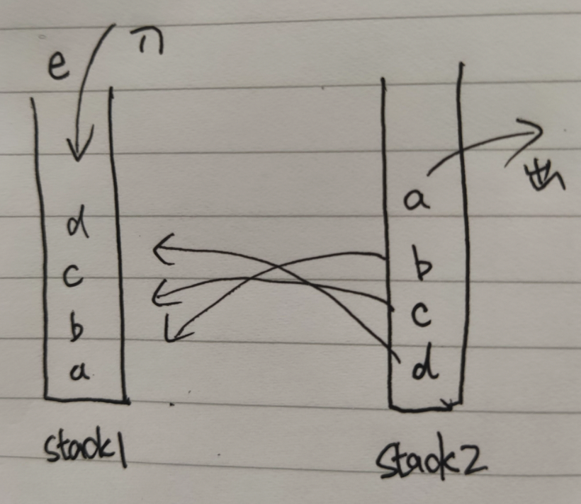
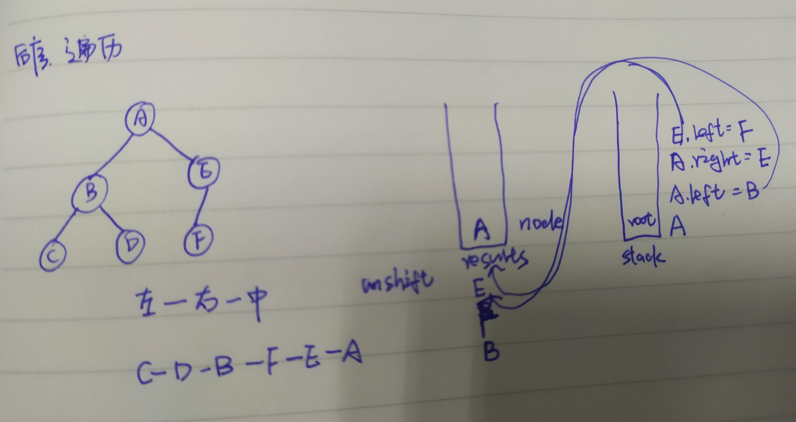

[TOC]

## 算法复杂度

+ 时间复杂度：

  也就是电脑CPU的计算量，主要包括几种

  ```
  O(1):不管输入有多大，操作次数都是固定的次数就是O(1)
  O(n)：一层循环
  O(logn):二分
  O(nlogn):循环与二分的嵌套
  O(n^2):指数
  ```

  

+ 空间复杂度

  运算所需要占用的空间,前端“重时间轻空间”

  ```
  O(1):不管输入有多大，空间都是固定的大小O(1)
  O(n)：数组复制
  ```

  


## 环境搭建

### ts环境

+ 安装

  ```
  sudo npm install -g typescript
  ```

+ 新建项目

  ```
  npm init 
  ```

+ 编写ts文件:app.ts

  ```
  let a:string= 'hello'
  console.log('a', a)
  ```

+ 编译运行

  ```
  tsc app.ts==>生成app.js文件
  node app.js
  //如果安装失败，可以全局安装一次
  sudo npm install typescript -g 
  ```


### jest测试工具

```
npm i -D jest typescript
npm i -D ts-jest @types/jest
...
npx jest
```

适配es6

```
npm install --save-dev babel-plugin-transform-es2015-modules-commonjs
```


## 数据结构类

## 1.链表

### 反转链表

【JZ24】反转链表


思想：每次把下一个指向next暂存起来避免指向丢失

```js
/*function ListNode(x){
    this.val = x;
    this.next = null;
}*/
function ReverseList(pHead)
{
    let pre = null
    let cur = pHead
    while(cur){
        let next = cur.next
        cur.next = pre
        pre = cur
        cur = next
    }
    return pre
}
```

### 合并两个排序的链表

【JZ25】 合并两个排序的链表

```
将两个升序链表合并为一个新的 升序 链表并返回。新链表是通过拼接给定的两个链表的所有节点组成的。 

输入：1->2->4, 1->3->4
输出：1->1->2->3->4->4
```
+ 注意**链表需要一个新的链表节点指向新的链表的头部**,这样最后才能返回这个新的链表
+ 还需要一个新链表的尾部节点，这样才能通过移动一个一个拼接后续的节点

```js
function ListNode(x){
    this.val = x;
    this.next = null;
}
function Merge(pHead1, pHead2)
{
    let mergeLinkHead =new ListNode(null);
    let mergeLinkFoot=mergeLinkHead;
    while(pHead1 && pHead2){
        if(pHead1.val<pHead2.val){
            mergeLinkFoot.next=pHead1
            mergeLinkFoot=mergeLinkFoot.next
            pHead1=pHead1.next
        }else{
            mergeLinkFoot.next=pHead2
            pHead2=pHead2.next
            mergeLinkFoot=mergeLinkFoot.next
        }
    }
    if(!pHead1){
        mergeLinkFoot.next=pHead2
    }
    if(!pHead2){
        mergeLinkFoot.next=pHead1
    }
    return mergeLinkHead.next
}
```


## 2.用两个栈模拟一个队列

[分析]：栈有三个主要的功能，入队，出队，获取队列长度

思路：入队：入队元素直接push进栈stack1；出队：先把所有元素放进去栈stack2,把最上边的元素pop出去，再把剩下的元素放回去stack1



```js
 export class MyQueue{
   private stack1=[]
   private stack2=[]
   
   pushItem(item){
     this.stack1.push(item)
   }
   popItem(){
     const stack1 = this.stack1
     const stack2 = this.stack2
     if(!stack1){
       return null
     }
     while(stack1.length){
       stack2.push(stack1.pop())
     }
     const res = stack2.pop()
     while(stack2.length){
       stack1.push(stack1.pop())
     }
     return res
   }
   get len(){
     return this.stack1.length
   }
 }
```

## 3.二叉树

二叉树每个节点最多有两个子节点，每个树的树节点都有value,left,right组成，left，right可能不存在，如下是一棵树的结构表示


```js
 interface TreeNode{
   value:string
   left:TreeNode| null
   right:TreeNode| null
 }

const tree:TreeNode={
  value:'A',
  left:{
    value:'B',
    left:{
      value:'D',
      left:{
        value:'F',
        left:null,
        right:null
      },
      right:null
    },
    right:{
      value:'E',
      left:null,
      right:null
    }
  },
  right:{
    value:'C',
    left:null,
    right:null
  }
}
```

### 二叉树遍历

要表示一棵树，必须传入根节点

#### 前序遍历

根-->左-->右

```tsx
function preOrderTraverse(node:TreeNode| null){
  if(node===null) return 
  console.log(node.value)
  preOrderTraverse(node.left)
  preOrderTraverse(node.right)
}
preOrderTraverse(tree)
```

结果：

```
A
B
D
F
E
C
```

如果需要把最终的结果都要保存在一个数组里，那么此时需要一个数组用来存储最终遍历出来的结果，一个数组用来暂存节点


```js
var preorderTraversal = function(root) {
    if(root===null){
        return []
    }
    var results=[]
    var stack=[root]
    while(stack.length){
        var node = stack.pop()
        results.push(node.val)
        if(node.right !==null){
            stack.push(node.right)
        }
        if(node.left !==null){
            stack.push(node.left)
        }
    }
    return results
};
```

#### 中序遍历

左-->根-->右

```tsx
function inOrderTraverse(node:TreeNode| null){
  if(node===null) return 
  inOrderTraverse(node.left)
  console.log(node.value)
  inOrderTraverse(node.right)
}
inOrderTraverse(tree)
结果：
F
D
B
E
A
C
```


```tsx
var inorderTraversal = function(root) {
    if(root===null){
        return []
    }
    var results=[]
    var stack=[]
    var cur = root
    while(true){
        while(cur!==null){
            stack.push(cur)
            cur=cur.left
        }
        if(stack.length==0){
            break
        }
        var cur=stack.pop()
        results.push(cur.val)
        cur=cur.right
    }
    return results
};
```


#### 后序遍历

左-->右-->根

```tsx

function postOrderTraverse(node:TreeNode| null){
  if(node===null) return 
  postOrderTraverse(node.left)
  postOrderTraverse(node.right)
  console.log(node.value)
}
postOrderTraverse(tree)
结果：
F
D
E
B
C
A
```



```js
var postorderTraversal = function(root) {
    if(root===null){
        return []
    }
    var stack=[root]
    var results=[]
    while(stack.length>0){
        let nodes=stack.pop()
        results.unshift(nodes.val)
        if(nodes.left){
            stack.push(nodes.left)
        }
        if(nodes.right){
            stack.push(nodes.right)
        }
    }
    return results
};
```

### 判断是否是后续遍历的二叉搜索树

【**JZ33** 】

二叉搜索树是指父亲节点大于左子树中的全部节点，但是小于右子树中的全部节点的树，[1,3,2]，返回为true，是二叉搜索树的后续遍历结果

分析：后序遍历，最后一个元素是根节点，然后逐步判断是否左树元素全部小于根节点，右树元素全部大于根节点即可，而且需要注意，如果左树或者右树只有0或者1个元素了，那说明不能再往下划分新的左树和右数了

```js
function VerifySquenceOfBST(sequence)
{
   if(!sequence.length){
      return false 
   }
   return helper(sequence)
}

function helper(sequence){
   let len=sequence.length;
   if(len<2){
       return true
   }
   let root=sequence[len-1];
   for(var i=0;i<len-1;i++){
       if(sequence[i]>root){
           break;
       }
   }
   let noderight=sequence.slice(i,len-1).every(x=>x>root);
   if(noderight){
       return helper(sequence.slice(0,i)) && helper(sequence.slice(i,len-1))
   }else{
       return false
   }
}
```

### 特殊的二叉树

+ 二叉搜索树BST

类似二分搜索，比根节点小的都在左节点，比根节点大的都在右节点，从而实现查找快，增删快的目的

+ 平衡二叉树

如果BST不平衡，只有左节点或者只有右节点，就会退化为链表

==》红黑树：一种自平衡的二叉树，通过颜色转换来维持平衡


