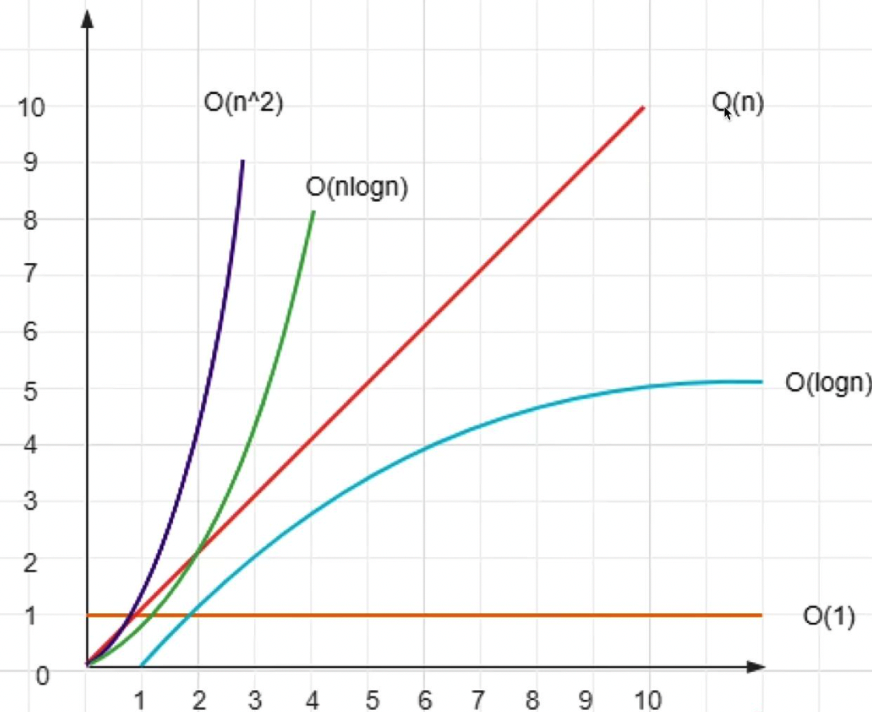
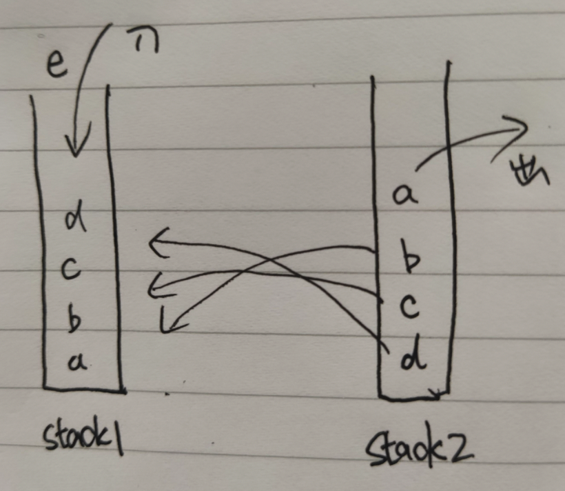

[TOC]

## 算法复杂度

+ 时间复杂度：

  也就是电脑CPU的计算量，主要包括几种

  ```
  O(1):不管输入有多大，操作次数都是固定的次数就是O(1)
  O(n)：一层循环
  O(logn):二分
  O(nlogn):循环与二分的嵌套
  O(n^2):指数
  ```

  

+ 空间复杂度

  运算所需要占用的空间,前端“重时间轻空间”

  ```
  O(1):不管输入有多大，空间都是固定的大小O(1)
  O(n)：数组复制
  ```

  


## 环境搭建

### ts环境

+ 安装

  ```
  sudo npm install -g typescript
  ```

+ 新建项目

  ```
  npm init 
  ```

+ 编写ts文件:app.ts

  ```
  let a:string= 'hello'
  console.log('a', a)
  ```

+ 编译运行

  ```
  tsc app.ts==>生成app.js文件
  node app.js
  //如果安装失败，可以全局安装一次
  sudo npm install typescript -g 
  ```


### jest测试工具

```
npm i -D jest typescript
npm i -D ts-jest @types/jest
...
npx jest
```

适配es6

```
npm install --save-dev babel-plugin-transform-es2015-modules-commonjs
```


## 数据结构类

### 1.用两个栈模拟一个队列

[分析]：栈有三个主要的功能，入队，出队，获取队列长度

思路：入队：入队元素直接push进栈stack1；出队：先把所有元素放进去栈stack2,把最上边的元素pop出去，再把剩下的元素放回去stack1



```
 export class MyQueue{
   private stack1=[]
   private stack2=[]
   
   pushItem(item){
     this.stack1.push(item)
   }
   popItem(){
     const stack1 = this.stack1
     const stack2 = this.stack2
     if(!stack1){
       return null
     }
     while(stack1.length){
       stack2.push(stack1.pop())
     }
     const res = stack2.pop()
     while(stack2.length){
       stack1.push(stack1.pop())
     }
     return res
   }
   get len(){
     return this.stack1.length
   }
 }
```

