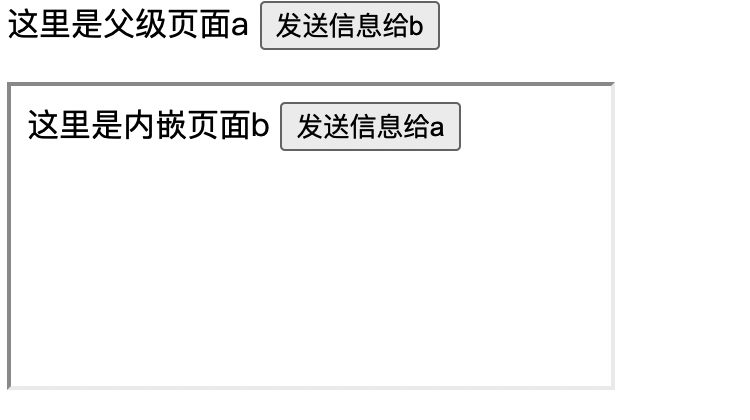

[toc]

# 1.new发生了什么

new就是通过构造函数创建了一个实例，它可以使用原型上的方法，并且执行了构造函数里的赋值操作，把自己的值传递了过去，那么构造函数，原型，实现了什么

+ 1.执行this,创建变量，这样每个实例单独拥有自己的变量

  ```
  function MyProto = function(age,name){
     this.name = name
     this.age = age
  }
  ```

+ 2.在原型上创建函数，避免重复创建

  ```
  MyProto.prototype.getName = function(){
    return this.name
  }
  ```

因此new主要也实现两个功能，一个是继承了构造函数的原型，另一个是执行了构造函数

```js
//构造函数及原型
function MyProto(name){
      this.name = name
}
MyProto.prototype.getName = function(){
    return this.name
}
//自定义的new方法 
function Mynew(){
    let fn=Array.prototype.shift.call(arguments);
    let obj = Object.create(fn.prototype)
    //obj.__proto__=fn.prototype;
    fn.apply(obj,arguments);
    return obj
}

//执行验证
const test = MyNew(MyProto,'yoly')
console.log('MyNew',test.getName())
```

## Object.create和{}的区别

+ {}创建的是空对象，原型指向Object.prototype
+ Object.create创建的也是空对象，原型指向传入的值

# 2.手写instanceof

原理：f instanceof F, 沿着f的原型链往上找，`f__proto__`,能否找到	`F.prototype`

**注意：**

+ **值类型没有原型链**
+ **F已经为null，则已经不存在null.prototype**

```js
function myInstanceOf(f, Fn){
      if(Fn === null){
        //判断是否是null，是null则已经到达顶点，不存在null.prototype
        return false 
      }
      if(typeof f!=='object' && typeof f!=='function'){
        // 值类型
        return false
      }
      while(f){
        if(f.__proto__=== Fn.prototype){
          return true
        }
        f = f.__proto__
      }
      return false
    }
```

# 2. js里数字精度问题

- JS 采用 IEEE 754 双精度版本（64位）,数字都用二进制表示

```js
sign(符号): 占 1 bit, 表示正负;
exponent(指数): 占 11 bit，表示范围;
mantissa(尾数): 占 52 bit，表示精度，多出的末尾如果是 1 需要进位;

//因此安全数是2^53

// (0011) 表示循环
0.1 = 2^-4 * 1.10011(0011)
```

- 最大值指的是2的53次幂-1，超过安全整数范围在计算时会有误差。在ES6中被定义为Number.MAX_SAFE_INTEGER和Number.MIN_SAFE_INTEGER。当超过整数范围时会返回infinity。

## 0.1+0.2!==0.3

很多小数用二进制表示都是无限循环的,JS把循环的超出的部分截掉了,因此0.1+0.2！==0.3

```
0.200000000000000002 === 0.2 // true
```

**console.log**

```
console.log(0.100000000000000002) // 0.1
```

因为发生了近似转换，二进制被转换为了十进制，十进制又被转换为了字符串，近似转换结果就为0.1

**解决办法**

- 针对大数的整数可以考虑使用 bigint 类型
- 保留位数
- 使用已有的库

```
parseFloat((0.1 + 0.2).toFixed(10)) === 0.3 // true
```

## 大数失真

开发中遇到shopId等前后端传输数字过大，超过了2^53，也就是约16位数字，后续的数字自动编舞了0.需要使用字符串表示

# 3.['1','2','3'].map(parseInt)输出什么

+ parseInt

```js
parseInt(str,radix):将字符串转化为数字
str:字符串
radix:进制，可以取2-36，默认当做10进制,不在2-36则返回为NAN
正常用法：parseInt("11",2);		//返回 3 (2+1)
```

```js
['1','2','3'].map(parseInt)
等效于
['1','2','3'].map((item,index)=>parseInt(item,index))
也就是
parseInt(’1‘,0) // 当做10进制，值为1
parseInt(’2‘,1) //NaN，取值范围是2-36
parseInt(’3‘,2) //NaN  2进制不能取3
```

其他特殊处理

```
字符串以’0x‘开头，会默认当做16进制处理
字符串以’0‘开头，会默认当做8进制处理（es5取消了，0开头会被忽略）
parseInt("0xA")  //得到10，当做16进制处理
parseInt("011")  //得到11,当做10进制处理
```

parseInt()内部处理，遇到不是其进制内部的数字，忽略截断,第一位必须是在其进制内的，否则NaN

```js
parseInt('14',2) //从小于2的位置开始，1*2^0=1
parseInt('342643',5) //2+4*5+3*25=97
parseInt('6',5) //NaN
parseInt('5',5) //NaN
```

# 5.实现eventBus

eventBus主要有几个功能

+ on('key',fn)，在eventBus里定义某一事件，事件名、函数，在同一个key上可以定义多个执行函数
+ once('key',fn),和on一样，但是绑定的事件只能执行一次
+ emit('key')执行key对应的事件
+ off('key',fn)解绑某一个事件上的函数，如果不传递fn，那么释放该事件上所有的函数

```js
export class eventBus {
  // {
  //   'key1':[{Fn:fn1,isonce:true},{{Fn:fn2,isonce:true}}],
  //   'key2':[{Fn:fn1,isonce:true},{{Fn:fn2,isonce:true}}]
  // }
  constructor() {
    this.eventStore = {}
  }
  on(eventName,fn,isonce=false){
    let events =  this.eventStore
    if(!events[eventName]){
      events[eventName] = [{Fn:fn,isonce:isonce}]
    }else{
      events[eventName].push({Fn:fn,isonce:isonce})
    }
  }

  once(eventName,fn,isonce){
    this.on(eventName,fn,true)
  }

  emit(eventName, ...args){
    let fnNeedRun =  this.eventStore[eventName]
    if(!fnNeedRun) return 
    this.eventStore[eventName] = fnNeedRun.filter(item=>{
      const {Fn, isonce} = item
      // 执行事件对应的事件
      Fn(...args)
      // 把once的过滤掉，重新为 this.eventStore[eventName]赋值
      if(!isonce) return true
      return false
    })
  }

  off(eventName,fn){
    if(!fn){
      this.eventStore[eventName] = []
    }else{
      let fnNeedRun =  this.eventStore[eventName]
      //把解绑的函数过滤掉，重新为对应的event赋值
      this.eventStore[eventName] = fnNeedRun.filter(item=>{
        if(item.Fn!==fn){
          return true
        }
        return false
      })
    }
  }
}
```

实际使用

```js
import {eventBus} from './utils.js'
    
function fn1(a,b){
  console.log('fn1',a,b)
}
function fn2(a,b){
	console.log('fn2',a,b)
}
function fn3(a,b){
	console.log('fn3',a,b)
}
const e = new eventBus()
e.on('fn',fn1)
e.on('fn',fn2)
e.once('fn',fn3)
e.emit('fn', 10, 20)
console.log('第二次执行')
e.emit('fn', 10, 20)
console.log('释放fn2再执行')
e.off('fn', fn2)
e.emit('fn', 10, 20)
```

或者可以考虑，把on的事件和once的时间使用两个数组进行存储

```
this.eventOnStore = {'key1':[fn1,fn2],'key2':[]}
this.eventOnceStore = {'key1':[fn1,fn2],'key2':[]}
```

# 6.iframe通信

+ 通过postMessage进行通信
+ 发送消息是通过要发送的元素postMessage, window.iframe1.contentWindow.postMessage, window.parent.postMessage('world', '*')
+ 接收消息是通过监听message事件
+ postMessage有跨域限制



代码如下

```html
//a页面
<body>
  <p>
    这里是父级页面a
    <button id = "btn1">发送信息给b</button>
  </p>
  <iframe id="iframe1" src="./b.html"></iframe>
</body>
<script>
  const btn = document.getElementById('btn1');
  btn1.addEventListener('click',()=>{
    console.log('父级页面a发送信息')
    window.iframe1.contentWindow.postMessage('hello','*')
    //第一个参数是内容，第二个参数可以限制发给哪些域，不是所有url都可以接收到这个消息
  })
  window.addEventListener('message', (e) => {
    console.log('父级页面a接收信息')
    console.log('origin', e.origin, e.data)
    //e.origin可以判断发送过来消息的源，判断是否合法
  })
</script>
```

```html
//b页面
<body>
  <p>
    这里是内嵌页面b
    <button id="btn1">发送信息给a</button>
  </p>
</body>
<script>
  const btn = document.getElementById('btn1');
    btn1.addEventListener('click', () => {
      console.log('内嵌页面b发送信息')
      window.parent.postMessage('world', '*')
    })
    window.addEventListener('message', (e) => {
      console.log('内嵌页面b接收信息')
      console.log('origin', e.origin, e.data)
    })
</script>
```


# 7.连续赋值问题

+ 从右往左执行
+ a.x的优先级较高

```js
a.x = 100
//解析为：a.x = undefined, a.x = 100
a.x = a = {n:2}
//解析为 a.x = undefined
//let temp = a.x
// temp = {n:2}
```

```js
let a = {n:1}
let b = a
a.x=a={n:2}
console.log('a.x',a.x) //undefined
console.log('b.x',b.x) //{n: 2}
```

原因：刚开始a和b都指向{n:1}, 连续赋值操作时，a.x优先级较高，先被赋值undefined, 因此a = b = {n:1, x:undefined}, 然后a的指向发生变化，指向{n:2}, 因此此时a.x = undefined, 然后原来的b.x指向a， 因此此时b={n:1,x:{n:2}}

# 8.ajax的原生实现

- XMLHTTPRequest,ActiveXObject
- onreadystatechange

```js
function getXHR(){
  var xhr = null;
  if(window.XMLHttpRequest) {// 兼容 IE7+, Firefox, Chrome, Opera, Safari
    xhr = new XMLHttpRequest();
  } else if (window.ActiveXObject) {
    xhr = new ActiveXObject();
  }else{
      alert('您的浏览器不支持ajax请求')
  }
  return xhr;
}

var xhr = getXHR();
xhr.open('GET', 'https:baidu.com',true);  //设置请求方式，url，以及是否异步
xhr.onreadystatechange=function(){   //设置回调监听函数
   if(xhr.readyState==4){
        if(xhr.status==200){
            var data=xhr.responseText;
            console.log(data);
   }
  }
}

xhr.onerror = function() {
  console.log("Oh, error");
};
xhr.send();  //发送请求
```

- 0 创建xhr,没有调用open
- 1 调用open，没有调用send
- 2 调用了send,已经接收了部分response header
- 3 已经接收部分response 报文主体
- 4 全部接收完毕，可以使用报文所有数据

# 10.sleep

效果：链式调用，有休眠的功能

```js
let mysleep = new MySleep('lily')
mysleep.eat('苹果').eat('香蕉').sleep(3).eat('火龙果')
===>
lily 吃 苹果
lily 吃 香蕉
开始休眠
结束休眠
lily 吃 火龙果
```

实现思路：

+ 先把所有函数搜集起来放到数组里，然后再挨个执行（函数里有next，知道执行完之后执行哪个）,而且是全部搜集完毕之后才开始执行，所以初始执行要使用setTimeout等待搜集完成
+ 链式调用，函数应该返回this
+ 

```js
class MySleep{
      constructor(name){
        this.name = name
        this.storeFn =[]
        setTimeout(()=>{
          this.next()
        },0)

      }
      eat(fruit){
        const task=()=>{
          console.log(`${this.name} 吃 ${fruit}`)
          this.next()
        }
        this.storeFn.push(task)
        return this
      }
      sleep(timestamp){
        const task=()=>{
          console.log('开始休眠')
          setTimeout(
            ()=>{
              console.log('结束休眠')
              this.next()
            },timestamp*1000
          )
        }
        this.storeFn.push(task)
        return this
      }
      next(){
        const fn = this.storeFn.shift()
        if(fn){
          fn()
        }
      }
    }
```

# 11.call、apply与bind

+ call和apply都是立即执行，call的参数是逐个传入的，而apply是放在数组或者对象里全部传入的

+ 基础用法：Fn.call(obj,1,2,3), 在obj上能使用Fn的函数方法，改变this指向为obj, 并且传入参数执行

+ 改变this指向的原理是,这样在执行obj.fn()的时候，this指向的是obj

  ```js
  const obj = {
    x: 1
    fn:function(){
       return this.x
    }
  }
  ```

## call实现

```js
Function.prototype.myCall = function(obj, ...arg){
	if(obj===null){ 
		obj = globalThis
	} 
	if(typeof obj != 'object'){
		obj = new Object(obj)
	}
	const fnKey = Symbol()
	obj.fnKey = this //这里的this就是函数，这样会变为obj调用了函数
	const res = obj.fnKey(...arg)
	delete obj.fnKey
	return res
}
function myfn(a,b,c){
	console.log(this,a,b,c)
}
myfn.myCall({x:1},1,2,3)

{x: 1, fnKey: ƒ} 1 2 3
```

```
//简略版本
Function.prototype.mycall=function(context){
    let contexts=context|| window;
    contexts.fn=this;
    let arg=[...arguments].slice(1);
    let results=contexts.fn(...arg)
    delete contexts.fn
    return result
}
```

说明：

+ null的时候，globalThis在js里指向window，在node里指向global
+ new Object(obj)需要考虑基础类型
+ const fnKey = Symbol()是为了避免和现有的属性名重复

## apply实现

类似，只是需要把所有参数一次性传入

```js
Function.prototype.myapply=function(context){
    let contexts=context|| window;
    contexts.fn=this;
    let results
    if(arguments[1]){
        results=contexts.fn(arguments[1])
    }else{
        results=contexts.fn()
    }
    delete contexts.fn
    return results
}
console.log(xw.say.myapply(xh))
```

## bind实现

+ bind返回的是一个新函数，但是没有执行
+ bind绑定的是this和部分参数

```js
Function.prototype.mybind=function(context){
    let fn=this;
    let contexts=context || window;
    let args=[...arguments].slice(1);
    return function(){
		return fn.apply(contexts, args.concat(Array.prototype.slice.call(arguments)));
	};
}
```

```js
Function.prototype.mybind=function(context,...bindarg){
    const self = this //当前的函数本身
    return function(...arg){
      //拼接参数
      const newArg = bindarg.concat(arg)
      return self.apply(context, newArg)
    }
}
```

# 12.防抖节流

## 防抖debounce

一直到动作停止后一段时间才执行

应用场景：

+ input输入，停止输入之后再触发搜索等动作
+ resize方法，停止之后再执行

思路：

+ 传入的是函数，返回的也是函数
+ 每次触发的时候, 如果之前已经有计时器在延迟执行，那么销毁计时器以及其上的事件
+ 传入的函数要通过apply绑定this进行执行

```js
  function debounce(fn,delay){
    let timer = 0
    return function(){
      if(timer) clearTimeout(timer)
      timer = setTimeout(()=>{
         fn.apply(this,arguments)
         timer =0
      },delay)
    }
  }
  let btn = document.getElementById('btn')
  function fn(){
    console.log(new Date())
  }
  btn.addEventListener('click', debounce(fn,1000))
```

## 节流throttle

就是一段每隔一段时间只执行一次，是为了避免某些操作频繁的发生

应用场景: 懒加载时要监听计算滚动条的位置，但不必每次滑动都触发，可以降低计算的频率；另外还有做商品预览图的放大镜效果时，不必每次鼠标移动都计算位置。

思路：

+ 输入函数返回函数、
+ 一段时间只执行一次，也就是如果当前有计时器，那么直接返回不再执行
+ 传入的fn需要使用apply进行执行

```js
  function throttle(fn,delay){
    let timer = 0
    return function(){
      if(timer) return
      timer = setTimeout(()=>{
         fn.apply(this,arguments)
         timer =0
      },delay)
    }
  }
  let btn = document.getElementById('btn')
  function fn(){
    console.log(new Date())
  }
  btn.addEventListener('click', throttle(fn,1000))
```

# 函数科理化

## 实现一个 add 函数

函数柯里化手写实现add(2, 3, 4) = 9, add(2, 3)(4) = 9, add(2)(3)(4) = 9

```js
function add(){
	let args = [...arguments];
	let addfun = function(){
		args.push(...arguments);
		return addfun;
	}
	addfun.toString = function(){
		return args.reduce((a,b)=>{
			return a + b;
		});
	}
	return addfun;
}

console.log(add(1))
console.log(add(1)(2))	
console.log(add(1)(2)(3));
console.log(add(1)(2, 3)); 
console.log(add(1, 2)(3)); 
console.log(add(1, 2, 3));
```

### sum(1)(2)(3)...(n).valueOf()

计算从1到n的累加和

> 闭包，柯里化

```js
//sum(1)(2)(3)...(n).valueOf() 计算从1到n的累加和
function sum(a){
    let result = a 
    function add(b){
        result += b
        return add
    }
    add.valueOf = function(){
        return result
    }
    return add
}
console.log(sum(1)(2)(4).valueOf())
```

扩展：sum(1)(2)(3)...(n)() 解决方案

```js
let sum = function(a){
    return function(b){
        if(b){ // 这里可以过滤掉 b 是0的情况,换成if(b!==undefined)这样就可以接受0了
            return sum(a+b)
        }else{
            return a
        }
    }
}
```

------

# promise

## Promise.all手写[1]

