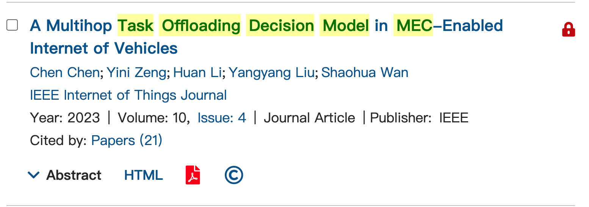
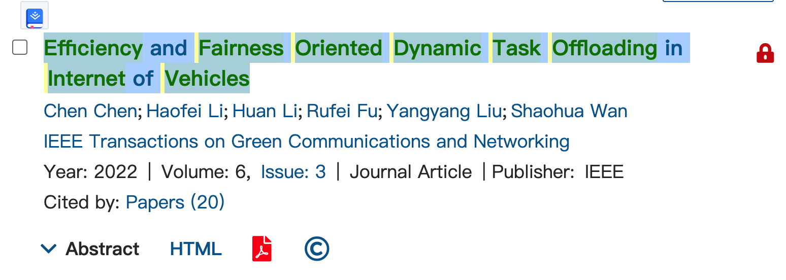

[toc]

http://www.letpub.com.cn/index.php?page=journalapp&view=search

### [A Multihop Task Offloading Decision Model in MEC-Enabled Internet of Vehicles](https://ieeexplore.ieee.org/document/9684560/)

一区SCI  IEEE Internet of Things Journal

### [Efficiency and Fairness Oriented Dynamic Task Offloading in Internet of Vehicles](https://ieeexplore.ieee.org/document/9758048/)

IEEE Transactions on Green Communications and Networking  SCIE  3区