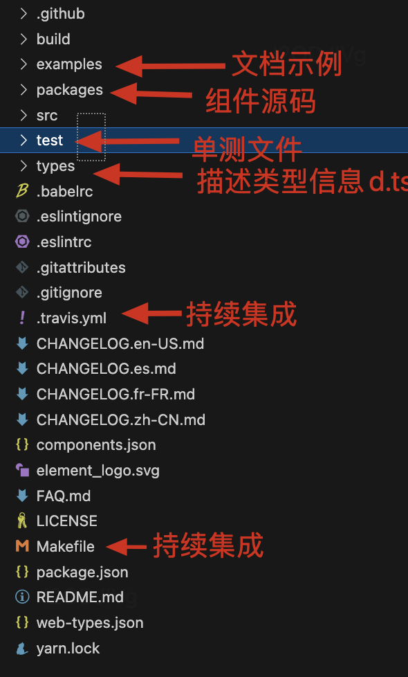
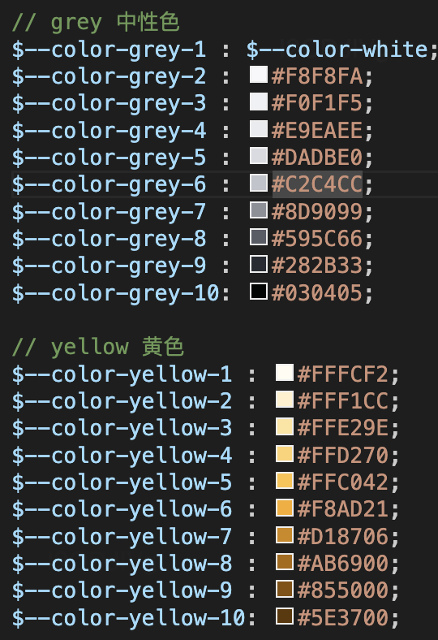
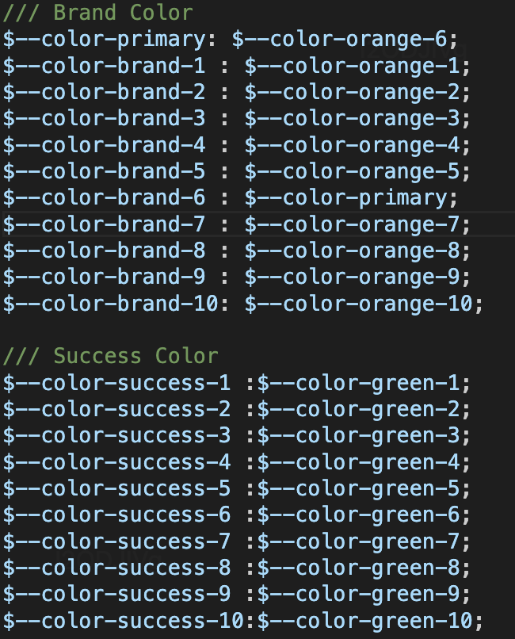
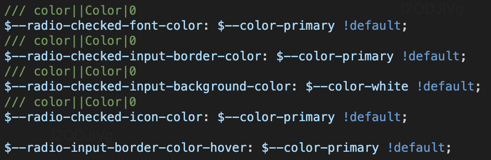
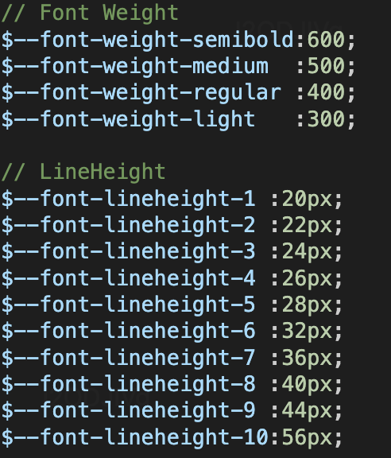

[toc]

# 1.背景

+ 不同业务的UI设计存在差异， 设计师的设计走查有较大的负担
+ 研发大量重复开发相似的组件和页面，影响交付效率

# 2.目的

+ 中后台系统的交互体验更一致
+ 帮助设计和前端提升中后台系统的交付效率

# 3.为什么开源

+ 希望更多参与者共建
+ 为Vue社区贡献力量（vue社区缺少高级组件、最佳实践模版、移动端组件、图表可视化组件等）

# 4.项目包括什么

+ 基础组件： 解决基础组件复用
+ 高级组件： 解决业务组件复用
+ 页面模版： 解决页面组装、逻辑开发提效
+ 研发脚手架： 解决研发过程效率问题

# 5.个人角色

核心参与者，主要工作：

+ 持续丰富物料（15个）

  ```
  - 基础组件扩展（3个）：timeline、calendar、backTop
  - 高级组件拓展（10个）：formstep、arrayTable、 arrayCard、formGroup、Input,Select,DatePicker,TimePicker,InputNumber,Password,Cascader组件的阅读态
  - 业务组件新增（2个）:selectInput、GroupTitle
  ```

+ 问题跟进（3+个）：

  ```
  - arrayCard的maxItem阻断
  - selectInput能力完善
  - GroupTitle能力完善
  ```

+ 组件库治理

  ```
  - 完成基础组件、高级组件代码CR与修改（15个）
  - 支持高级组件的单元测试（2个）
  - token改造（6个）
  ```

+ 新需求物料接入

+ 国际化相关能力支持

  ```
  - 支持pebble基础组件的RTL能力
  - 支持pebble基础组件库与高级组件库的文档翻译能力
  - 完成国际化最佳实践文档
  ```

# 6.具体介绍

## 基础组件

### (1)代码结构

复用element ui



+ travis.yml： 持续集成是将构建并测试的过程自动化，在你提交代码时，持续集成服务能够自动触发构建与测试过程，并反馈结果（https://blog.csdn.net/albertsh/article/details/125581553）
+ Makefile:用于告诉make工具如何编译和链接程序。

### (2)样式解决方案

#### 样式技术方案

最终采用的是sass

+ inline css

+ Css in js 

  ```js
  简单来讲就是将css写在javascript文件里，不独立使用.css、.less、.scss文件处理样式，这样CSS可以使用JS中的一些语句们比如模块声明、变量定义、函数调用等去灵活的扩展样式的定义。解析js文件的时候，会生成相应的css，并插入到dom中
  
  比如：
  import { createUseStyles } from 'react-jss';
  
  const useStyles = createUseStyles({
    button: {
      backgroundColor: '#3498db',
      color: '#fff',
      fontSize: '16px',
    },
  });
  
  // 在组件中使用
  const MyComponent = () => {
    const classes = useStyles();
    return <button className={classes.button}>Click me</button>;
  };
  
  缺点：
  - 陡峭的学习曲线
  - 代码可读性差
  - 没有统一的业界标准
  ```

+ Styled component: 也是一种css in js的实现思路

  ```js
  import styled from 'styled-components';
  
  const Button = styled.button`
    background-color: #3498db;
    color: #fff;
    font-size: 16px;
  `;
  
  // 在组件中使用
  const MyComponent = () => {
    return <Button>Click me</Button>;
  };
  ```

+ Sass/less

  ```
  - 支持嵌套
  - 支持变量
  ```

#### 色彩体系

和element ui不同

+ 基础色板配置(theme-chalk/src/common/colors.scss)

  

  

+ 品牌色+功能色配置(theme-chalk/src/common/global.scss)

  

+ 样式变量： 统一定义在(theme-chalk/src/common/var.scss)



+ 组件引用变量: 组件样式里去引用样式变量（theme-chalk/radio.scss）

```
在 SCSS（Sass的一种语法扩展）中，如果你在一个样式规则的最后添加 !default，它表示如果该变量没有被定义过，则将其设置为指定的值。这是 SCSS 的一种变量默认值设置方式。
```

#### 字体设置

设置字体，size, 行高等，  统一定义在(theme-chalk/src/common/var.scss)



### (3)组件实现

总体实现路径： UI出设计图==》props属性分析==》开发==》设计走查==》合并到master

#### button

<button>上写样式即可

React则是通过div和a属性去模拟，除了传入的属性，还需要继承原生的button自身有的属性, prop里加上

```js
// React.ButtonHTMLAttributes
用于表示 <button> 元素的属性。它继承自 HTML 属性，比如autoFocus，并添加了一些 React 特有的属性。

interface ButtonHTMLAttributes<T> extends HTMLAttributes<T> {
  autoFocus?: boolean;
  disabled?: boolean;
  form?: string;
  formAction?: string;
  formEncType?: string;
  formMethod?: string;
  formNoValidate?: boolean;
  formTarget?: string;
  name?: string;
  type?: "submit" | "reset" | "button";
  value?: string | string[] | number;
}

// React.AnchorHTMLAttributes
用于表示 <a>（锚点）元素的属性
```

### (4)组件测试用例

#### 重要性

+ 高质量代码
+ 更早发现bug, 减少成本
+ 重构和升级更加可靠
+ 开发流程更加敏捷

#### 测试方案介绍

Jest:  内置了集成度比较高的断言库expect.js,  常用的测试工具，比如自带断言、测试覆盖率工具，实现了开箱即用,  主要需要覆盖率

测试范围：

- **语句覆盖率（statement coverage）**：是不是每个语句都执行了？
- Branch分支覆盖率（branch coverage）**：是不是每个if代码块都执行了？
- **Funcs函数覆盖率（function coverage）**：是不是每个函数都调用了？
- **Lines行覆盖率（line coverage）**：是不是每一行都执行了？

### (5)代码打包输出与发布

#### 打包输出

有符合AMD、CMD、commonjs、ES等的模块化方案， 用rollup打包为UMD模块， UMD内部会进行判断，兼容各种模块化方案。

```js
(function (window, factory) {
  if (typeof exports === "object") {
    // CommonJS
    module.exports = factory();
  } else if (typeof define === "function" && define.amd) {
    // AMD
    define(factory);
  } else {
    // 浏览器全局定义
    window.eventUtil = factory();
  }
})(this, function () {
  // do something
});
```

ES模块的优点：

+ 官方支持
+ tree shaking

#### 转化为ES module

ts转化为ES module可以通过tsconfig进行配置

```js
scripts: {
  'build-ts': "tsc -p tsconfig.json"
}
```

```js
{
  compilerOptions: {
    "outdir": //输出的目录
    "module": 'esnext' // 输出为es midules
    "target": 'es5'// 兼容es6语法
    "moduleResolution": "node" //解析模块方法
    ...
  },
  include:[
     'src' // src目录下才转化
  ]，
  exclude:[
    'src/**/*.text.tsx'  // 不包含哪些目录文件
  ]
    
}
```

#### 转化css文件

可以通过node-sass进行配置, 将sass转换为css， 使用的时候直接引入进行使用

```
import XXXXX/xxx.css
```

```js
scripts: {
  'build-css': "node-sass  xxxxx/style/index  dist/xxx/index.css"
}
```

#### npm介绍

npm的作用

+ 下载别人的第三方包到本地
+ 下载并安装别人的命令行程序到本地使用（比如vue的脚手架）
+ 自己编写的包或者命令行程序上传到npm服务器

npm注册登录

```
// 检查是否登录
npm whoami
// 注册：npm官网注册
```

#### npm发包配置

```js
{
"name": 包名,
"version": 版本号： 需要遵循语义化版本号,
"description"： 包的描述,
"main": lib/...js 主模块，npm包的加载入口， 主要是commonjs规范， esmodule的规范可以使用module指定入口
// 描述哪些文件被发布在npm包中
"files": [
    "lib",
    "src",
    "packages",
    "types"
  ],  
// 当其他 TypeScript 项目引入该包时，TypeScript 编译器就能够正确地找到和使用类型定义。
"typings": "types/index.d.ts", 
"scripts": {} // 定义命令
"faas": [
    {
      "domain": "element",
      "public": "temp_web/element"
    },
    {
      "domain": "element-theme",
      "public": "examples/element-ui",
      "build": [
        "yarn",
        "npm run deploy:build"
      ]
    }
  ],
"repository": {
  // 包仓库信息
}
"homepage": 主页，
"keywords": 关键词，
"private": false 是否私有
"license": "MIT" 许可证类型，允许再开发
"bugs": 问题提报，
// "unpkg" 是一个用于访问 npm 包中的文件的 CDN（内容分发网络）服务。它允许你通过浏览器直接访问 npm 包中的文件，而无需在本地安装这些包。
"unpkg": "lib/index.js",
"style": 主要样式文件的加载路径，
"dependencies": {},
"peerDependencies": {},
 "devDependencies": {},
 // lint代码检测工具
 "lint-staged": {
    "*.{js,jsx,ts,tsx,vue}": "eslint --cache"
 }，
 // git提交工具规范的工具
 "config": {
    "commitizen": {
      "path": "./node_modules/cz-conventional-changelog"
    }
  },
}
```

+ 语义化版本2.0.0
  + 主版本号： 不兼容的修改， 比如代码CR后大版本更新
  + 次版本号： 做了兼容性的功能修改
  + 修订号： 做了兼容性的问题修复

+ 依赖包的管理

  + dependencies: 生产环境需要使用到的包

  + devDependencies：开发环境需要使用的包， 比如node-sass、ts、teest单测包、eslint、vue-router等等

  + peerDependencies：对等依赖

    ```js
    peerDependencies 字段用于指定当前包所依赖的其他包的版本范围。与 dependencies 字段不同的是，peerDependencies 字段指定的包不会被自动安装，而是需要由用户手动安装。
    
    自己的包中配置
    "peerDependencies": {
        "vue": "^2.5.17"
      },
    这将告诉用户，如果他们想要使用你的包，他们需要手动安装 vue，并且版本号必须在 2.5.17 及以上
    ```

#### 本地调试

Npm link软链


### (6)CI/CD 文档生成等

整体流程： 组件库==》运行测试==》发布==》编译==》上传至服务器==》生成新的文案展示

#### CI持续集成

软件个人研发的部分向软件整体部分交付，以便尽早发现个人开发部分的问题；

+ 频繁的将代码集成到主干
+ 快速发现错误
+ 防止分支大幅度偏移主干

#### CD:持续部署、持续交付

+ 频繁的将软件的新版本，交付给测试团队或者用户
+ 代码通过评审后，自动部署到生产环境

#### travis介绍

是一个持续集成服务工具，它可以与项目的git仓库集成，帮助开发者自动构建、测试和部署项目。在.travis.yml里进行统一的配置。

```js
sudo: false
language: node_js
node_js: 10
addons:
  chrome: stable
before_install:
- export TRAVIS_COMMIT_MSG="[deploy] $(git log --format='%h - %B' --no-merges -n 1)"
- export TRAVIS_COMMIT_USER="$(git log --no-merges -n 1 --format=%an)"
- export TRAVIS_COMMIT_EMAIL="$(git log --no-merges -n 1 --format=%ae)"
after_success:
- sh build/deploy-ci.sh
- cat ./test/unit/coverage/lcov.info | ./node_modules/.bin/coveralls
```

#### 流水线

使用内部的流水线服务进行持续部署和持续交付


## 高级组件

使用formily实现表单

## 原表单方案

```VUE
 <auto-form
    ref="form"
    :schema="configs"
    :data="detail"
    @input="changeValue"
 />

<script>
/* eslint-disable */
import AutoForm from '../utils/index.vue'
export default {
  name: "HelloWorld",
  components: {
    AutoForm,
  },
  data() {
    const fruitMap = [
      {
        label: '苹果',
        value: 1
      },
      {
        label: '香蕉',
        value: 2
      }
    ]
    return {
      configs: [{
        fruitType: {
          label: '水果类型',
          type: 'radio',
          prop: 'accountType',
          defaultValue: 2,
          options: fruitMap,
          mapConfig: fruitMap,
       },
       fruitType2: {
          label: '水果类型',
          type: 'radio',
          prop: 'accountType',
          defaultValue: 2,
          options: fruitMap,
          mapConfig: fruitMap,
       },
     }],
      detail: {
        'fruitType': 1,
        'fruitType2': 2
      }
      
    };
  },
  methods: {
    changeValue(prop, value){
      console.log('prop--', prop, value)
    }

  },
  async created() {
  }
}
```

封装的autoform, 其实就是el-form的简单封装，然后根据schema映射到不同的组件

```vue
<template>
  <el-form
    ref="autoValidateForm"
    :model="initData"
    :validate-on-rule-change="false"
    :disabled="disabled"
  >
    <div
      v-for="(conf, index) in schema"
      :key="index"
      class="group"
    >
      <div>
        <el-row
          v-for="(row, rowIndex) in conf"
          :key="rowIndex"
        >
          <el-col
            :key="key"
            :span="row.span"
            class="col"
          >
            <form-base
              ref="baseValidateForm"
              :prop="row"
              :data="initData"
              :disabled="disabled"
              @input="valueChange"
              @blur="inputBlur"
            />
          </el-col>
        </el-row>
      </div>
    </div>
  </el-form>
</template>

<script>
/* eslint-disable */
import formBase from './Base'
import clone from 'clone'
import {get } from 'lodash'

export default {
  name: 'AutoForm',
  components: {
    formBase,
  },
  props: {
    // 传入的表单schema
    schema: {
      type: Array,
      default () {
        return []
      }
    },
    data: {
      type: Object,
      default () {
        return {}
      }
    },
    disabled: {
      type: Boolean,
      default: false
    },
    onChange: {
      type: Function,
      default: ()=>{}
    },
  },
  data () {
    return {
      initData: clone(this.data),
    }
  },
  watch: {
    data: {
      immediate: true,
      deep: true,
      handler: function (newValue) {
        this.initData = clone(newValue)
      }
    }
  },
  created () {
  },
  methods: {
    async validate () {
      this.$emit('validate')
      let autoValidateForm = get(this, '$refs.autoValidateForm.validate')
      let res = autoValidateForm && (await autoValidateForm())
      return res
    },
    autoValidateForm (prop) {
      this.$refs.autoValidateForm.validateField(prop)
    },
    resetFields () {
      this.$emit('resetFields')
      this.$refs.autoValidateForm.resetFields()
    },
    clearValidate () {
      this.$emit('clearValidate')
      this.$refs.autoValidateForm.clearValidate()
    },
    valueChange (value, prop) {
      this.$emit('input', clone(value), prop)
    },
    inputBlur (value, prop) {
      this.$emit('blur', clone(value), prop)
    },
  }
}
</script>
```

formItem

```vue
<script>
/* eslint-disable */
const componentseMap = {
  radio: 'auto-radio',
}
export default {
  name: 'AutoFormBase',
  components: {
  },
  props: {
    data: {
      type: [Object, Array],
      default() {
        return {}
      }
    },
    prop: {
      type: [Object, Array],
      default() {
        return {}
      }
    },
    parentKey: {
      type: String,
      default: ''
    },
    disabled: {
      type: Boolean,
      default: false
    }
  },
  methods: {
    valueChange(value) {
      this.data[this.prop.prop] = value
      this.$emit('input', {
        ...this.data,
      }, this.prop.prop)
    },
    inputBlur(value, prop) {
      this.data[this.prop.prop] = value
      this.$emit('blur', {
        ...this.data,
      }, this.prop.prop)
    },
    getBaseElem(createElement) {
      let components = componentseMap[this.prop.type] || ''
      return createElement(components, {
        props: {
          data: this.data,
          value: this.data[this.prop.prop],
          prop: this.prop,
          parentKey: this.prop.prop,
          disabled: this.disabled
        },
        on: {
          input: this.valueChange,
        }
      })
    },
    getLabelMessage (createElement) {
      if (!this.prop.label) return
      return createElement('span', { slot: 'label' }, [
        createElement('span', {}, this.prop.label),
      ])
    },
    getFormItem(createElement) {
      return createElement(
        'el-form-item',
        {
          key: this.prop.label,
          ref: 'baseFormItem',
          props: {
            prop: this.prop.prop,
            rules: this.prop.rules,
            key: this.prop.label,
            'label-width': this.prop.width ? this.prop.width : '',
            'show-message': this.prop.showMessage
          }
        },
        [
          this.getLabelMessage(createElement),
          this.getBaseElem(createElement),
        ]
      )
    },
  },
  render(createElement) {
    return createElement(
      'section',
      {
        class: {
          'group-item': true
        },
        attrs: {
          style: this.prop.style
        }
      },
      [this.getFormItem(createElement)]
    )
  }
}
</script>

```

radio组件

```
import Vue from 'vue'
import Radio from '../formComp/radio'
/* eslint-disable*/
Vue.use(Radio)
```

```vue
import Radio from './index.vue'
Radio.install = function (Vue) {
  Vue.component(Radio.name, Radio)
}
export default Radio
```

问题： 如何封装一个表单项：value+ onchange事件

### (1)为什么使用formily

需要统一五花八门的配置化表单方案

```
在中后台项目的前端开发中，配置化表单（配置JSON自动生成表单界面）是一个非常高频使用的场景，但是目前业界并未形成统一的方案。
在以往探索中自研或采用了五花八门配置化表单方案，导致了配置化表单方案各自维护，新人上手需要学习多套 json-schema 的配置协议，影响了技术的复用、降低了开发效率。
```

横向对比多种方案，formily的得分比较高

+ 社区活跃度
+ 需求满足度(研发体验、功能、其他)
+ 成本（学习、使用、维护的成本）

Formily方案的优点：

- 抽象了表单领域模型 的 MVVM 表单解决方案
- 优雅的解决了多种复杂场景的表单的数据、状态管理、联动、校验等问题

### (2)formily提供的能力

#### 表单领域问题的建模

- 数据管理
  - 表单值转换逻辑复杂(前后端格式不一致)
  - 数据层级管理
  - 类似日期范围选择，一个组件对应多个字段 等等
  - 同步默认值与异步默认值合并逻辑复杂等等
  - 为【前后端数据差异兼容】奠定基础
- 字段管理
  - 字段管理：增加、删除、修改、查询
  - 字段类型区分：数据类与纯展示UI容器进行分层；
  - 为灵活的【场景化与布局能力】奠定基础
- 校验管理
  - 校验器：符合的条件配置，联动校验等
  - 校验时机：校验出发时机，例如校验规则只在聚焦或者失焦的时候触发
  - 校验策略：执行所有校验规则的时候
  - 校验结果：结果获取、展示与结果写入
- 联动管理
  - 主动联动：某字段数据改变会引起其他字段数据改变
  - 被动联动：某字段数据依赖于其他字段的数据改变而改变

#### 统一且完备的 json-schema 协议

+ 用什么组件（x-component）
+ 组件什么属性(x-conponent-props)
+ 组件的展示行为(x-visible)
+ 描述数据承载数据字段的类型(type）
+ 虚拟容器： 承载纯UI字段类型（void）

### (3)组织分层

- 高级组件库包： 表单所需要的表单子项
- @formily/core 内核库：负责管理表单的状态，表单校验，联动等
- @formily/vue UI 桥接库：一个 UI 库来接入内核数据，用来实现最终的表单交互效果，对于不同框架的用户，我们有不同的桥接库

# 7.项目的优点与不足

优点

+ 提供了更丰富的物料体系

  ```
  - 新增了element ui没有的组件，优化了部分组件的交互体验和功能
  - 封装了表单、表格、详情、列表的复合组件
  - 统一了配置化表单方案
  ```

+ 更完善的国际化能力

- 配套的低码能力

不足

+ 刚开始没有注意代码规范，导致开源前使用大量人力重新修改

  ```
  + 梳理清楚主要功能， 开会进行代码CR
  + 调整点
    +  自定义组件名称、所属分类（比如预览组件的分类、不太通用组件的分类）
    +  git提交规范
    +  props的校验
    +  token规范
  ```

+ vue3的支持

+ 高级组件的易用性

# 8.项目遇到的难点


# 9.项目推进中受到的启发

+ 双周会机制推进， 保证项目进度
+ 技术运营： 值班机制
+ 方案宣讲： 进行大组、小组多次宣讲，不断加深影响力

# 10.其他问题

弹窗组件如何实现

+ 如果让你去原生实现弹窗，你会怎么做？多个弹窗的时候如何展示？这里的弹窗dom结构怎么写
+ 如何控制弹窗的顺序，比如b弹窗一定要在a弹窗展示关闭之后再展示？
+ 有了解过常用组件库弹窗的写法吗，比如ant-design

https://blog.csdn.net/qq_23876873/article/details/106816613

notification

1.flex-grow

2.父组件想使用子组件的方法 

3.sass获取键盘操作

4.点击状态未松开 ：active状态

5.sass map操作

============

6.switch组件

键盘操作，键盘上使用-->tab键可以切换不同的元素选中，enter可以切换开关状态

sass里 ： & 表示父元素

​                 ~表示同一个父元素下处于其后的所有指定元素

https://developer.mozilla.org/zh-CN/docs/Web/CSS/:focus-visible

当元素匹配[`:focus`](https://developer.mozilla.org/zh-CN/docs/Web/CSS/:focus)伪类并且客户端 (UA) 的启发式引擎决定焦点应当可见 (在这种情况下很多浏览器默认显示“焦点框”。) 时，**`:focus-visible`** 伪类将生效。

这个选择器可以有效地根据用户的输入方式 (鼠标 vs 键盘) 展示不同形式的焦点。

==============

7.timeline

https://cn.vuejs.org/v2/api/#vm-slots

用来访问被[插槽分发](https://cn.vuejs.org/v2/guide/components.html#通过插槽分发内容)的内容。每个[具名插槽](https://cn.vuejs.org/v2/guide/components-slots.html#具名插槽)有其相应的 property (例如：`v-slot:foo` 中的内容将会在 `vm.$slots.foo` 中被找到)。`default` property 包括了所有没有被包含在具名插槽中的节点，或 `v-slot:default` 的内容。

