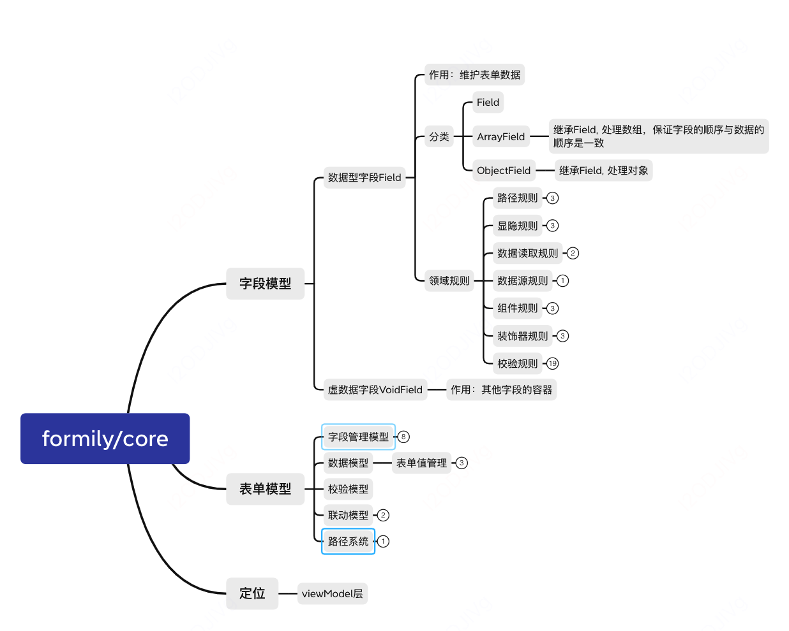
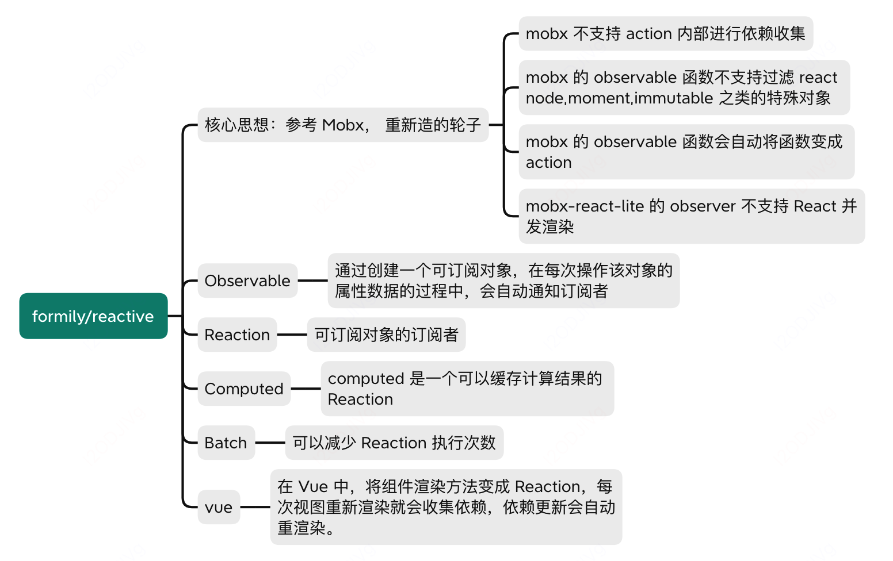
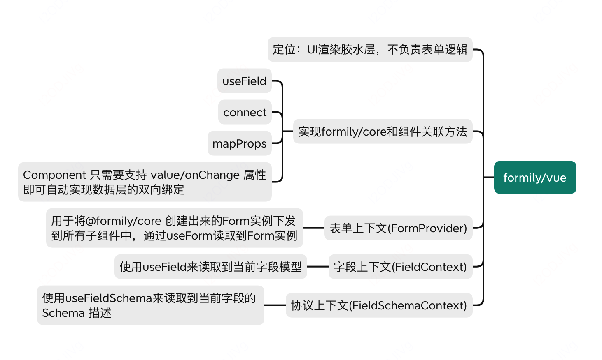

[toc]

# 1.背景

+ 不同业务的UI设计存在差异， 设计师的设计走查有较大的负担
+ 研发大量重复开发相似的组件和页面，影响交付效率

# 2.目的

+ 中后台系统的交互体验更一致
+ 帮助设计和前端提升中后台系统的交付效率

# 3.为什么开源

+ 希望更多参与者共建
+ 为Vue社区贡献力量（vue社区缺少高级组件、最佳实践模版、移动端组件、图表可视化组件等）

# 4.项目包括什么

+ 基础组件： 解决基础组件复用
+ 高级组件： 解决业务组件复用
+ 页面模版： 解决页面组装、逻辑开发提效
+ 研发脚手架： 解决研发过程效率问题

# 5.个人角色

核心参与者，主要工作：

+ 持续丰富物料（15个）

  ```
  - 基础组件扩展（3个）：timeline、calendar、backTop
  - 高级组件拓展（10个）：formstep、arrayTable、 arrayCard、formGroup、Input,Select,DatePicker,TimePicker,InputNumber,Password,Cascader组件的阅读态
  - 业务组件新增（2个）:selectInput、GroupTitle
  ```

+ 问题跟进（3+个）：

  ```
  - arrayCard的maxItem阻断
  - selectInput能力完善
  - GroupTitle能力完善
  ```

+ 组件库治理

  ```
  - 完成基础组件、高级组件代码CR与修改（15个）
  - 支持高级组件的单元测试（2个）
  - token改造（6个）
  ```

+ 新需求物料接入

+ 国际化相关能力支持

  ```
  - 支持pebble基础组件的RTL能力
  - 支持pebble基础组件库与高级组件库的文档翻译能力
  - 完成国际化最佳实践文档
  ```

# 6.具体介绍

## 基础组件

### (1)代码结构

复用element ui


+ travis.yml： 持续集成是将构建并测试的过程自动化，在你提交代码时，持续集成服务能够自动触发构建与测试过程，并反馈结果（https://blog.csdn.net/albertsh/article/details/125581553）
+ Makefile:用于告诉make工具如何编译和链接程序。

### (2)样式解决方案

#### 样式技术方案

最终采用的是sass

+ inline css

+ Css in js 

  ```js
  简单来讲就是将css写在javascript文件里，不独立使用.css、.less、.scss文件处理样式，这样CSS可以使用JS中的一些语句们比如模块声明、变量定义、函数调用等去灵活的扩展样式的定义。解析js文件的时候，会生成相应的css，并插入到dom中
  
  比如：
  import { createUseStyles } from 'react-jss';
  
  const useStyles = createUseStyles({
    button: {
      backgroundColor: '#3498db',
      color: '#fff',
      fontSize: '16px',
    },
  });
  
  // 在组件中使用
  const MyComponent = () => {
    const classes = useStyles();
    return <button className={classes.button}>Click me</button>;
  };
  
  缺点：
  - 陡峭的学习曲线
  - 代码可读性差
  - 没有统一的业界标准
  ```

+ Styled component: 也是一种css in js的实现思路

  ```js
  import styled from 'styled-components';
  
  const Button = styled.button`
    background-color: #3498db;
    color: #fff;
    font-size: 16px;
  `;
  
  // 在组件中使用
  const MyComponent = () => {
    return <Button>Click me</Button>;
  };
  ```

+ Sass/less

  ```
  - 支持嵌套
  - 支持变量
  ```

#### 色彩体系

和element ui不同

+ 基础色板配置(theme-chalk/src/common/colors.scss)

  

  

+ 品牌色+功能色配置(theme-chalk/src/common/global.scss)

  

+ 样式变量： 统一定义在(theme-chalk/src/common/var.scss)


+ 组件引用变量: 组件样式里去引用样式变量（theme-chalk/radio.scss）

```
在 SCSS（Sass的一种语法扩展）中，如果你在一个样式规则的最后添加 !default，它表示如果该变量没有被定义过，则将其设置为指定的值。这是 SCSS 的一种变量默认值设置方式。
```

#### 字体设置

设置字体，size, 行高等，  统一定义在(theme-chalk/src/common/var.scss)


#### BEM命名规范

BEM 是一种用于命名和组织 CSS 类的约定，用于提高样式的可维护性和可读性， (Block Element Modifier) 块-元素-修饰符， B__E--M1， 比如```el-alert__closebtn```

##### 定义连接符

```css
// packages\theme-chalk\src\mixins\config.scss

$namespace: 'pb';
$element-separator: '__';
$modifier-separator: '--';
$state-prefix: 'is-';
```

##### BEM的定义

```css
// 生成一个根据传入的参数动态生成类名的样式块，并且可以插入自定义的样式规则。
@mixin b($block) {
  $B: $namespace+'-'+$block !global;

  .#{$B} {
    @content;
  }
}

// 根据传入的选择器元素列表生成相应的 CSS 选择器，并根据条件动态生成样式规则。
@mixin e($element) {
  $E: $element !global;
  $selector: &;
  $currentSelector: "";
  @each $unit in $element {
    $currentSelector: #{$currentSelector + "." + $B + $element-separator + $unit + ","};
  }

  @if hitAllSpecialNestRule($selector) {
    @at-root {
      // @at-root: 去除嵌套规则直接提到全局层级
      #{$selector} {
        #{$currentSelector} {
          @content;
        }
      }
    }
  } @else {
    @at-root {
      #{$currentSelector} {
        @content;
      }
    }
  }
}

@mixin m($modifier) {
  $selector: &;
  $currentSelector: "";
  @each $unit in $modifier {
    $currentSelector: #{$currentSelector + & + $modifier-separator + $unit + ","};
  }

  @at-root {
    #{$currentSelector} {
      @content;
    }
  }
}
```


#### token命名规范

token 是设计和开发共同使用的 **设计稿&代码变量**。

##### 背景

+ 设计： 新人不知道不同场景对应色值的应用
+ 开发：迭代以及维护成本增加
+ 主题色调整：需要快速支持

##### 规范分类

+ 全局 Token：全局都可以使用 $color-blue-7

  >色彩:
  >
  >文字: 字体、字号、字重、行高
  >
  >线和圆角
  >
  >间距
  >
  >阴影

+ 别名token: 让 Token 更加 **场景化**、语义化

  >${类别}-{等级}-{结构}-{状态}（若没有，可缺省）
  >
  >$color_brand-border-hover: $color-orange-6
  >
  >类别： 色彩 color、文字 font、线框 line/radius、间距 spacing、阴影 shadow
  >
  >等级：一级 primary、二级 secondary、三级 tertiary、大 large、中 medium、小 small、深 dark、浅 light、粗 bold、常规 regular、细 thin
  >
  >结构：背景 bg、文本 text、边框 border、蒙版 mask
  >
  >状态：普通态 default、悬浮态 hover、激活态 active、禁用态 disabled

+ 组件Token： 组件使用的token

  >${元件}-{类别}-{等级}-{结构}-{状态}（若没有，可缺省）
  >
  >$button_primary-color_brand-bg-hover
  >
  >元件： 按钮 button、单选 radio、多选 check ……  - 子类：主要按钮 *button_primary*、次级按钮 *button_secondary*

别名只能引用全局， 组件只能引用别名，不跨层引用

### (3)组件实现

总体实现路径： UI出设计图==》props属性分析==》开发==》设计走查==》合并到master

#### button

<button>上写样式即可

React则是通过div和a属性去模拟，除了传入的属性，还需要继承原生的button自身有的属性, prop里加上

```js
// React.ButtonHTMLAttributes
用于表示 <button> 元素的属性。它继承自 HTML 属性，比如autoFocus，并添加了一些 React 特有的属性。

interface ButtonHTMLAttributes<T> extends HTMLAttributes<T> {
  autoFocus?: boolean;
  disabled?: boolean;
  form?: string;
  formAction?: string;
  formEncType?: string;
  formMethod?: string;
  formNoValidate?: boolean;
  formTarget?: string;
  name?: string;
  type?: "submit" | "reset" | "button";
  value?: string | string[] | number;
}

// React.AnchorHTMLAttributes
用于表示 <a>（锚点）元素的属性
```

#### switch组件

UI要求：新增loading态、选中状态、尺寸改为size、键盘操作

https://www.w3.org/WAI/ARIA/apg/patterns/switch/examples/switch/

##### 键盘操作

键盘上使用-->tab键可以切换不同的元素选中，当焦点位于开关上时, enter/space可以切换开关状态， 本质上是调整focus的样式

```html
<div
    class="el-switch"
    :class="[
      size==='medium' ? 'el-switch--medium' : '',
      { 'is-disabled': switchDisabled, 'is-checked': checked },
      isRTL() ? 'el-switch-rtl' : '',
    ]"
    role="switch"
    :aria-checked="checked"
    :aria-disabled="switchDisabled"
    @click.prevent="switchValue"
   >
```

role和:aria-checked都表示ARIA的属性， role表示div被用于switch, 并且以switch的交互方式处理用户操作, 这样就比较美观而不是原始的switch样式

##### focus-visible

是一个 CSS 伪类，用于匹配当前元素在键盘焦点进入时是否应该显示焦点边框。通常，当使用鼠标点击时，页面元素获得焦点时会显示焦点轮廓（默认的浏览器行为）

```js
:focus {
  outline: 2px solid blue;
}
```

##### 选中状态

+ ：focus： 当元素获得焦点时触发，通常由用户通过键盘（Tab 键导航）或鼠标点击选中元素
+ :focus-within： 当元素自身或其后代元素获得焦点时触发
+ ：Active：当用户通过鼠标点击并按住（即按下鼠标按钮但尚未释放）时触发，表示元素被激活的状态。
+ :visited： 选择已被访问的链接
+ :checked: 选择表单元素中被选中的状态，如复选框或单选按钮

#### notification

UI要求：新增居中提示、底部新增操作按钮

##### 使用

```js
import {Notification} form 'xxx'
// 在每个vue实例上都可以使用
Vue.prototype.$notify = Notification;
this.$notify({
          title: '偏移',
          message: '这是一条带有偏移的提示消息',
          offset: 100
        });
```

##### 实现原理

```js
// main.js
import Main from './main.vue';
// 使用弹出框组件Main.vue组件构造组件
const NotificationConstructor = Vue.extend(Main);

let instance;
let instances = [];
let seed = 1;

const Notification = function(options) {
  const userOnClose = options.onClose;
  const id = 'notification_' + seed++;
  options.onClose = function() {
    Notification.close(id, userOnClose);
  };
  // 传参给Main.vue组件， 并且装饰器模式对关闭事件进行了处理
  instance = new NotificationConstructor({
    data: options
  });
  // message是虚拟节点的时候，直接插槽模式
  if (isVNode(options.message)) {
    instance.$slots.default = [options.message];
    options.message = 'REPLACED_BY_VNODE';
  }
  // 生成当前的notification的id，手动挂载，插入到body中
  instance.id = id;
  instance.$mount();
  document.body.appendChild(instance.$el);
  // 以下是计算notification的位置
  instance.visible = true;
  instance.dom = instance.$el;
  instance.dom.style.zIndex = PopupManager.nextZIndex();

  let verticalOffset = options.offset || 0;
  instances.filter(item => item.position === position).forEach(item => {
    verticalOffset += item.$el.offsetHeight + 16;
  });
  verticalOffset += 40;
  instance.verticalOffset = verticalOffset;
  instances.push(instance);
  return instance;
};

// Notification关闭事件：执行、删除关闭的notification, 与更新notification其他位置
Notification.close = function(id, userOnClose) {
  let index = -1;
  const len = instances.length;
  const instance = instances.filter((instance, i) => {
    if (instance.id === id) {
      index = i;
      return true;
    }
    return false;
  })[0];
  if (!instance) return;

  if (typeof userOnClose === 'function') {
    userOnClose(instance);
  }
  instances.splice(index, 1);

  if (len <= 1) return;
  const position = instance.position;
  const removedHeight = instance.dom.offsetHeight;
  for (let i = index; i < len - 1 ; i++) {
    if (instances[i].position === position) {
      instances[i].dom.style[instance.verticalProperty] =
        parseInt(instances[i].dom.style[instance.verticalProperty], 10) - removedHeight - 16 + 'px';
    }
  }
};
export default Notification;
```

```js
// main.vue
role="alert"  按照alert交互方式
```

##### 父组件想使用子组件的方法 

直接把函数作为参数传递过去

```js
this.$notify({
  title: '自定义按钮',
  message: '这是一条自定义的提示信息',
  customBtn: [
    {
      value:'关闭按钮',
      actions:(close)=>{
          console.log('关闭')
          close()
       }
    },
  ]
})

// 实现
<el-button type="text" @click="onCustomAction(item.actions)">{{ item.value }}</el-button>

onCustomAction(handler) {
  handler(this.close);
},

```

##### 水平居中

```css
 &.center {
    left: 50%;
    transform: translateX(-50%);
  }
```

##### 键盘事件

```js
keydown(e) {
  if (e.keyCode === 46 || e.keyCode === 8) {
    this.clearTimer(); // detele 取消倒计时
  } else if (e.keyCode === 27) { // esc关闭消息
    if (!this.closed) {
      this.close();
    }
  } else {
    this.startTimer(); // 恢复倒计时
  }
}
```

#### tag组件

#### timeline组件

UI要求： 新增右对齐的模式， 点改为不能自定义

#### backtotop

UI要求： 调整距离和样式

##### 实现原理

```js
1.监听scroll事件， 节流触发throttle(300, this.onScroll)
2.判断滚动高度和可视高度
onScroll() {
  const scrollTop = this.el.scrollTop;
  this.visible = scrollTop >= this.visibilityHeight;
},
3.点击按钮的时候，实现页面滚动到顶部的函数
```

#### drawer组件

```
<div
          aria-modal="true"
          aria-labelledby="el-drawer__title"
          :aria-label="title"
          ref="drawer"
          role="dialog"
          tabindex="-1"
        >
```

+ aria-modal=``"true"``：作用：指示当前元素是一个模态元素（modal element），即它是一个模态对话框或类似的界面。这有助于屏幕阅读器等辅助技术理解页面结构。
+ aria-labelledby=``"el-drawer__title"``：
  作用：关联当前元素与一个用来描述该元素内容的元素，该元素的 id 为 ``"el-drawer__title"``。通常用于指定一个标题元素，以提供更多的上下文信息。
+ :aria-label=``"title"``：
  作用：使用Vue.js绑定 aria-label 属性，为当前元素提供一个辅助性的文本描述，以便屏幕阅读器能够理解该元素的作用。:aria-label 是Vue.js中的动态绑定语法，其中 title 是变量或表达式。
+ role=``"dialog"``：
  作用：定义了当前元素的角色，即它是一个对话框。role 属性有助于屏幕阅读器等辅助技术理解页面结构。
+ tabindex=``"-1"``：
  作用：将元素添加到键盘的 Tab 键顺序中，但是设置为 -``1` `表示它不能通过 Tab 键聚焦，通常是因为模态对话框出现时，焦点应该保留在对话框内，而不是在背后的页面元素上。
+ `this.$el` 是在Vue.js中的一个属性，它表示当前组件实例所关联的根 DOM 元素。在Vue生命周期中的某些阶段，`this.$el` 可能会为空（`undefined`），因此在访问它之前需要确保组件已经被挂载。

 

### (4)组件测试用例

#### 重要性

+ 高质量代码
+ 更早发现bug, 减少成本
+ 重构和升级更加可靠
+ 开发流程更加敏捷

#### 测试方案介绍

Jest:  内置了集成度比较高的断言库expect.js,  常用的测试工具，比如自带断言、测试覆盖率工具，实现了开箱即用,  主要需要覆盖率

测试范围：

- **语句覆盖率（statement coverage）**：是不是每个语句都执行了？
- Branch分支覆盖率（branch coverage）**：是不是每个if代码块都执行了？
- **Funcs函数覆盖率（function coverage）**：是不是每个函数都调用了？
- **Lines行覆盖率（line coverage）**：是不是每一行都执行了？

### (5)代码打包输出与发布

#### 打包输出

有符合AMD、CMD、commonjs、ES等的模块化方案， 用rollup打包为UMD模块， UMD内部会进行判断，兼容各种模块化方案。

```js
(function (window, factory) {
  if (typeof exports === "object") {
    // CommonJS
    module.exports = factory();
  } else if (typeof define === "function" && define.amd) {
    // AMD
    define(factory);
  } else {
    // 浏览器全局定义
    window.eventUtil = factory();
  }
})(this, function () {
  // do something
});
```

ES模块的优点：

+ 官方支持
+ tree shaking

#### 转化为ES module

ts转化为ES module可以通过tsconfig进行配置

```js
scripts: {
  'build-ts': "tsc -p tsconfig.json"
}
```

```js
{
  compilerOptions: {
    "outdir": //输出的目录
    "module": 'esnext' // 输出为es midules
    "target": 'es5'// 兼容es6语法
    "moduleResolution": "node" //解析模块方法
    ...
  },
  include:[
     'src' // src目录下才转化
  ]，
  exclude:[
    'src/**/*.text.tsx'  // 不包含哪些目录文件
  ]
    
}
```

#### 转化css文件

可以通过node-sass进行配置, 将sass转换为css， 使用的时候直接引入进行使用

```
import XXXXX/xxx.css
```

```js
scripts: {
  'build-css': "node-sass  xxxxx/style/index  dist/xxx/index.css"
}
```

#### npm介绍

npm的作用

+ 下载别人的第三方包到本地
+ 下载并安装别人的命令行程序到本地使用（比如vue的脚手架）
+ 自己编写的包或者命令行程序上传到npm服务器

npm注册登录

```
// 检查是否登录
npm whoami
// 注册：npm官网注册
```

#### npm发包配置

```js
{
"name": 包名,
"version": 版本号： 需要遵循语义化版本号,
"description"： 包的描述,
"main": lib/...js 主模块，npm包的加载入口， 主要是commonjs规范， esmodule的规范可以使用module指定入口
// 描述哪些文件被发布在npm包中
"files": [
    "lib",
    "src",
    "packages",
    "types"
  ],  
// 当其他 TypeScript 项目引入该包时，TypeScript 编译器就能够正确地找到和使用类型定义。
"typings": "types/index.d.ts", 
"scripts": {} // 定义命令
"faas": [
    {
      "domain": "element",
      "public": "temp_web/element"
    },
    {
      "domain": "element-theme",
      "public": "examples/element-ui",
      "build": [
        "yarn",
        "npm run deploy:build"
      ]
    }
  ],
"repository": {
  // 包仓库信息
}
"homepage": 主页，
"keywords": 关键词，
"private": false 是否私有
"license": "MIT" 许可证类型，允许再开发
"bugs": 问题提报，
// "unpkg" 是一个用于访问 npm 包中的文件的 CDN（内容分发网络）服务。它允许你通过浏览器直接访问 npm 包中的文件，而无需在本地安装这些包。
"unpkg": "lib/index.js",
"style": 主要样式文件的加载路径，
"dependencies": {},
"peerDependencies": {},
 "devDependencies": {},
 // lint代码检测工具
 "lint-staged": {
    "*.{js,jsx,ts,tsx,vue}": "eslint --cache"
 }，
 // git提交工具规范的工具
 "config": {
    "commitizen": {
      "path": "./node_modules/cz-conventional-changelog"
    }
  },
}
```

+ 语义化版本2.0.0
  + 主版本号： 不兼容的修改， 比如代码CR后大版本更新
  + 次版本号： 做了兼容性的功能修改
  + 修订号： 做了兼容性的问题修复

+ 依赖包的管理

  + dependencies: 生产环境需要使用到的包

  + devDependencies：开发环境需要使用的包， 比如node-sass、ts、teest单测包、eslint、vue-router等等

  + peerDependencies：对等依赖

    ```js
    peerDependencies 字段用于指定当前包所依赖的其他包的版本范围。与 dependencies 字段不同的是，peerDependencies 字段指定的包不会被自动安装，而是需要由用户手动安装。
    
    自己的包中配置
    "peerDependencies": {
        "vue": "^2.5.17"
      },
    这将告诉用户，如果他们想要使用你的包，他们需要手动安装 vue，并且版本号必须在 2.5.17 及以上
    ```

#### 本地调试

Npm link软链


### (6)CI/CD 文档生成等

整体流程： 组件库==》运行测试==》发布==》编译==》上传至服务器==》生成新的文案展示

#### CI持续集成

软件个人研发的部分向软件整体部分交付，以便尽早发现个人开发部分的问题；

+ 频繁的将代码集成到主干
+ 快速发现错误
+ 防止分支大幅度偏移主干

#### CD:持续部署、持续交付

+ 频繁的将软件的新版本，交付给测试团队或者用户
+ 代码通过评审后，自动部署到生产环境

#### travis介绍

是一个持续集成服务工具，它可以与项目的git仓库集成，帮助开发者自动构建、测试和部署项目。在.travis.yml里进行统一的配置。

```js
sudo: false
language: node_js
node_js: 10
addons:
  chrome: stable
before_install:
- export TRAVIS_COMMIT_MSG="[deploy] $(git log --format='%h - %B' --no-merges -n 1)"
- export TRAVIS_COMMIT_USER="$(git log --no-merges -n 1 --format=%an)"
- export TRAVIS_COMMIT_EMAIL="$(git log --no-merges -n 1 --format=%ae)"
after_success:
- sh build/deploy-ci.sh
- cat ./test/unit/coverage/lcov.info | ./node_modules/.bin/coveralls
```

#### 流水线

使用内部的流水线服务进行持续部署和持续交付


## 高级组件

使用formily实现表单


## 原表单方案

```VUE
 <auto-form
    ref="form"
    :schema="configs"
    :data="detail"
    @input="changeValue"
 />

<script>
/* eslint-disable */
import AutoForm from '../utils/index.vue'
export default {
  name: "HelloWorld",
  components: {
    AutoForm,
  },
  data() {
    const fruitMap = [
      {
        label: '苹果',
        value: 1
      },
      {
        label: '香蕉',
        value: 2
      }
    ]
    return {
      configs: [{
        fruitType: {
          label: '水果类型',
          type: 'radio',
          prop: 'accountType',
          defaultValue: 2,
          options: fruitMap,
          mapConfig: fruitMap,
       },
       fruitType2: {
          label: '水果类型',
          type: 'radio',
          prop: 'accountType',
          defaultValue: 2,
          options: fruitMap,
          mapConfig: fruitMap,
       },
     }],
      detail: {
        'fruitType': 1,
        'fruitType2': 2
      }
      
    };
  },
  methods: {
    changeValue(prop, value){
      console.log('prop--', prop, value)
    }

  },
  async created() {
  }
}
```

封装的autoform, 其实就是el-form的简单封装，然后根据schema映射到不同的组件

```vue
<template>
  <el-form
    ref="autoValidateForm"
    :model="initData"
    :validate-on-rule-change="false"
    :disabled="disabled"
  >
    <div
      v-for="(conf, index) in schema"
      :key="index"
      class="group"
    >
      <div>
        <el-row
          v-for="(row, rowIndex) in conf"
          :key="rowIndex"
        >
          <el-col
            :key="key"
            :span="row.span"
            class="col"
          >
            <form-base
              ref="baseValidateForm"
              :prop="row"
              :data="initData"
              :disabled="disabled"
              @input="valueChange"
              @blur="inputBlur"
            />
          </el-col>
        </el-row>
      </div>
    </div>
  </el-form>
</template>

<script>
/* eslint-disable */
import formBase from './Base'
import clone from 'clone'
import {get } from 'lodash'

export default {
  name: 'AutoForm',
  components: {
    formBase,
  },
  props: {
    // 传入的表单schema
    schema: {
      type: Array,
      default () {
        return []
      }
    },
    data: {
      type: Object,
      default () {
        return {}
      }
    },
    disabled: {
      type: Boolean,
      default: false
    },
    onChange: {
      type: Function,
      default: ()=>{}
    },
  },
  data () {
    return {
      initData: clone(this.data),
    }
  },
  watch: {
    data: {
      immediate: true,
      deep: true,
      handler: function (newValue) {
        this.initData = clone(newValue)
      }
    }
  },
  created () {
  },
  methods: {
    async validate () {
      this.$emit('validate')
      let autoValidateForm = get(this, '$refs.autoValidateForm.validate')
      let res = autoValidateForm && (await autoValidateForm())
      return res
    },
    autoValidateForm (prop) {
      this.$refs.autoValidateForm.validateField(prop)
    },
    resetFields () {
      this.$emit('resetFields')
      this.$refs.autoValidateForm.resetFields()
    },
    clearValidate () {
      this.$emit('clearValidate')
      this.$refs.autoValidateForm.clearValidate()
    },
    valueChange (value, prop) {
      this.$emit('input', clone(value), prop)
    },
    inputBlur (value, prop) {
      this.$emit('blur', clone(value), prop)
    },
  }
}
</script>
```

formItem

```vue
<script>
/* eslint-disable */
const componentseMap = {
  radio: 'auto-radio',
}
export default {
  name: 'AutoFormBase',
  components: {
  },
  props: {
    data: {
      type: [Object, Array],
      default() {
        return {}
      }
    },
    prop: {
      type: [Object, Array],
      default() {
        return {}
      }
    },
    parentKey: {
      type: String,
      default: ''
    },
    disabled: {
      type: Boolean,
      default: false
    }
  },
  methods: {
    valueChange(value) {
      this.data[this.prop.prop] = value
      this.$emit('input', {
        ...this.data,
      }, this.prop.prop)
    },
    inputBlur(value, prop) {
      this.data[this.prop.prop] = value
      this.$emit('blur', {
        ...this.data,
      }, this.prop.prop)
    },
    getBaseElem(createElement) {
      let components = componentseMap[this.prop.type] || ''
      return createElement(components, {
        props: {
          data: this.data,
          value: this.data[this.prop.prop],
          prop: this.prop,
          parentKey: this.prop.prop,
          disabled: this.disabled
        },
        on: {
          input: this.valueChange,
        }
      })
    },
    getLabelMessage (createElement) {
      if (!this.prop.label) return
      return createElement('span', { slot: 'label' }, [
        createElement('span', {}, this.prop.label),
      ])
    },
    getFormItem(createElement) {
      return createElement(
        'el-form-item',
        {
          key: this.prop.label,
          ref: 'baseFormItem',
          props: {
            prop: this.prop.prop,
            rules: this.prop.rules,
            key: this.prop.label,
            'label-width': this.prop.width ? this.prop.width : '',
            'show-message': this.prop.showMessage
          }
        },
        [
          this.getLabelMessage(createElement),
          this.getBaseElem(createElement),
        ]
      )
    },
  },
  render(createElement) {
    return createElement(
      'section',
      {
        class: {
          'group-item': true
        },
        attrs: {
          style: this.prop.style
        }
      },
      [this.getFormItem(createElement)]
    )
  }
}
</script>

```

radio组件

```
import Vue from 'vue'
import Radio from '../formComp/radio'
/* eslint-disable*/
Vue.use(Radio)
```

```vue
import Radio from './index.vue'
Radio.install = function (Vue) {
  Vue.component(Radio.name, Radio)
}
export default Radio
```

问题： 如何封装一个表单项：value+ onchange事件

### (1)为什么使用formily

需要统一五花八门的配置化表单方案

```
在中后台项目的前端开发中，配置化表单（配置JSON自动生成表单界面）是一个非常高频使用的场景，但是目前业界并未形成统一的方案。
在以往探索中自研或采用了五花八门配置化表单方案，导致了配置化表单方案各自维护，新人上手需要学习多套 json-schema 的配置协议，影响了技术的复用、降低了开发效率。
```

横向对比多种方案，formily的得分比较高

+ 社区活跃度
+ 需求满足度(研发体验、功能、其他)
+ 成本（学习、使用、维护的成本）

Formily方案的优点：面向DDD的响应式状态管理方案

- 超高性能：依赖追踪，高效更新，按需渲染
- 跨终端，跨框架： UI无关，框架无关
- 抽象了表单领域模型 的 MVVM 表单解决方案
- 优雅的解决了多种复杂场景的表单的数据、状态管理、联动、校验等问题

### (2)formily提供的能力

#### 表单领域问题的建模

- 数据管理
  - 表单值转换逻辑复杂(前后端格式不一致)
  - 数据层级管理
  - 类似日期范围选择，一个组件对应多个字段 等等
  - 同步默认值与异步默认值合并逻辑复杂等等
  - 为【前后端数据差异兼容】奠定基础
- 字段管理
  - 字段管理：增加、删除、修改、查询
  - 字段类型区分：数据类与纯展示UI容器进行分层；
  - 为灵活的【场景化与布局能力】奠定基础
- 校验管理
  - 校验器：符合的条件配置，联动校验等
  - 校验时机：校验出发时机，例如校验规则只在聚焦或者失焦的时候触发
  - 校验策略：执行所有校验规则的时候
  - 校验结果：结果获取、展示与结果写入
- 联动管理
  - 主动联动：某字段数据改变会引起其他字段数据改变
  - 被动联动：某字段数据依赖于其他字段的数据改变而改变

#### 统一且完备的 json-schema 协议

+ 用什么组件（x-component）
+ 组件什么属性(x-conponent-props)
+ 组件的展示行为(x-visible)
+ 描述数据承载数据字段的类型(type）
+ 虚拟容器： 承载纯UI字段类型（void）

### (3)组织分层

- 高级组件库包： 表单所需要的表单子项

- @formily/core 内核库：负责管理表单的状态，表单校验，联动等

  

- @formily/reactive 

  

- @formily/vue UI 桥接库：一个 UI 库来接入内核数据，用来实现最终的表单交互效果，对于不同框架的用户，我们有不同的桥接库， 它不负责管理表单数据，表单校验，它仅仅是一个渲染胶水层

  

## vue2升级vue3

### 方案调研

方案1：Vue 2 / Vue 3 两套组件库对应两套不同的代码， 比如饿了么的 ElementUI，其 Element UI for Vue 2.0，而 Element Plus for Vue 3.0

> 缺点：  组件功能和 API 不同步的，维护成本高

方案2：参考tinyvue， 实现版本适配器， 抹平vue2和vue3的差异

> 缺点：可能有坑

### 具体实现

#### v-model的兼容

vue2的v-model默认是value,input, vue3默认是modelValue和update:modelValue, vue2中的model可以定制v-model的名称和事件名称，或者使用sync语法来绑定value的名称，https://v3-migration.vuejs.org/zh/breaking-changes/v-model.html

外部使用的v-model

```JS
<pb-radio v-model="radio" disabled label="1" subTitle="副标题">备选项</pb-radio>
<pb-radio v-model="radio" label="2">备选项</pb-radio>
```

>1.添加model定义代码
>
>```
>this.$emit('input', val);
>调整为
>model: {
>   prop: 'modelValue',
>   event: 'update:modelValue'
>},
>this.$emit('update:modelValue', val)
>```
>
>2.传入的变量value–>modelValue
>
>```
>props: {
>      value: {},
>  }
>调整为
>props: {
>    modelValue: {},
>}
>```
>
>3.组件内部使用的v-model不需要兼容， 编译的时候自动做转化
>
>```
><input
>   v-model="model"
>>
>```

#### this.$parent

vue2 访问父级组件实例, vue3已经废弃， 建议使用 `provide` 和 `inject` 进行父子组件通信

>```
>1.父组件添加
>provide() {
>    return {
>      'select': this
>    }
>  },
>  
>2.子组件添加
>inject: ['select'],
>computed: {
>    parent() {
>      return this.select || this.$parent
>    }
>  },
> 
>this.$parent改为this.parent即可
>
>```

#### this.$children

vue2访问组件的子组件实例数组, vue3已经废弃， 建议使用this.vm.$children或者使用ref

#### $on

vue2用于监听自定义事件， vue3仍然存在，但在 Composition API 中可能更多使用 `on` 函数，尤其是在 `setup` 中, 可以改用this.vm.$on

#### 组件定义的改造

组件定义一定要使用新的 defineComponent 和 setup

```js
<script>
import { defineComponent, setup, $prefix } from 'xxxx'
import {  renderless } from './renderless'
 
export default defineComponent({
    name: $prefix + 'Select',
    componentName: $prefix + 'Select',
    setup(props, context){
        return setup({
            props,
            context,
            renderless: () => ({})
        })
    }
 
    // ...
})
 
<script>
```

原理

>```js
>// defineComponent
>// vue2.x版本
>import` `* as compositionHooks from ``'@vue/composition-api'
>import` `* as vueHooks from ``'vue'
>```
>
>```js
>const` `isVueHooks = Boolean(Vue.version?.includes(``'2.7'``))
>const` `hooks = isVueHooks ? vueHooks : compositionHooks
>```
>
>```js
>export ``const` `defineComponent = hooks.defineComponent
>```
>
>```js
>//vue2.7版本
>import` `* as hooks from ``'vue'
>export ``const` `defineComponent = hooks.defineComponent
>```
>
>```js
>// vue3.X版本
>import` `* as hooks from ``'vue'
>export ``const` `defineComponent = hooks.defineComponent
>```


#### jsx的兼容

1.render函数

原来有的render函数只需要在 script 标签中条件 `lang="jsx"`即可，如下所示

```
<script lang="jsx"> 
// ... 
</script>
```

2.h(createElement) 函数

如果有使用h函数的必须使用 兼容层中的h函数

```js
// vue2
import * as vueHooks from 'vue'
import * as compositionHooks from '@vue/composition-api'
// vue2.7有version字段
const isVueHooks = Boolean(Vue.version?.includes('2.7'))
const hooks = isVueHooks ? vueHooks : compositionHooks
 
 
export const h = hooks.h
 
 
//vue2.7
import * as hooks from 'vue'
export const h = hooks.h
 
// vue3
import * as hooks from 'vue'
 
type CreateElement = (component: any, propsData?: any, childData?: any) => ReturnType<typeof hooks.h>
 
export const h: CreateElement = (component, propsData, childData) => {
  let props = {}
  let children = childData
  const ret = customResolveComponent(component)
  const customElement = ret.customElement
  const type = ret.type
 
  component = ret.component
 
  if (propsData && typeof propsData === 'object' && !Array.isArray(propsData)) {
    props = parseProps(propsData)
    propsData.scopedSlots && (children = propsData.scopedSlots)
  } else if (typeof propsData === 'string' || Array.isArray(propsData)) {
    childData = propsData
  }
 
  if (typeof childData === 'string' || Array.isArray(childData))
    children = typeof component !== 'string' || customElement ? () => childData : childData
 
  return hooks.h(type, props, children)
}
```

3.事件的兼容写法

vue2是on: { click: submitForm }, vue3是onClick: submitForm,

https://v3-migration.vuejs.org/zh/breaking-changes/render-function-api.html

#### slots的兼容

el-cascader 内部
:render-label=``"$slots.default"` `===> 修改为:render-label=``"slots.default"

slots是从兼容层拿出来的

#### 指令兼容

指令兼容： Vue 的指令（Directives）是带有 `v-` 前缀的特殊属性。它们在模板中以 `v-` 开头，用于提供可重用的 DOM 操作功能。Vue.use改为app.directive

```js

export default {
  install(Vue) {
    Vue.use(directive);
  },
};
 
 
const Loading = {
  install(app) {
    app.directive('loading', directive)
  },
}
```


#### Vue.prototype原型上的兼容

```
Vue.prototype.$loading = service;
 
 
import { setupComponent } from '@/vue-adapter'
setupComponent.PbLoading = {
  init(root) {
    root.$loading = service
  }
}
```

#### Vue.extend()做兼容

>Vue.extend方法在vue3里被废除了，它是Vue.js 提供的一个全局方法，主要作用是扩展一个现有的 Vue 组件，以创建一个新的 Vue 子类。使用 `Vue.extend()` 的一般流程如下：
>
>+ 定义一个 Vue 组件。这个组件可以是一个普通的对象（包含组件的选项），或者是一个使用 `Vue.component()` 注册的组件。
>+ 使用 `Vue.extend()` 方法来扩展这个组件，创建一个新的子类。
>+ 使用这个子类创建一个新的 Vue 实例。
>
>extend 创建的是 Vue 构造器，而不是我们平时常写的组件实例，所以不可以通过 new Vue({ components: testExtend }) 来直接使用，需要通过 new TemConstructor().$mount(’#mount-point’) 来挂载到指定的元素上。或者直接const intance =  new TemConstructor({el:"#app"})生成一个实例并挂载

>vue3为什么废除Vue.extend
>
>+ 更直观的组件定义：在 Vue 3 中，使用 `defineComponent` 函数来定义组件。与 `Vue.extend` 不同，`defineComponent` 不再基于构造函数和原型链。相反，它接受一个普通的 JavaScript 对象，这种方式更加直观和简洁，并且更符合现代 JavaScript 开发的风格。
>+ **简化了组件实例化的过程**：在 Vue 2 中，使用 `Vue.extend` 创建组件需要先创建构造函数，然后再通过构造函数实例化组件。而在 Vue 3 中，通过 `defineComponent` 创建的组件更加直接，不需要先创建构造函数，而是直接通过普通对象定义组件选项。
>+ **更好的类型推断和编辑器支持**：由于 `Vue.extend` 是基于 JavaScript 构造函数的，因此对于 TypeScript 或其他类型检查工具来说，类型推断可能会有些困难。而在 Vue 3 中，由于使用了更现代的 API，类型推断和编辑器支持更加友好和准确。

以下是LoadingConstructor的示例（loading这类型组件就是为了在js里好调用）

```js
原来的写法
const LoadingConstructor = Vue.extend(loadingVue);
let instance = new LoadingConstructor({
    el: document.createElement('div'),
    data: options
  });
 
兼容的写法
let instance = createComponent({
    el: document.createElement('div'),
    component: loadingVue,
    propsData: options
  })
 
  // note: 兼容vue2/3设置，因为vue3不支持设置data属性，所以这里只能通过实例去设置属性，动态覆盖data属性
  for (let name in options) {
    if (name in instance) {
      instance[name] = options[name]
    }
  }
 
 
createComponent的工作
const createComponent = createComponentFn()
// vue3
export const createComponentFn = (provide: any = {}) => {
  return ({ component, propsData, el }) => {
    const comp = Object.assign(component, { provide: { ...provide } })
    const vnode = hooks.createVNode(comp, propsData)
 
    hooks.render(vnode, el)
    return createVm({}, vnode.component)
  }
}
// vue2
export const createComponentFn = () => {
  return ({ component, propsData, el }) => {
    const comp = Object.assign(component, { provide: {} })
    return new (Vue.extend(comp))({ propsData, el }).$mount()
  }
}

```

#### 指令升级

自定义指令的名称参数有改变https://v3-migration.vuejs.org/zh/breaking-changes/custom-directives.html

```js
directives： { Clickoutside }===》 修改为directives: directive({ Clickoutside }),
adapter的directive方法把方法名称统一起来
// vue3
export const directive = (directives) => {
  for (const name in directives) {
    const content = directives[name]
 
 
    mapping(content, 'bind', 'beforeMount')
    mapping(content, 'update', 'updated')
    mapping(content, 'unbind', 'unmounted')
  }
 
  return directives
}
// vue2
export const directive = (directives) => {
  for (const name in directives) {
    const content = directives[name]
 
 
    mapping(content, 'beforeMount', 'bind')
    mapping(content, 'updated', 'update')
    mapping(content, 'unmounted', 'unbind')
  }
 
  return directives
}
```


# 7.项目的优点与不足

优点

+ 提供了更丰富的物料体系

  ```
  - 新增了element ui没有的组件，优化了部分组件的交互体验和功能
  - 封装了表单、表格、详情、列表的复合组件
  - 统一了配置化表单方案
  ```

+ 更完善的国际化能力

- 配套的低码能力

不足

+ 刚开始没有注意代码规范，导致开源前使用大量人力重新修改

  ```
  + 梳理清楚主要功能， 开会进行代码CR
  + 调整点
    +  自定义组件名称、所属分类（比如预览组件的分类、不太通用组件的分类）
    +  git提交规范
    +  props的校验
    +  token规范
  ```

+ vue3的支持

+ 高级组件的易用性

# 8.项目遇到的难点

既是开发维护者又是使用者

技术方面：

+ 技能点缺失：遇到不懂的组件库和vue知识点，比如键盘操作、父组件如何去使用子组件的方法、token的分层和命名规范、样式的BEM管理规范==》补充相关技能学习并记录
+ 辅助技术挑战：残障人士的阅读支持
+ 国际化的挑战：翻译字段的新增、组件库和国际化的结合==》补充示例，提高易用性
+ 维护和演进：组件库需要持续维护，以适应新的技术趋势和用户需求。不断更新和改进组件，同时确保向后兼容性。==》兼容代码、文档标注
+ 遵循提交代码规范==》breaking change能够清晰明了
+ vue2升级vue3的过程中如何调试与解决问题

时间管理方面：

+ 和业务项目时间冲突==》以始为终，明确收益，确定优先级

沟通问题：

+ 使用新的组件库替换element UI需要提前说明，保证测试覆盖范围
+ 组件库升级要特别注意breaking change, 了解影响范围
+ 明确规范：不能UI要求改旧改，要遵循组件库规范

# 9.项目推进中受到的启发

+ 双周会机制推进， 保证项目进度
+ 技术运营： 值班机制
+ 方案宣讲： 进行大组、小组多次宣讲，不断加深影响力
+ 任务推进

# 10.其他问题

sass里 ： & 表示父元素

​                 ~表示同一个父元素下处于其后的所有指定元素

弹窗组件如何实现

+ 如果让你去原生实现弹窗，你会怎么做？多个弹窗的时候如何展示？这里的弹窗dom结构怎么写
+ 如何控制弹窗的顺序，比如b弹窗一定要在a弹窗展示关闭之后再展示？
+ 有了解过常用组件库弹窗的写法吗，比如ant-design

============

7.timeline

https://cn.vuejs.org/v2/api/#vm-slots

用来访问被[插槽分发](https://cn.vuejs.org/v2/guide/components.html#通过插槽分发内容)的内容。每个[具名插槽](https://cn.vuejs.org/v2/guide/components-slots.html#具名插槽)有其相应的 property (例如：`v-slot:foo` 中的内容将会在 `vm.$slots.foo` 中被找到)。`default` property 包括了所有没有被包含在具名插槽中的节点，或 `v-slot:default` 的内容。

