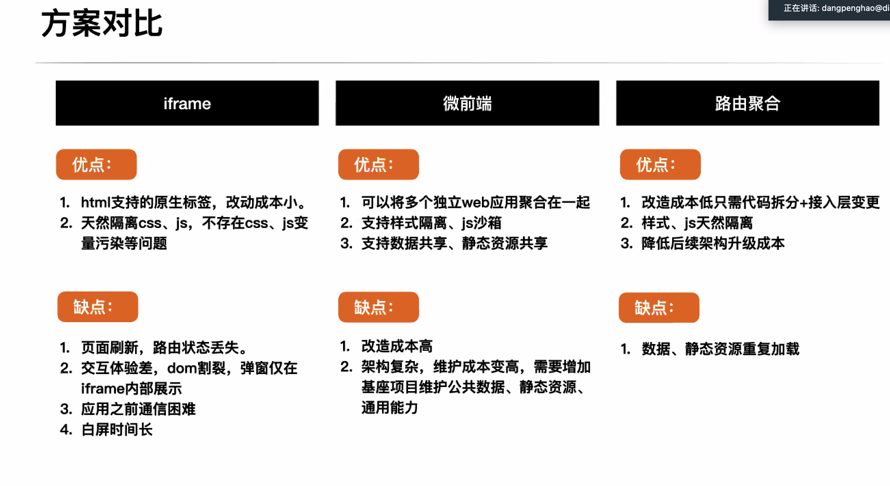

[toc]

# 总结

>项目介绍： CRM(客户关系管理系统)是管理公司潜在商户与平台商户的信息系统，主要功能包括三部分：第一部分是获取客户，建立连接，提供商家签约入驻的功能；第二部分是组织连接：主要包括权限管理，BD拜访及绩效管理功能； 第三部分为商家需求预测，主要提供商户诊断等能力。包括PC、H5。
>
>技术栈：Vue+nuxt+Vuex+Vue-router+Pebble UI+Rich UI+Formily
>
>工作和成就：
>
>1.负责CRM签约入驻模块的维护和迭代:  具体包括3个项目(PC管理端、H5移动端、商家自入驻)、 7+个国家（MX、PE等）、5+场景（主体签约、门店修改等）、32+模块、32+表单、100+表单字段的维护， 共支持了40+需求无延时交付， 沉淀10+业务与技术文档。
>
>2.负责移动端CRM系统签约流改造， 独立负责多国表单差异化方案的方案的制定、BDAPP路由层、元数据层、schema层的改造， 与RD、PM共同制定灰度方案，参与PC端CRM的签约流改造， 最终完成业务目标，支持了1000+商家修改商家类型、支持了Normal改造签约流平稳切换，减少后期多国表单维护成本 75%。
>
>3.参与商家诊断模块的开发维护：主要使用echarts将品牌、商家关注的指标呈现出来，以便于BD拜访呈现给商家，重点参与了PC端CRM的商家诊断模块框架搭建、移动端CRM的商家诊断横屏展示支持、诊断分享能力支持，目前诊断工具覆盖约50%，受到前线BD好评。
>
>4.从0-1建设品牌拜访计划工具、拜访日程管理工具，孵化周日历组件，拜访时间组件， 拜访工具使用覆盖率70%左右， 拜访日程管理功能, BD管理团队使用率接近100%。
>
>5.负责PC端CRM的js报错治理， 目前从周报错5089降低至2301，减少54.7%
>
>6.负责CRM的技术相关改造：如pebble UI组件库接入、国际化能力改造、微前端子系统改造、字体替换、翻译热更新接入、性能监控工具接入、安全验签能力接入等， 未产生技术工单。

# 主要技术点

## 1.诊断echarts

### echarts基础

#### 循环多个图表

```vue
 <div
      v-for="(item, index) in options"
      :key="'chart' + index"
      :class="['brand-chart', 'chart' + index]"
      :style="{ height: height + 'px' }"
    />
  </div>
 
 init() {
      if (this.options) {
        this.options.forEach((option, index) => {
          const chart = echarts.init(
            this.$el.querySelectorAll('.brand-chart')[index],
            null,
            { devicePixelRatio: 2 }
          )
          chart.setOption(option)
        })
      }
    },
```

#### 公共参数抽离

多个图表的配置有重复的地方，抽取出去单独配置

```js
  LegendBuilder,
  XAxisBuilder,
  YAxisBuilder,
  TitleBuilder,
  ToolTipBuilder
```

#### 其他图表

热力图是table模拟的, 然后数据分层格子映射为不同的颜色

转化率图也是根据图片画的

也有table类的图表，左边显示内容，右边画图

### 图表横屏展示

 echarts的V4.8.0及以上版本

```js
.full-screen-diagnosis-charts{
  width: calc(100vh - var(--barheight));
  height: 100vw;
  transform: rotate(90deg);
  transform-origin: left top;
  margin-left: 100vw;
  padding-left: var(--barheight);
}
```

#### 问题1：tooltip展示问题

> 问题：点击图表，展示的是上一个图表的tooltip
>
> 解决方法：先clear,  然后重新设置setOption
>
> ```
> Horinit() {
>       setTimeout(() => {
>         if (!this.charts) {
>           this.charts = echarts.init(this.$refs.wrap)
>         }
>         if (this.chartOptions) {
>           // 必须clear, 否则图表切换tooltip展示有问题
>           this.charts.clear()
>           this.charts.setOption(this.chartOptions)
>           this.charts.resize()
>         }
>       }, 0)
>     },
> ```

> 问题：tooltip要求设置在顶部， 点击图标外的区域时tooltip没有消失
>
> 解决方法： 使用dispatchAction事件， 这里使用了eventBus进行传递
>
> ```
> // 用于通知图表点击了其他区域，隐藏图表的tooltip
> closeToolTip() {
>   EventBus.$emit('handleToolTipClose', '')
> },
> 
> // 接受到点击了其他区域的消息，隐藏图表的tooltip
> EventBus.$on('handleToolTipClose', message => {
>   this.charts.dispatchAction({
>   type: 'hideTip'
>   })
> })
> ```

#### 问题2：多语言图例兼容展示

多语言时， 图例占用的底部空间不一致， 需要留出不同的空间大小

解决方法： grid进行动态配置

```js
grid: {
  top: 26,
  left: left,
  right: right,
  bottom: direction === 'vertical' ? bottom : bottomHor
},
```

待优化点： echarts能否支持动态根据内容留出图例空间

#### 问题3:  echarts的图例怎么使用直线，而不是圆圈

```
legend: LegendBuilder([
     '售罄',
      {
        name: '占比',
        icon:
          'path://M960 470.857143H64c-5.028571 0-9.142857 4.114286-9.142857 9.142857v64c0 5.028571 4.114286 9.142857 9.142857 9.142857h896c5.028571 0 9.142857-4.114286 9.142857-9.142857v-64c0-5.028571-4.114286-9.142857-9.142857-9.142857z'
      }
    ]),
```

#### 问题4：echarts无法渲染

根据id来渲染的，组件不管调用几次，id都只有一个，重复渲染组件时，发现id已经被渲染过了，就不会再进行渲染了。

解决方法：
 1、调用组件时，传入不同id，根据传入的id进行渲染
 2、在封装的组件中，不使用id进行绑定，而使用ref


### 诊断分享

将移动端的诊断页面通过whatsapp、短信发送链接给商家，商家打开链接访问

#### 问题1：分享jsbridge

> 约定jsbridge,  是使用了window下一个空间的方法
>
> (1)mounted的时候使用初始化的bridge, 配置所需的参数
>
> (2)点击分享按钮的时候， 判断是否客户端， 判断IOS和Andriod的版本是否最新版本， 都是， 再调用分享的bridge

```js
/**
 * 比较版本号大小
 * 如果 version1 > version2 返回 1，如果 version1 < version2 返回 -1，除此之外返回 0。
 */
export function compareVersion(version1, version2) {
  let v1 = version1.split('.'),
    v2 = version2.split('.')
  let index = 0
  while (index < v1.length || index < v2.length) {
    if (!v2[index]) {
      v2[index] = 0
    }
    if (!v1[index]) {
      v1[index] = 0
    }
    if (+v1[index] < +v2[index]) {
      return -1
    } else if (+v1[index] > +v2[index]) {
      return 1
    } else {
      index++
    }
  }
  return 0
}
```

后改为使用库进行版本比较

#### 问题2：商家app身份验证

商家app使用的是客户端登录，需要支持H5登录, 类似于SSO登录

#### 问题3：端之间的页面共享

方法1： 简单粗暴：登录后其他应用复制一份相同的代码（难以维护）

方法2：

## 2.签约模块重构

### 项目背景

前线业务希望能够提供商家类型转换能力、当前签约流缺失商家类型升降机制

### 问题与挑战

业务上:Normal 签约流改造范围大，存在业务稳定性挑战

技术上:Normal 改造功能拓展导致存在多国表单差异化挑战

### 解决方案

#### 多国表单差异化解决方案

方案选型： 复用当前表单方案进行改造

路由层： 

​	问题:UI 重复开发、多国方案不统一 

​	解决:实现页面组件复用、多国方案统一

schema层:

​    问题:重复性高、多国方案不统一 

​	解决:统一使用元数据库+schema 个性化配置生成最终 schema

元数据层：

​	问题:MX/BR/JP 无元数据层，难以实现 schema 多场景复用，新场景需要 重新设置完整的 schema
 	解决:所有国家表单字段 schema 抽取公共部分形成元数据，维护元数据库

#### 稳定性方案

Normal签约流改造前后端改造量大、签约入驻是商家端核心体验流程

==》

技术上:

考虑签约特殊流程场景进行提示(主体处于基础信息审核等状态)

 制定灰度方案: 按国家:针对未选择签约的商家、按标识位:针对已选择签约方式的商家

流程机制上:按照分国家、分阶段的顺序进行灰度开放

### 个人职责

+ 独立负责多国表单差异化方案的方案的制定
+ 独立负责BDAPP路由层、元数据层的改造，主体签约模块schema层改造

与代码开发

+ 与RD、PM共同制定灰度方案、独立完成BDAPP灰度方案的代码实现
+ 参与加特兰表单方案改造

### 项目收益

+ 完成业务目标:支持了1000+商家修改商家类型，解决了一店多开需要多次 签约问题，为商户升降机机制客观化、线上化提供了工具基础
+ 支持了Normal改造签约流平稳切换
+ 其他收益:提高研发效率，减少后期多国表单维护成本 75%

## 子系统微前端改造

### 背景

整个gtr的定位：国际运营工具后台， 包括面向各端运营的能力，比如签约， 面向多端的通用能力，比如财务， 基础服务模块， 比如权限角色管理， 但是目前的nginx层跳转的方式存在以下问题

+ 系统切换效率低,切换时间长，平均子系统切换时长6s
  + **切换应用需要页面reload**
  + **资源重复加载** 系统之间资源无法共享、资源重复加载
  + 重复请求userinfo
+ **基础框架能力升级成本高** 导航、侧边栏通过npm包单独维护，npm包升级需要每个子应用单独构建发布。

### 方案调研

重点考虑如何通信，如何互不影响



选择微前端方案

+ 模块化开发：将一个庞大的前端应用拆分为多个小型微应用，使得各个团队可以独立开发、测试和部署，减少了团队之间的依赖性，提升了开发效率。
+ 技术多样性：跟技术栈无关，任何前端技术栈都可以接入。
+ 独立部署和更新：一个复杂庞大的项目拆成多个微应用，单独开发、单独部署、单独测试，互不影响。
+ 渐进式迁移：在迁移遗留系统时，前端微应用提供了一种渐进式迁移的途径。你可以逐步将旧系统拆分为多个微应用，从而避免大规模重构带来的风险。
+ 原理是通过在主应用引入每个子应用的入口文件(main.js)，进行解析，并指定渲染的容器(DOM)，其次每个子应用设置打包的文件为[UMD](https://link.juejin.cn?target=https%3A%2F%2Fsegmentfault.com%2Fa%2F1190000012419990)，然后在main.js暴露(`export`)生命周期方法(`bootstrap`、`mount`，`unmount`)，然后再其`mount`进行渲染，也就是`new Vue(...)`，并在`unmount`执行`destory`。

#### iframe

+ 微应用的最简单的方案，通过 iframe 加载子应用。
+ 通信可以通过 postMessage 进行通信。
+ 完美的沙箱机制，自带应用隔离。
+ 缺点：用户体验差（弹框只能在 iframe 中、在内部切换刷新就会丢失状态）

#### web Component

+ 将前端应用程序分解为自定义 HTML 元素。
+ 基于 CustomEvent 实现通信。
+ ShadowDOM 天生的作用域隔离。
+ 缺点：浏览器支持问题，学习成本，调试困难，修改样式难等问题。

#### single-spa

+ single-spa 通过路由劫持实现应用的加载（采用 SystemJS,动态模块加载器，允许开发者在浏览器中按需加载 JavaScript 模块, 支持 ES6 模块、CommonJS、AMD 和 UMD 等多种模块格式, 其核心主要是依赖 JSONP 原理，可以跨域请求静态资源。），提供应用间公共组件加载及公共业务逻辑处理。子应用需要暴露固定的钩子 bootstrap、mount、unmount 接入协议。
+ 基于 props 主子应用间通信。
+ 无沙箱机制，需要自己实现沙箱及 CSS 沙箱。
+ 缺点：学习成本高、无沙箱机制、需要对原有的应用进行改造、子应用间相同资源重复加载问题。

#### qiankun

+ 对single-spa 进行了封装，使用更加简单直观。
+ 提供了强大的沙箱机制，确保微应用之间的隔离性。
+ 提供了完整的 API 文档和社区支持。
+ 缺点：性能问题，跨应用通信复杂，框架和库的兼容性问题，学习曲线

### 方案选型

**qiankun**

**优点：**

+ qiankun 实现了主应用加载完毕后，对其他应用进行了预加载
+ qiankun 对 single-spa 进行了封装，只需要对子应用进行一些简单修改就可以接入到子应用，但是由于是基于 single-spa 的，所以还是需要实现 bootstrap，mount，unmount 这些钩子函数的。
+ qiankun 还在 single-spa 的基础上实现了样式隔离，js 沙箱等能力。 目前 qiankun 已经被大量开发者使用，所以 qiankun 是一个比较好的微应用解决方

### 方案实现

路由页内挂载，把子应用内嵌页入使用

+ 基座开发-->注册子应用-->监听url-->加载资源-->挂载应用-->卸载应用

  

+ 子系统改造：

><1>打包编译：
>
>- 修改打包方式为umd
>- 增加导出名称为项目名
>- 打包工具通过CDN加载，且通用的带ignore表示
>- 支持跨域
>
><2>配置插件：
>
>- 增加micro-utils工具包： 里边包括公用方法，比如初始化基座， 是否是基座环境， 数据通信
>- 修改项目名称
>
><3>暴漏公共方法
>
>- 导入运行时public-path.js配置： 修改dev环境运行时public-path，保证主应用加载子应用时能正确获取静态资源
>- 获取用户信息增加是否在qiankun内环境判断：是的话使用基座的信息
>- 导出qiankun基座所需要的生命周期方法：比如子应用加载mount,卸载等
>- 导出destory方法，卸载子应用时调用，防止内存泄露
>- 修改i18n初始化流程、修改local初始化流程
>- 修改omega初始化逻辑，微前端环境导入基座omega
>- 微前端环境使用基座的request
>- 修改router初始化方式、增加路由base、路由守卫跳转增加qiankun内跳转逻辑

#### 主应用

```js
// 主应用进行注册
import  { registerMicroApps, start,initGlobalState } from 'qiankun'
registerMicroApps([
  {
    name: 'reactApp',
    entry: '//localhost:8000', // 入口
    activeRule: '/react' // 路径是/react时候启动
    container: '#container' // 挂载位置
    loader,
    props: {}
  },{
    beforeLoad(){
     xxx
    }
    beforeMount(){}
    afterMount(){}
    beforeUnmount()
    afterUnmount()
  }
])
start()
```

#### 子应用

```js
// 主应用请求子应用的bundle.js， 子应用需要支持跨域， 对vite支持不好，一般打包为umd再接入
webpack:(config)=>{
  config.output.libraryTarget = 'umd'
  config.output.library = 'm-react'  // 打包格式为umd
  return config
}
devServer:(config)=>{
  config.headers = {
    'Access-control-Allow-Origin': '*'
  }
  return config
}
```

#### css隔离方案

第一种方式：添加 experimentalStyleIsolation 属性，本质上就是给所有的样式标签增加了一个 data-qiankun="reactApp"，效果是 div[data-qiankun="reactApp"] { color: yellow; }，类似于 css-module 方式，增加属性，来进行隔离。这种方式的缺点，就是子应用中的dom元素如果挂在到了外层，会导致样式不生效。

第二种方式：添加 strictStyleIsolation 属性，shadowDOM 严格隔离。不过，如果这样的话，如果父应用想要操作子应用或者子应用操作父应用 dom，就无法实现了。qiankun 在 3.0 版本之后，也不在使用这种方式。

#### js隔离方案

Js沙箱的目的是防止应用在加载的时候对 window 造成污染，目前沙箱在 qiankun 中有三种实现方案。

+ 方案一：SnapshotSandbox

快照模式，先保留 a 应用的属性，在失活的时候，把修改的属性存起来，激活的时候再还原回来，这种方案是比较浪费性能的。因为需要不断的 window 拍照，每次修改拿快照比对。

+ 方案二：LegacySandbox

仅存储修改的或者添加的属性，不对 window 进行拍照。基于 proxy 实现的沙箱，但是目前 proxy 依然存在兼容性问题。vue 中也使用 proxy 进行代理，频繁的获取以及设置也会浪费性能。（这属于小问题，因为目前 vue3 已经在大量使用 proxy）。快照基于proxy ，只能在单例的情况下使用，同时加载两个应用就会混乱风险。

+ 方案三：ProxySandbox

采用多例实现，支持 Proxy 时，可以创建一个对象代理 window，子应用的操作都在代理 window 上。这样避免子应用污染全局变量。


### 难点

#### 页面跳转报错

1. 页面跳转时query参数需进行encodeURIComponent编码
2. 禁止使用JSON.stringfy 格式化Set 数据结构类型数据，如需请解构成普通数组，示例： JSON.stringify([...set]

### localStorage、sessionStorage应用之间的使用

因为父子应用都是同一个 window，所以 localStorage、sessionStorage、cookie, 这些方法就会造成数据覆盖问题


### 收益

时间：首页用户可交互时长减少了 **75.98** %，子系统可交互时长减少了 **70.93** %

### 个人角色

子系统接入

## 权限控制

+ 基于RBAC（role-based access control）, 是基于角色的权限控制，通过角色关联用户， 角色关联权限间接赋予用户权限
+ 进一步可以划分功能权限和数据权限， 申请角色的时候可以对应选择数据范围， 比如国家范围的数据还是城市范围的数据，这样页面将会把数据进行相应的筛选再返回

## 组件封装

组件封装的原则

组件出现3次就必须要进行封装了

封装原则

+ 单一职责

+ 明确接受参数：必选，非必选，参数尽量设置以_开头，避免变量重复

+ 可扩展：需求变动能够及时调整，不影响之前代码

+ 代码逻辑清晰

+ 封装的组件必须具有高性能，低耦合的特性


# 项目难点如何解决

## 难点1：国际化挑战

### (1)多语言造成的样式潜在问题

国际化一定要注意多语言问题，可能某些语言的情况下需要换行显示，某些语言则是显示正常的

```js
.tip-overflow {
  white-space: normal !important;
  word-break: keep-all;
}
```

### (2)快速支持换肤能力


### (3)多国表单差异化

## 难点2：历史包袱重，系统脆弱

## 难点3：多端项目差异化的要求

# 工作计划


# 存在的其他小问题

## 下载链接无法下载

点击下载的时候，谷歌浏览器闪一下，但是没有下载，还是返回了之前的页面

原因：下载链接是http， 页面是https, 也就是页面使用了混合内容

## npm 安装冲突

unable to resolve dependency tree

无法解析依赖树

```
npm i --legacy-peer-deps
该命令是解决因npm版本不兼容产生的一系列问题
```

## 文件批量上传报错

Uncaught TypeError: Cannot set properties of undefined (setting ‘status‘)

没有把所有文件上传完成就强制file-list设为了空

解决方法：可以使用absort方法强制停止上传再设置为空

## formatdata

图片上传使用的FormData

`FormData` 对象的字段类型可以是 [`Blob`](https://developer.mozilla.org/zh-CN/docs/Web/API/Blob), [`File`](https://developer.mozilla.org/zh-CN/docs/Web/API/File), 或者 string: **如果它的字段类型不是Blob也不是File，则会被转换成字符串类)。**

一个 **Blob**对象表示一个不可变的, 原始数据的类似文件对象。Blob表示的数据不一定是一个JavaScript原生格式。 [`File`](https://developer.mozilla.org/zh-CN/docs/Web/API/File) 接口基于Blob，继承 blob功能并将其扩展为支持用户系统上的文件。你可以通过 [`Blob()`](https://developer.mozilla.org/zh-CN/docs/Web/API/Blob/Blob) 构造函数创建一个Blob对象。

## package限制npm版本

engine字段限制

## 缓存问题

Window.open(url, '_blank'),  导出功能，当携带的请求参数没有发生变化的时候。发现请求没有发送到服务端， 这是浏览器缓存的原因， 可以在参数里增加一个timestamp=+new Date(), 保证每次的url都是唯一的，请求能被发送到服务端

## 大数失真

shopId的数字位数过长，数字失真

## 413上传实体过大

上传文件的ngnix配置限制了图片大小10M

## 页面突然无法加载

CDN的证书过期了

## 组件库版本升级

一定要注意breaking change
