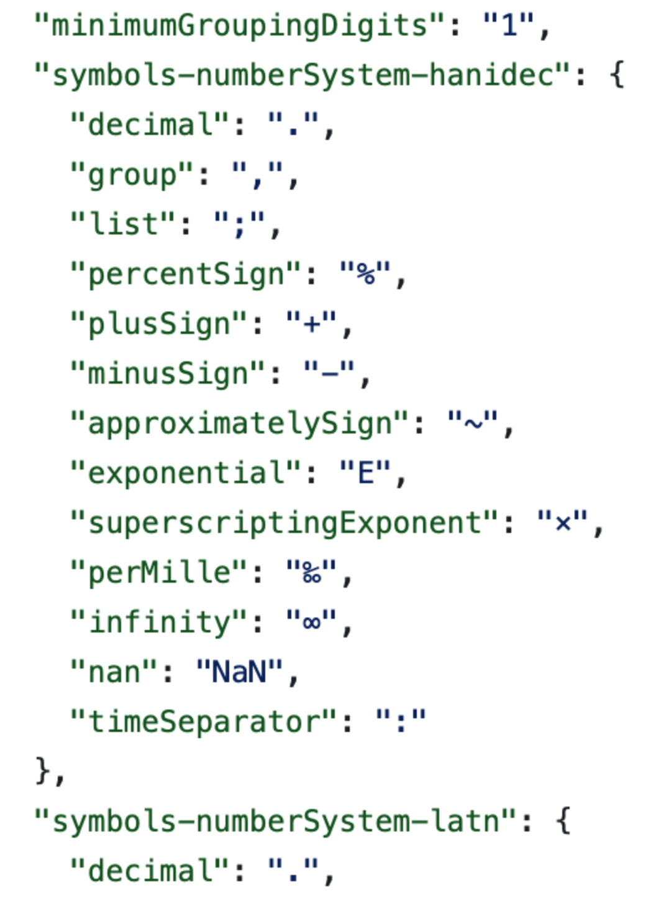
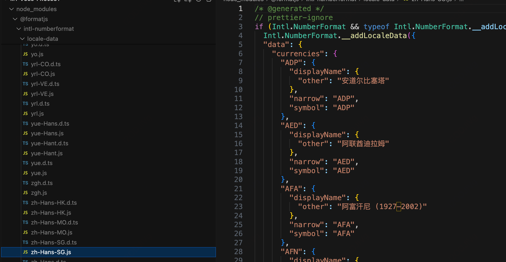

[toc]

# 国际化统一解决方案-FE **Elvish**推广使用

## 项目介绍

国际化包括地区与语言环境（locale和lang）、文字（文字翻译和书写方向）、文化（颜色主题、名字称谓、电话号码、货币、度量衡）、书写习惯（日期与时间格式、时区与夏令时、数字）等， 其中频率较高的时间货币格式化存在一些问题： 格式化结果错误、不统一等， 所以推进了国际化统一方案Elvish的推广和使用， 国际化外卖场景涉及到 i18n 各问题域的处理，如时间、货币、度量衡等，但是 当前的处理存在一些问题，需要进行统一的改造处理。

## 问题

+ 外卖侧 FE 解决国际化问题方案不统一： 
  + 存在 6+SDK，且每个项目存在引入多 个 SDK 包、包版本不一致等问题
  + FE 项目内存在自定义方法解决国际化问题:比如:项目内存在货 币硬编码问题、项目内基于 SDK 或原生方法自定义封装方法解决 国际化问题
+ 当前方案对国际化能力支持不足
  + 当前SDK只能单一解决国际化某一问题域，比如@didi/i18n-util-v2 只能解决时间问题
  + 当前方案存在转换结果错误的问题
  + 当前方案存在格式化结果不规范的问题
  + 当前方案完全依赖于后端时区数据库，令时切换曾导致线上问题
+ 前后端转换结果不一致
  + 前后端使用方案不一致，导致前后端对时间、货币转换格式不同， 影响用户体验

## 挑战

+ 如何将当前方案改造为标准化方案
+ 如何保证标准化方案的推广落地:外卖侧共存在28+个FE项目需要改 造，如何保证标准化方案的推广落地是另一个存在的挑战

## 解决方案

+ 制定标准替换方案
  + 确认标准化方案为**elvish**
  + **制定 **elvish 替换方案： elvish 接入编码指南
  + 制定elvish改造稳定性方案：改造量大、无法灰度、

+ **elvish**推广落地方案
  + 确认改造范围项目
  + 确认项目内改造项:开发代码扫描工具
  + 确定推广落地节奏以及对应负责人
  + 解决各项目替换过程出现的问题
  + 保证各项目改造效果

## 个人职责

+ 外卖FE Elvish改造专项核心研发
+ elvish共建者
+ 项目改造负责人

## 项目收益

+ 形成外卖侧国际化问题域标准处理方案，消除旧SDK维护成本
+ 外卖侧前端elvish改造落地100%
+ 其他收益:时间货币展示更加符合当地习惯，提升用户体验

# 时区数据库介绍

## json格式

https://github.com/unicode-org/icu-data/blob/main/tzdata/icunew/2019c/44/zoneinfo64.txt

夏令时新闻： 【原始新闻】https://github.com/eggert/tz/blob/main/NEWS

以巴西为例

```js
/* America/Sao_Paulo */ :table {
trans:intvector { -1767214412, -1206957600, -1191362400, -1175374800, -1159826400, -633819600, -622069200, -602283600, -591832800, -570747600, -560210400, -539125200, -531352800, -195426000, -184197600, -155163600, -150069600, -128898000, -121125600, -99954000, -89589600, -68418000, -57967200, 499748400, 511236000, 530593200, 540266400, 562129200, 571197600, 592974000, 602042400, 624423600, 634701600, 656478000, 666756000, 687927600, 697600800, 719982000, 728445600, 750826800, 761709600, 782276400, 793159200, 813726000, 824004000, 844570800, 856058400, 876106800, 888717600, 908074800, 919562400, 938919600, 951616800, 970974000, 982461600, 1003028400, 1013911200, 1036292400, 1045360800, 1066532400, 1076810400, 1099364400, 1108864800, 1129431600, 1140314400, 1162695600, 1172368800, 1192330800, 1203213600, 1224385200, 1234663200, 1255834800, 1266717600, 1287284400, 1298167200, 1318734000, 1330221600, 1350788400, 1361066400, 1382238000, 1392516000, 1413687600, 1424570400, 1445137200, 1456020000, 1476586800, 1487469600, 1508036400, 1518919200, 1541300400, 1550368800 }
    typeOffsets:intvector { -11188, 0, -10800, 0, -10800, 3600 }
    typeMap:bin { "01020102010201020102010201020102010201020102010201020102010201020102010201020102010201020102010201020102010201020102010201020102010201020102010201020102010201020102010201020102010201" }
    links:intvector { 202, 372, 376 }
  } //Z#202
```

+ trans 表示时间戳
+ typeOffsets表示时间时区偏移，两两一组，比如[-10800, 0]表示时间偏移为-10800+0，也就是utf-3
+ typeMap：表示时间戳到时间区间的映射，比如时间戳在[ -1767214412, -1206957600]之间，也就是位置为0，此时typeMap位置为0的值为0，也就是对应于typeOffsets的第0组，也就是【-11188, 0】，从0开始计数，其他类似

## 夏令时

比如进入夏令时（从01:59:59直接变更到03:00:00）， 那么2点半是不存在的时间字符串

结束夏令时（从02:59:59直接变更到02:00:00）， 那么2点半会出现2次

> 如果是不存在的时间字符串，ICU默认解析为后1个小时， 比如2点半不存在则解析为3点半对应的时间戳
>
> elvish会把不存在的时间字符串解析为错误的时间戳， 和momentjs的处理一直

>如果是对应两个时间戳，ICU默认解析为后一次出现的时间戳
>
>Elvish如果是西时区，解析为前一次出现的时间戳，都则取后一次出现的时间戳

## zdump格式

format.js里， 使用的时候可以允许自定义时区数据库格式

```JS
import '@formatjs/intl-datetimeformat/add-all-tz' // Add ALL tz data

if ('DateTimeFormat' in Intl && Intl.DateTimeFormat.__addTZData) {
  Intl.DateTimeFormat.__addTZData
```

### add-all-tz文件怎么生成的

formatjs-main/packages/intl-datetimeformat/BUILD文件里

><1>构建 Docker 容器以编译指定版本的 tzcode 和 tzdata, tzdata是时区信息的数据库，tzcode是时区的一些命令和用于生成时区数据库的工具。https://www.iana.org/time-zones
>
><2>针对tz_data.tar.gz文件使用zic工具对"backward","africa", "antarctica", "asia","australasia", "etcetera", "europe", "northamerica", "southamerica",文件做编译
>
><3> 对于africa文件，里边包含非洲地区的很多时区的时区信息， 创建一个zump目录， 创建africa文件夹，然后对于它内部的每个时区创建一个文件，里边包含这个时区的时区信息
>
><4>使用生成的时区文件， 进行操作，生成包含abbrvs、offsets、zones格式的文件


### backward文件

指定了旧的时区名称和新的时区名称之间的对应关系。

```js
# Link	TARGET			LINK-NAME	#= TARGET1
Link	Australia/Sydney	Australia/ACT	#= Australia/Canberra

TARGET 是当前时区的名称，LINK-NAME 是旧时区的名称
#= TARGET1: 这个注释说明了这个链接是为了兼容某些解析器的问题。
```

#### africa

关于非洲地区时区数据，以及一些非洲地区时区缩写, `EAT`（东非时间）已经被接受并在当前时间戳中使用，但其他缩写较为罕见且仅在过去的时间戳中使用。

```
+00 GMT: 表示格林威治标准时间。
+02 CAT: 表示中非时间（Central Africa Time）。
+02 SAST: 表示南非标准时间（South Africa Standard Time）。
+01 WAT: 表示西非时间（West Africa Time）。
+02 WAST: 表示西非夏令时（West Africa Summer Time）。
+03 CAST: 表示中非夏令时（Central Africa Summer Time）。
+03 SAST: 表示南非夏令时（South Africa Summer Time）。
+03 EAT: 表示东非时间（East Africa Time）。
```

以下为一个时区信息的示例

```js
# Algeria
# Rule	NAME	FROM	TO	-	IN	ON	AT	SAVE	LETTER/S
Rule	Algeria	1916	only	-	Jun	14	23:00s	1:00	S
Rule	Algeria	1916	1919	-	Oct	Sun>=1	23:00s	0	-

第一行规定了在 1916 年 6 月 14 日，23:00 时（夏令时结束时），要将时钟向前调整 1 小时（SAVE 列为 1:00）。第二行规定了在 1916 年到 1919 年的每年 10 月的第一个星期日，23:00 时（夏令时结束时），要将时钟向后调整 1 小时（SAVE 列为 0）。
```

#### 最终时区信息

```js
{
  "abbrvs": "LMT|GMT|+0230|EAT|+0245|PMT|WET|WEST|CET|CEST|...
  "offsets": "-qw|0|6tg|6y0|8c0|7n0|kc|fl|2s0|5k0|...,
  "zones": [
    "Africa/Accra|,0,0,0|-u9rgl5,0,0,0|-u9rgl4,1,1,0|NaN,1,1,0",
    "Africa/Addis_Ababa|,0,2,0|-w6p5hh,0,2,0|-w6p5hg,2,3,0|-lnsey1,2,3,0|-lnsey0,3,4,0|-kvcdo1,3,4,0|-kvcdo0,2,3,0|-h80ka1,2,3,0|-h80ka0,4,5,0|-eb6ib1,4,5,0|-eb6ib0,3,4,0|NaN,3,4,0",
    
abbrvs: 时区缩写的字符串，以 | 分隔不同的时区缩写。
offsets: 时区偏移量的字符串，以 | 分隔不同的偏移量。
zones: 时区规则的数组，每个元素表示一个时区的规则，格式为 "时区名|abbrvIndex， offsetIndex，dst|"。每个过渡日期和时间表示了该时区在该日期和时间发生的偏移变化。
    
```


# CLDR

**https://cldr.unicode.org/index/downloads#h.nosb01ot1guy**

Unicode通用语言环境数据存储库（CLDR）为支持世界语言的软件提供了关键构建块，提供了最大、最广泛的语言环境数据标准存储库。这些数据被广泛的公司用于软件国际化和本地化，使软件适应不同语言的约定，以完成此类常见的软件任务。它包括：

>特定于语言环境的格式化和解析模式：日期、时间、时区、数字和货币值、度量单位，…
>
>名称的翻译：语言、脚本、国家和地区、货币、时代、月份、工作日、日周期、时区、城市和时间单位、表情符号和序列（以及搜索关键字），…
>
>语言和脚本信息：使用的字符；复数情况；名单的性别；资本化；排序和搜索规则；写作指导；音译规则；拼写数字的规则；将文本分割成字母、单词和句子的规则；键盘布局…
>
>国家信息：语言使用、货币信息、日历偏好、周惯例等，…

CLDR使用UTS#35提供的XML格式：Unicode语言环境数据标记语言（LDML）。LDML是一种格式，不仅用于CLDR，还用于通用的语言环境数据交换，例如在.NET.

2011年，委员会批准了一项标准化JSON格式规范，可用于表示LDML数据。我们希望，通过标准化格式，基于Javascript的应用程序将更容易以这种格式共享和交换数据, 比如：json的数字中文

https://github.com/unicode-org/cldr-json/blob/main/cldr-json/cldr-numbers-full/main/zh/numbers.json



## formatjs

引用的时候要引用对应地区的cldr

```
import '@formatjs/intl-numberformat/polyfill'
import '@formatjs/intl-numberformat/locale-data/en' // locale-data for en
```

使用内部方法_addLocaleData



>1.extract-currencies文件从cldr的https://github.com/unicode-org/cldr-json/blob/main/cldr-json/cldr-numbers-full/main/pt-MZ/currencies.json里提取货币信息
>
>+ **displayName：** 这是用于显示货币名称的通用规则。它指定了货币在不考虑数量的情况下的显示方式。通常情况下，它表示的是货币的常规名称。
>+ **displayName-count-one：** 这是用于显示货币名称的特定规则，当数量为单数时使用。例如，在某些语言中，当数量为 1 时，可能会使用不同的货币名称形式。这个属性允许根据数量的不同而显示不同的货币名称。
>+ displayName-count-other： 这是用于显示货币名称的特定规则，当数量不为单数时使用。它表示了除了单数之外的所有其他数量的显示方式。通常情况下，这个规则会覆盖 `displayName` 规则，用于显示大部分情况下的货币名称。
>+ **symbol：** 这个属性表示货币的常规符号。通常情况下，它是货币的标准符号，用于在数字前面表示货币的金额。在你的示例中，"EC$" 就是东加勒比元的标准货币符号。
>+ **symbol-alt-narrow：** 这个属性表示货币的替代符号，通常是一个窄型的符号，用于在有限的空间内显示货币的金额。这个符号可能比较短小，以适应较小的显示区域。在你的示例中，"$" 就是东加勒比元的窄型货币符号。

```
    "numbers": {
      "currency": {
        "latn": {
          "accounting": "¤#,##0.00;(¤#,##0.00)",
          "currencySpacing": {
            "afterInsertBetween": " ",
            "beforeInsertBetween": " "
          },
          "short": {
            "1000": {
              "other": "0"
            },
            "10000": {
              "other": "¤0万"
            },
            ,,,
          },
          "standard": "¤#,##0.00",
          "unitPattern": "{0}{1}"
        }
      },
```

>- **accounting：** 这个属性定义了货币的会计格式。格式为 `"positive;negative"`，表示正数和负数的显示格式。在这个示例中，`"¤#,##0.00;(¤#,##0.00)"` 表示正数和负数分别以带有货币符号和千位分隔符的方式显示，并且负数用括号括起来。
>- **currencySpacing：** 这个属性定义了货币符号和数字之间的间隔。`"afterInsertBetween"` 和 `"beforeInsertBetween"` 分别表示在数字和货币符号之间插入的字符。在这个示例中，它们都是空格。
>- **short：** 这个属性定义了短格式下各数量级别的显示方式。在这个示例中，以万（10^4）、亿（10^8）等为单位，每个数量级别都定义了 `other` 规则，表示其他情况下的显示方式。例如，"10000" 对应的显示方式是 `"¤0万"`，表示一万；"100000" 对应的显示方式是 `"¤00万"`，表示一百万，以此类推。
>- **standard：** 这个属性定义了标准格式下的货币显示方式。在这个示例中，格式为 `"¤#,##0.00"`，表示以带有货币符号、千位分隔符和两位小数的方式显示。
>- **unitPattern：** 这个属性定义了货币单位的显示模式。`{0}` 表示货币符号，`{1}` 表示货币金额。在这个示例中，表示将货币符号和金额拼接在一起显示。


# RTL方案

## 概述

从右向左（RTL）阅读的语言，例如阿拉伯语和希伯来语，其 UI 应该被镜像，以确保内容易于理解。

RTL包含的内容：

+ 文本
+ 布局
+ 图标

## 调研

|                 | ant design（V4）                                             | ant design（V5）                                             | arco design                                                  | bootstrap                                                    | material-ui                                                  |
| :-------------- | :----------------------------------------------------------- | :----------------------------------------------------------- | :----------------------------------------------------------- | :----------------------------------------------------------- | :----------------------------------------------------------- |
| 出品公司        | 蚂蚁金服                                                     | 蚂蚁金服                                                     | 字节跳动                                                     | Twitter                                                      | Google                                                       |
| 官网            | https://ant-design.antgroup.com/components/config-provider-cn | https://ant-design.antgroup.com/components/config-provider-cn | https://arco.design/react/docs/i18n                          | https://v5.bootcss.com/docs/getting-started/rtl/             | https://v4.mui.com/zh/guides/right-to-left/                  |
| 实现RTL方法概述 | 定义组件ConfigProvider， 允许传入direction组件内部获取direction的值， 组件上添加对应的类名单独为组件添加rtl下的样式 | 定义组件ConfigProvider， 允许传入direction组件内部获取direction的值， 组件上添加对应的类名采用cssinjs方案，直接修改原有css为采用css逻辑属性， 配合降级方案兼容低版本浏览器实现(V5) | 定义组件ConfigProvider， 允许传入direction组件内部获取direction的值， 组件上添加对应的类名单独为组件添加rtl下的样式 | 实验性质的功能V5.3版本才提供1.使用时必须在html元素上添加dir="rtl", 或者添加lang="ar"2. 必须引入有rtl的css样式文件 | 1.body上必须设置dir="rtl"。 避免本地开发的组件出现问题2.传入direction配置3.依赖jss-rtl插件实现样式翻转 |
| 优点            | 不依赖其他插件, 内置RTL功能可读性高                          | 便于维护可读性高                                             | 不依赖其他插件， 内置RTL功能                                 | 简单开发效率高，无需额外大量添加rtl布局的css代码 可读性较低  | 维护简单，只需编写一套样式，插件会根据需要进行翻转工作量小， 减少潜在的错误 |
| 缺点            | 改造工作量大， 每个组件都需要做改造， 容易出错可维护性高增加额外rtl样式代码大小 | 改造工作量大， 几乎每个组件都需要做改造某些css属性没有对应的逻辑属性的时候，需要单独对RTL布局定义浏览器对css逻辑属性支持性差，需要使用降级方案 | 改造工作量大， 每个组件都需要做改造，容易出错增加额外rtl样式代码大小 | html直接设置dir="rtl", 会影响外部项目文字排列和布局依赖rtlcss插件生成rtl下的样式，存在多套主题色时需要生成多套对应的rtl样式css库 | 需要基于css in js模式编写，仅适合jsx语法开发较为复杂， 可读性差运行耗时，有性能代价 |

总体来看， 这些组件库实现方式有以下几种

- 单独为rtl下重写或者覆写样式
- 借助工具rtlcss、jss-rtl等插件直接进行转化
- 使用css逻辑属性

基于可读性高、便于维护、浏览器兼容性好等要求， 采用单独为rtl下重写或者覆写样式的方式

## 实现方法

- **初始化传入direction属性**：在组件库初始化的时候传入direction方向
- 组件改造：
  - pebble新增css样式类做兼容
  - pebble组件针对js或者style属性做单独处理

### 组件库改造

新建src/direction/index.js文件(参考vue locale的方法）

```js
let defaultDirection = 'LTR';
let pbDirection = '';
 
export const setDirection = function(dir) {
  pbDirection = dir || defaultDirection;
}
 
export const getDirection = function(dir) {
  return pbDirection
}
export const isRTL = function() {
  return pbDirection === 'RTL';
};
 
export default { setDirection, getDirection, isRTL };
```

### 组件库组件改造

```js
1.组件引入isRTL方法

import { isRTL } from 'xxx';
methods: {
  isRTL,
}

2.组件css改造

（1）组件最外层添加css样式
<button
    class="pb-button"
    :class="[
      xxx
      isRTL() ? 'pb-button-rtl' : '',
    ]"
  >
 
（2）引入rtl样式
@import "./theme-chalk-rtl/button__rtl.scss"  
 
 (3)rtl样式
@include b(button) {
  &-rtl {
    direction: rtl;
  }
}

3.组件的style和js兼容
// tabs组件内部
const horizontalDir = sizeDir === 'x' && isRTL();
// form-item
const marginStart = isRTL() ? 'marginRight' : 'marginLeft';
```

### 使用组件方改造

src/index.js入口改造

```js
const install = function(Vue, opts = {}) {
  locale.use(opts.locale);
  locale.i18n(opts.i18n);
  direction.setDirection(opts.pbDirection);
xxxx


import direction from 'element-ui/lib/direction'
direction.use('RTL')
```


# Elvish介绍

https://www.unicode.org/reports/tr35/tr35-numbers.html

## 初始化

>+ 传入country兼容，格式不对将传入的当做config,country当做没有
>+ locale兼容，locale与country不符时操作
>+ 格式兼容，改为短横线
>+ 如果采用线上形式，就从appolo获取json文件，否则就直接使用线下的模式
>+ 缓存检测localstorage

## 货币格式化

>+ 货币值转化/100
>+ 检查locale，country，是否经过了初始化
>+ 获取货币格式"$ ###,##0.00"
>+ 如果模板有两位小数，对0进行处理为0.00，再num.toLocaleString转换为字符串
>+ 如果模板没有小数，四舍五入处理，再num.toLocaleString转换为字符串
>+ 正负号处理
>+ 读取分隔符，处理千分位和小数位进行替换
>+ 如果是不支持的国家模板，那么就先对蝌蚪文进行处理，然后再直接使用Intl.NumberFormat转换

## 时间格式化


### 时间骨架介绍

CU：使用CLDR规定的日期字段符号表

ICU文档说明：https://unicode-org.github.io/icu/userguide/format_parse/datetime/

CLDR文档说明：https://www.unicode.org/reports/tr35/tr35-dates.html#Date_Field_Symbol_Table

ICU并没有提供对每个国家限定的时间格式化，而是开放了一个可编程接口，可用于生成多种格式的格式化日期和时间。格式包括几乎所有最常见的格式。

`yyyy` is ordinary calendar year.

`YYYY` is week-based calendar year.“将这一年中第一周的周日当作今年的第一天”.因此有时结果和yyyy相同，有时就会不同

### 格式化原理

>+ 根据传入的时间戳获取时间偏移
>+ 获取传入的想要格式化为的格式
>+ 通过new Date()的getMonth()等获取到时间的日、秒等信息
>+ 通过时间模板（例如dd/MM/yyyy），把对应每个字母根据时间戳和格式模板进行替换，获取最终想要的格式

### new Date的主要方法

传入标准的时间戳，利用new Date()的时候，会自动调用格式化为浏览器时区的时间,Date构造函数会自己算一次偏移量

+ getHours、getMinutes、getSeconds

  >getHours根据本地时间返回时间的小时字段：

+ getMonth()

  >可返回表示月份的数字。
  >
  >+ 返回值是 0（一月） 到 11（十二月） 之间的一个整数。

+ getDate()

  >获取时间对象里面的 日期信息, 值为1到31

+ getDay()

  >可返回一周（0~6）的某一天的数字
  >
  >星期天为 0, 星期一为 1, 以此类推

+ getFullYear()

  >获取时间对象里面的 年份信息

+ setHours()

  >用于将小时设置为具有有效小时值(介于00到23之间)的Date对象
  >
  >大于23的小时值将从开始的小时值(0)开始被截断，例如，我们将26设置为小时值，它将被截断为2。

+ setMonth()

  >该值介于 0（一月） ~ 11（十二月） 之间：
  >
  >-1 为去年的最后一个月
  >
  >12 为明年的第一个月

+ setDay()

  >表示月的某一天的数值
  >
  >+ 该值介于 1 ~ 31 之间（以本地时间计）
  >+ 0 为上个月的最后一天
  >+ -1 为上个月的最后一天之前的一天

### getTimezoneOffset() 

返回格林威治时间和本地时间之间的时差, 以分钟为单位, 如果时区为 GMT+2, 将返回-120 

```
var d = new Date()
var n = d.getTimezoneOffset();
```

### 时间表示

例子：比如想在当前浏览器上显示秘鲁的时间

Timestamp = 当前标准时间戳 + （时区数据库获取的格林尼治到秘鲁时间差） +  （getTimezoneOffset获取到的格林尼治到北京时间时间差）

然后 new Date(Timestamp),new Date内部会自动减去（格林尼治到北京时间时间差），这样最终拿到的是秘鲁的当地时间

### 获取零点信息

例子：想要获取秘鲁的零点信息

通过setHours(0, 0, 0, 0)将时间设置为0点

+new Date()得到北京零点的时间戳

秘鲁零点时间戳 = 北京0点时间戳-（格林尼治与秘鲁时间差）-（格林尼治与北京时间差）

### Date UTC()

返回指定日期与 1970 年 1 月 1 日午夜之间的毫秒数：

```
var d = Date.UTC(2012, 02, 30);
```

### 获取一年起始时间

```js
let start = new Date();
start.setDate(1)
start.setMonth(0)
start.setHours(0, 0, 0, 0);
console.log('start', start)
Sat Jan 01 2022 00:00:00 GMT+0800 (中国标准时间)
```

```js
let end = new Date();
end.setMonth(12); //12为明年第一个月
end.setDate(0);   //0为上个月最后一天
end.setHours(23, 59, 59, 0);
//Sat Dec 31 2022 23:59:59 GMT+0800 (中国标准时间)
```

同理：获取一个月起始时间

```js
起：setDate, setHours
止：当前月的下一个月，上个月最后一天，setHours, 这样可以避免上个月31天、29天的差异
本月最后一天 === 下个月第 0 天

//获取当前月开始时间， 设为这个月第一天
let currentDate = new Date();
currentDate.setDate(1)
currentDate.setHours(0, 0, 0, 0);
let start = +new Date(currentDate);
//获取当前月结束时间，设为
//改为下个月第一天
//改为上个月最后一天（setDate正常取值1-31， 0表示上个月最后一天）
// 改为当前月最后一天13:59:59
currentDate.setMonth(current.getMonth() + 1);
cucurrentDaterrent.setDate(0);
currentDate.setHours(23, 59, 59, 0);
let end = +new Date(currentDate);
```

### 获取一周的起始

```
始：date.getDate() - date.getDay()
终：current.getDate() + (6 - current.getDay())
```

### 获取浏览器所在时区

```
Intl.DateTimeFormat().resolvedOptions().timeZone
```

## 问题总结

### (1)ios出现Nan-na-na问题

```
> new Date('2017-08-12 23:00:00')
< Invalid Date  = $1
> new Date('2017/08/12 23:00:00')
< Sat Aug 12 2017 23:00:00 GMT+0800 (CST)
```

解决：使用斜杠

### (2)获取上个月第一天

参考： https://blog.csdn.net/jingjingchen1014/article/details/102842413

T.setMonth(M)方法，即计算时间T的日期在M月上的映射，如果有多的就累加。如果T为10月31号，M为9月，即获取9月的31号，而9月没有31号，就会累加，得到的日期为10月1号。 如果M为8月，8月刚好有31号，即获取时间为8月31号

```
比如：
 new Date(new Date("2021-10-31").setMonth(new Date("2021-10-31").getMonth()-1)))
 希望得到上个月的今天，9月31号，但是9月没有31天，自动转换为了10月1号， 但是得到的是 Fri Oct 01 2021 08:00:00 GMT+0800 (中国标准时间)
```

### (3)unsupported time zone specified undefined

tolocalestring兼容问题

### (4)使用场景不合适

产品设计问题

### (5) elvish加载失败

改用CDN链接

# toLocaleString()

+ dateObj.toLocaleString([locales[, options]])

  ```js
  let time = new Date();
  time.toLocaleString('es-PE', { month: 'short' })
  //结果：Oct.
  time.toLocaleString('es-MX', { weekday: 'short' })
  //结果：lun
  ```

+ Number.toLocaleString()

# `Intl` 

2012 年 12 月，ECMA International 发布了标准 ECMA-402 的第一版，更广为人知的是*ECMAScript Internationalization API*。该规范提供了框架，为 ECMAScript 实现带来了迟来的本地化方法。

`Intl`对象是 ECMAScript 国际化 API 的一个命名空间，它提供了精确的字符串对比、数字格式化，和日期时间格式化。

`locales` 参数必须是一个 [BCP 47 语言标记](http://tools.ietf.org/html/rfc5646)的字符串，或者是一个包括多个语言标记的数组。如果 `locales` 参数未提供或者是 undefined，便会使用运行时默认的 locale。一个 BCP 47 语言标记代表了一种语言或者区域（两者没有很大的区别）。在其最常见的格式中，它以这样的顺序囊括了这些内容：语言代码，脚本代码，和国家代码，全部由连字符分隔开。例如：en-US、zh-CN。

https://developer.mozilla.org/zh-CN/docs/Web/JavaScript/Reference/Global_Objects/Intl/NumberFormat

+ 优点：在速度和体积上均表现最佳。速度，因为它是本机编译代码，比库中解释的 JavaScript 代码运行得更快。而且不需要额外的 JavaScript 或资源加载即可执行。
+ **缺点：**
  - 有限的浏览器支持（目标客户端可能不支持它）。
  - 缺乏资源加载机制（某些语言环境可能在客户端上不可用）。
  - 不一致。不同的浏览器可能会给出不同的结果。

# formatjs

https://data.iana.org/time-zones/releases/ 拉取最新的时区信息
https://data.iana.org/time-zones/tz-link.html

New TimeZones or renames of TimeZones are not updated using the Bazel script. You need to manually update `index.bzl`.

cldr-dates-full


# vue-i18n

## 基础使用方法：

```js
// 准备翻译的语言环境信息
const messages = {
  en: {
    message: {
      hello: 'hello world'
    }
  },
  ja: {
    message: {
      hello: 'こんにちは、世界'
    }
  }
}

// 方法1：通过选项创建 VueI18n 实例
const i18n = new VueI18n({
  locale: 'ja', // 设置地区
  messages, // 设置地区信息
})

// 通过 `i18n` 选项创建 Vue 实例
new Vue({ i18n }).$mount('#app')


// 方法2： 通过模块化
import Vue from 'vue'
import VueI18n from 'vue-i18n'
Vue.use(VueI18n)
```

主要工作：

+ 创建VueI18n对象，指定语言和资源
+ 作为插件挂到全局Vue上

==》VueI18n做了什么， 怎么挂载到全局vue上

## VueI18n对象

文件位置： 入口文件src/index， 导出了VueI18n

 new VueI18n， 并且内部创建了this._vm = new Vue()对象

```js
export default class VueI18n {
  xxxxxxx
  constructor (options: I18nOptions = {}) {
    // 初始化，如果有全局Vue，则传入window.Vue，自动去安装
    if (!Vue && typeof window !== 'undefined' && window.Vue) {
      install(window.Vue)
    }
    xxxxxxx
    // 实例化一个vue对象，将传入的参数变成vue中的响应式数据，大部分vue的插件都使用这种做法，比如vuex
    //  this._vm = new Vue({ data })
    this._initVM({
      locale,
      fallbackLocale,
      messages,
      dateTimeFormats,
      numberFormats
     })
  }
// 在constructor里声明实例方法和在class里声明方法，前者的方法是挂在了实例上，后者的方法是挂在了prototype上

// VueI18n对象上暴露出去的方法、属性，都关联于this._initVM这个方法里创建的Vue对象(this._vm)
getLocaleMessage (locale: Locale): LocaleMessageObject {
    return looseClone(this._vm.messages[locale] || {})
 }
// VueI18n监听自己的数据对象$data(是个深度监听，即deep为true，常见的修改就是动态改变了语言设置locale了)，如果发生了改变，就通知到各个Vue实例去强制更新(调用的是$forceUpdate())
watchI18nData (): Function {
     const self = this
     return this._vm.$watch('$data', () => {
       let i = self._dataListeners.length
       while (i--) {
         Vue.nextTick(() => {
           self._dataListeners[i] && self._dataListeners[i].$forceUpdate()
         })
       }
     }, { deep: true })
 }
  
}

VueI18n.install = install
```

## install 绑定在全局Vue上

文件位置：src/install

```js
export function install (_Vue, options = { bridge: false }) {
  Vue = _Vue
  // 判断是否安装过
  // 判断版本
  // 对全局Vue做了扩展，新增了方法，在extend.js里
  extend(Vue)
  // 将一个混入对象应用到全局Vue上, Vue.mixin() 是全局注册混入对象，影响之后创建的所有 vue 实例
  Vue.mixin(defineMixin(options.bridge))
  // 注册一个t的自定义指令
  Vue.directive('t', { bind, update, unbind })
  // 注册Vue组件
  Vue.component(interpolationComponent.name,   interpolationComponent)
  Vue.component(numberComponent.name, numberComponent)
  // 合并Vue 实例的 i18n 选项。具体来说，如果子组件有定义 i18n 选项，则使用子组件的值，否则使用父组件的值。
  const strats = Vue.config.optionMergeStrategies
  strats.i18n = function (parentVal, childVal) {
    return childVal === undefined
      ? parentVal
      : childVal
  }
}
```

## extend.js

把vueI18n创建的this._vm上的方法绑定在全局Vue上

```js
// 代理的线路是VueI18n创建的Vue对象 → VueI18n对象(.vm) → 全局Vue对象(.[$]i18n)。
export default function extend (Vue: any): void {
  // Vue实例原型上加上$i18n属性，使用的时候调用this._i18n， 也就是vue.prototype._i18n 
  if (!Vue.prototype.hasOwnProperty('$i18n')) {
    Object.defineProperty(Vue.prototype, '$i18n', {
      get () { return this._i18n }
    })
  }

  // 在Vue实例上添加$t方法，实际上调用的是Vue.$i18n.$t, 也就是Vuei18n._i18n.$t
  // 在 Vue 的原型中挂载 $t 方法，这是我们为什么能够直接在模板中使用的原因
// 把 VueI18n 对象实例的方法都注入到 Vue 实例上
  Vue.prototype.$t = function (key: Path, ...values: any): TranslateResult {
    const i18n = this.$i18n
    return i18n._t(key, i18n.locale, i18n._getMessages(), this, ...values)
  }
 // 同理$tc,$te,$d,$n
}

```

// 其中，所用到的_t在new VueI18n()的时候定义了

```js
_t (key: Path, _locale: Locale, messages: LocaleMessages, host: any, ...values: any): any {
  if (!key) { return '' }
  const parsedArgs = parseArgs(...values)
  // 如果 escapeParameterHtml 被配置为 true，那么插值参数将在转换消息之前被转义。
  if(this._escapeParameterHtml) {
    parsedArgs.params = escapeParams(parsedArgs.params)
  }
  const locale: Locale = parsedArgs.locale || _locale
  // 翻译
  let ret: any = this._translate(
    messages, locale, this.fallbackLocale, key,
    host, 'string', parsedArgs.params
  )
}

//  _translate
_translate (){
   ...this._interpolate(step, messages[step], key, host, interpolateMode, args, [key])
}

// _interpolate
this._render(ret, interpolateMode, values, key)

// _render, 可以调用自定义方法去处理插值对象，或者是默认的方法处理插值对象。
_render () {
   // 默认的插值对象
    ret = defaultFormatter.interpolate(message, values, 
}
                                       
// defaultFormatter
export default class BaseFormatter {
  // 实现缓存效果
  _caches: { [key: string]: Array<Token> }

  constructor () {
    this._caches = Object.create(null)
  }

  interpolate (message: string, values: any): Array<any> {
    // 没有插值对象的话，就直接返回
    if (!values) {
      return [message]
    }
    // 如果存在 tokens，则组装值返回
    let tokens: Array<Token> = this._caches[message]
    if (!tokens) {
      // 没有存在 tokens，则拆分 tokens
      tokens = parse(message)
      this._caches[message] = tokens
    }
    return compile(tokens, values)
  }
}
```


以下为一个示例：

```
<p>{{ $t('message.sayHi', { name: 'Gopal' })}}</p>
```

主要涉及两个方法，我们先来看 parse，代码比较直观，可以看到本质上是遍历字符串，然后遇到有 {} 包裹的，把其中的内容附上类型拿出来放入到 tokens 里返回。

```
if (char === '{') {
      if (text) {
        tokens.push({ type: 'text', value: text })
      }
      
// 结果
[
    {
        "type": "text",
        "value": "hi, I am "
    },
    {
        "value": "name",
        "type": "named"
    }
]
```

还有 parse，就是将上述的组装起来

```
最后返回 ["hi, I am ", "Gopal"]
```

## mixin

文件位置： src/mixin

```js
export default function defineMixin (bridge: boolean = false) {
  function mounted (): void {
    XXX
    }
  }
  return bridge
    ? { mounted } 
    : { 
    beforeCreate (): void {
    // 把_i18n和_i18nWatcher都准备好, 考虑多种场景, new Vue({ i18n }).$mount('#app')的时候this.$options有i18n
      const options: any = this.$options
      XXX
      this._i18n = options.i18n
      this._i18nWatcher = this._i18n.watchI18nData()
    },

    beforeMount (): void {
    },

    mounted,

    beforeDestroy (): void {
    }
  }
}

```

# 涉及到的知识点

## 1.怎么判断是不是有html标签

```JS
const htmlTagMatcher = /<\/?[\w\s="/.':;#-\/]+>
```

1. `/<` 和 `>/`: 匹配标签的开始 `<` 和结束 `>`。
2. `\/?`: 匹配零个或一个 `/`，表示标签可能是自闭合标签（如 ``）或普通标签（如 `<div></div>`）。
3. `[\w\s="/.':;#-\/]+`: 匹配标签名和标签属性。具体解释如下：
   - `[\w\s="/.':;#-\/]`: 字符集，包含字母（`\w`）、空白字符（`\s`）、斜杠（`\/`）、双引号（`"`）、单引号（`'`）、冒号（`:`）、分号（`;`）、井号（`#`）、点号（`.`）和减号（`-`）。
   - `+`: 表示前面的字符集可以出现一次或多次，确保匹配标签名和属性中的一个或多个字符。

