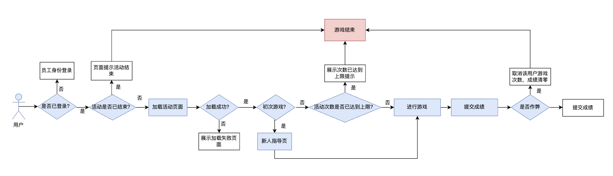
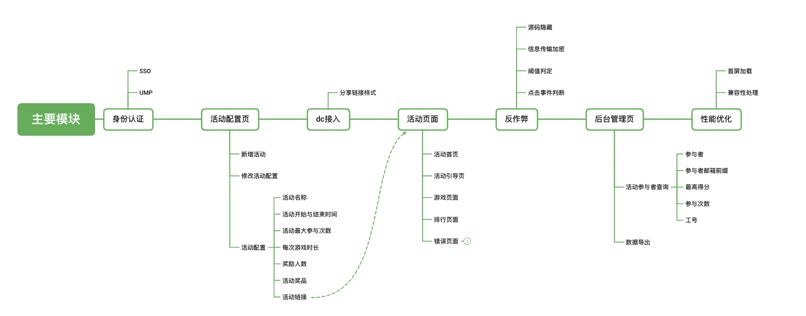
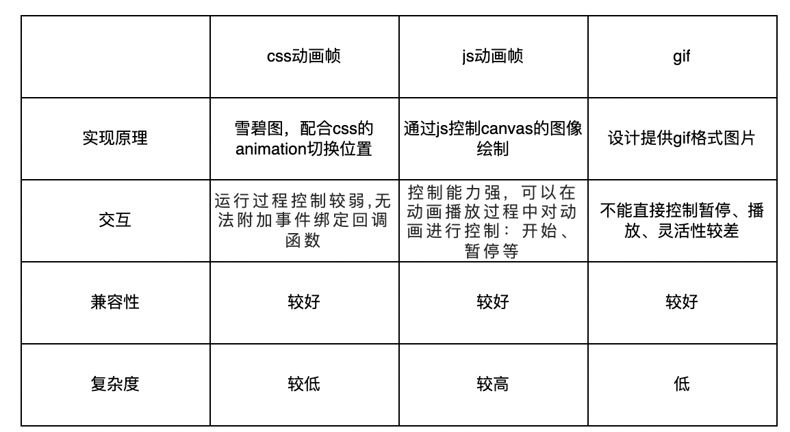
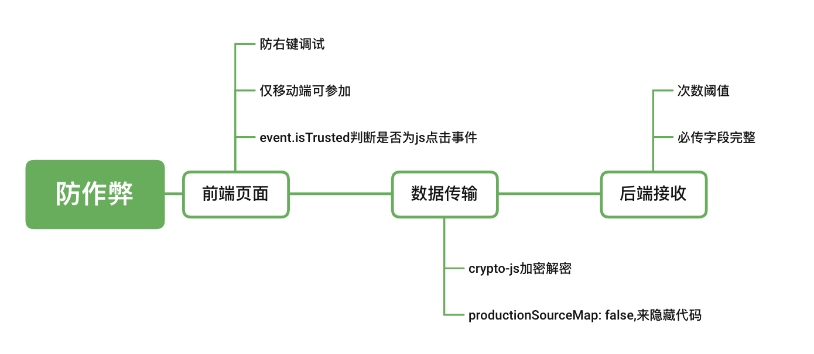
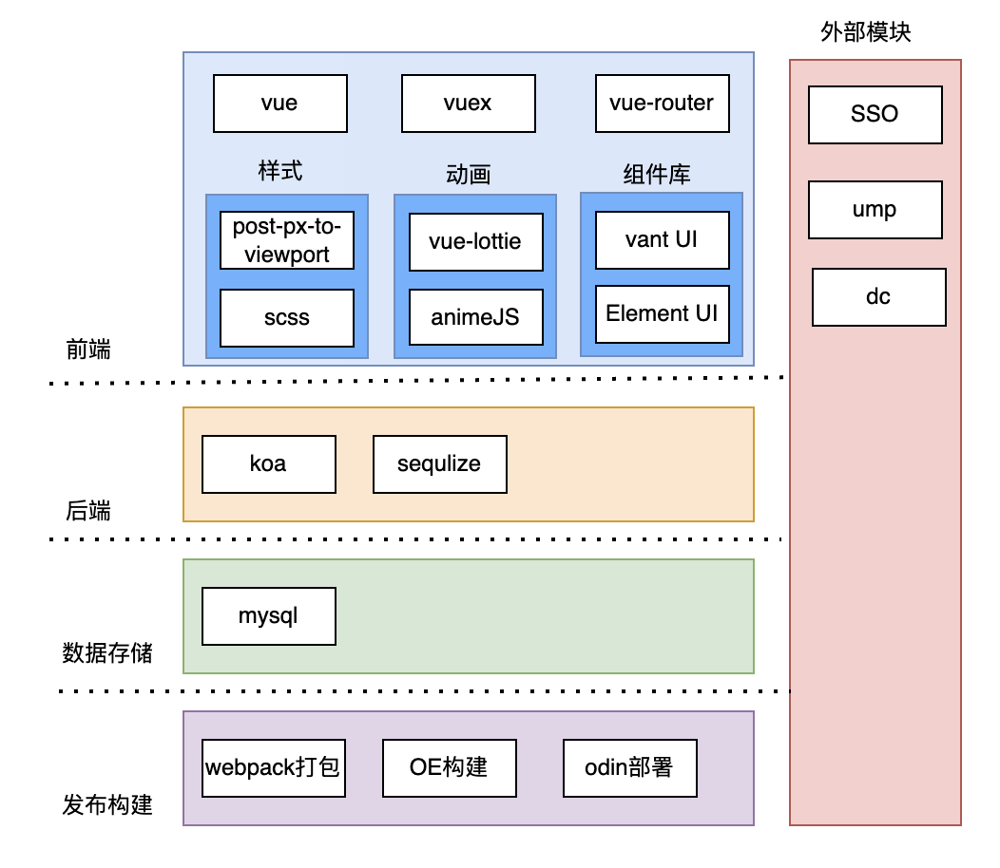

[toc]


# 需求拆分

“小年”将至，部门需要实现摸“吉祥物”脑袋功能，获取半分钟内摸福脑袋的次数，进行排行榜显示，连击时显示不同的动作效果，并且最高得分时需要有额外提示

# 模块设计

## 总体流程设计

+ 用户身份认证
+ 打开页面的时间是否在活动开始结束的范围内
+ 页面是否加载成功
+ 是否初次游戏
+ 游戏次数是否达到上限
+ 是否作弊



## 功能实现



后台进行活动配置信息，得到活动的唯一ID，然后生成活动链接，前台用户打开生成的活动链接，参与活动

### 动画部分实现



对于复杂交互动画，js动画帧是一种较为理想的实现方案，对于简单动画交互，css动画帧但是对于前端开发来说，复杂度较高，而且也不能保证与设计提供的交互完全一致

#### （1）vue-lottie方案

**前提：**设计可以提供lottie文件产出

**Lottie**是一个库，可以解析使用AE制作的动画（需要用bodymovin导出为json格式），支持web、ios、android和react native。

优点：

- 动画由设计使用专业的动画制作工具Adobe After Effects来实现，动画效果基本可以实现完全还原
- 前端可以方便的调用动画，并对动画进行控制，减少前端动画工作量
- json文件大小会比gif文件小很多，性能也会更好

不足：

- lottie-web文件本身仍然比较大，lottie.js大小为513k，轻量版压缩后也有144k，经过gzip后，大小为39k
- lottie动画其实可以理解为svg动画/canvas动画，不能给已存在的html添加动画效果；
- 动画json的导出，如果设计师建了很多的图层，可能仍然有json文件比较大（20kb）的问题

#### （2）animeJS

可用于实现CSS动画的库

### 防作弊方案

由于本次活动涉及奖品的发放，所以要防止有人恶意刷榜，接口与传输数据的安全格外重要，因此设计防作弊方案如下：



+ 判断是否为js模拟点击

  ```
  for(var i=0;i<180;i++){
    $('.touchArea').click()
  }
  ```

  可能有人认为去模拟点击

### 首次加载优化

冗余文件删除、gzip压缩、图片压缩

## 系统架构



## 接口设置

+ 提交、更新活动配置
+ 提交用户得分
+ 获取所有活动配置信息（后台需要）
+ 根据活动id查询特定活动的配置信息（前台需要）
+ 获取排行榜信息
+ 获取用户信息（最高分）

# 项目分工

时间排期： 01.07-01.24

人员分工：3.5人力

# 项目复盘

## 回顾目标：

本次的目标分为

1. 基本需求
   1. 实现用户员工身份认证
   2. 实现游戏互动与分数排行的功能
   3. 实现管理页面数据显示功能
2. 进阶要求：
   1. 获取用户头像
   2. dc接入
   3. 防作弊
   4. 活动可配置

活动效果收益：

参与人数：238

活动天数：3

总数据： 1569

## 评估结果：

+ 亮点：

  + 增加了活动配置页，实现活动的复用，且活动之间数据隔离，活动的开始与结束灵活可控

  + 实现了数据管理页面，可以查看不同活动的数据

  + 实现了敏感数据的获取，可以接收到用户头像、部门、工号等敏感信息

  + 实现了DC接入，分享样式得到优化

  + 实现了接口防作弊

  + 按照设计图实现了活动主体部分的全部功能
+ 不足：

  + 性能可以进一步优化，目前仅仅针对静态资源进行了优化

  + 移动端兼容性在某些机型中适配性不好

  + 对于引入插件的前期调研不足，是“”做一步找一步“的方案，对现有方案对比不足

  + “头像”获取问题导致排行榜模块出现线上问题

  + 防作弊方案覆盖场景不足
+ 失败关键原因

  + 多人合作代码冲突严重，导致代码合并用时较久

  + 调研不足

  + 对外部模块的调用没有做异常处理

  + 对于突发线上bug处理能力不足

  + 接口设计需要进一步优化
+ 线上问题复盘
  + 排行榜无法显示：新入职、外包等特殊人群拿不到头像信息，接口未做异常处理，后端修复后接口返回数据格式改变，导致前端部分相应修改，修改修复上线的时间较长，没有相应的回滚机制
  + 活动结束时间显示为12时制，造成目标人群误解：测试时没有注意到
  + 防作弊误判：防作弊初始标识值设置错误，导致新用户进入，没有任何点击动作时被错误判定为作弊

# 活动配置页面

权限管理：白名单用户才能进行活动配置

表单页面：活动新增、删除

用户可以配置 活动名称、活动时间、活动最大参与次数、每次游戏时长（s）、奖励人数、活动奖品进行提交， 然后自动生成活动的activitykey， 把这些信息都保存在数据库里

# 用户登录

使用现有SSO能力

# 活动页面

+ 根据活动配置页面的activitykey，生成新链接， 打开活动页面，根据activitykey获取活动的具体配置，活动时间等信息
+ 根据当前时间与活动时间做对比，判断活动状态：活动未开始、活动正在进行、活动已经结束

## 活动正在进行

分为背景图、规则页面、主体人物动画部分、首页引导部分

点击 准备开始游戏按钮：

+ 用户有使用次数但是没有使用过： 遮罩层进行引导

  ```js
  <!-- 提示指引遮罩层 -->
            <van-overlay :show="show">
              <div class="wrapper">
                <div class="block_title">
                  <div>快速点击福豆头部</div>
                  <div>获取虎年福气</div>
                </div>
                <div class="fd_guide_score">
                  +100
                </div>
                <van-image
                  width="24rem"
                  fit="contain"
                  :src="img_fd"
                />
                <van-image
                  class="fd_guide_hand"
                  width="10rem"
                  fit="contain"
                  :src="img_hand"
                />
                <div class="fd_footer_button_primary" @click="showClick">马上摸福</div>
              </div>
            </van-overlay>
  ```

  并且进行手部动画指引

  ```JS
      // 新手指引动画
      guideAnime () {
        // 手部动画
        this.guideHandAnime = anime({
          targets: ['.fd_guide_hand'], // 动画指定元素
          width: '9rem',
          duration: 1000, // 动画时常
          easing: 'easeInOutQuad', // 过渡效果
          loop: true, // 是否循环
        })
        // 分数动画
        this.guideScoreAnime = anime({
          targets: ['.fd_guide_score'], // 动画指定元素
          translateY: -150, // 动画Y偏移量
          duration: 1000, // 动画时常
          easing: 'easeInOutQuad', // 过渡效果
          loop: true, // 是否循环
        })
      },
  ```

  

+ 用户有使用次数已经使用完： 提示下次再玩

+ 用户有使用次数且使用过：正常进入游戏

正常进入游戏：

+ 游戏开始，背景音乐开启

  ```js
  <!-- 背景音乐 -->
  <audio ref="bgMusic" id="audio" autoplay='autoplay' loop='loop'>
    <source :src="bgMusic" type="audio/ogg">
    <source :src="bgMusic" type="audio/mpeg">
  </audio>
  ```

+ 开始倒计时计算分数

  ```js
  // 倒计时开始事件
  onTimeStart () {
    this.$nextTick(() => {
    this.$refs.countDown.start()
    // 背景音乐播放
    this.$refs.bgMusic.load()
    this.$refs.bgMusic.play()
  })
  // 监听用户长时间未操作
  this.monitorAction()
  // 监听连击事件
  this.onClickTimes()
  },
  ```

  ```js
      // 监听用户长时间未操作
      monitorAction () {
        this.timer = setInterval(() => {
          // 获取现在时间
          this.currentTime = new Date().getTime()
          // 判断-当未操作事件大于设定的pauseTime时间时：lastTime代表上次点击时间
          if (this.currentTime - this.lastTime > this.pauseTime) {
            this.animState = 'think'// 设置动画状态为think状态
            this.anim.think.setSpeed(3)// 设置动画速度
            this.animStop('think')// 停止think动画
            this.animPlay('think')// think动画播放
          }
        }, 1000)
      },
  ```

  ```js
      // 实现连击
      onClickTimes () {
        this.timerClickTimes = setInterval(() => {
          // 如果有点击
          if (this.isClick) {
            this.clickTimes++ // 增加连击次数
            this.isClick = false // 状态重置为未点击
          } else {
            this.clickTimes = 0 // 若没有点击操作则连击次数重置0
          }
        }, 150)
      },
  ```

  倒计时结束

  ```
  <van-count-down ref="countDown" style="color:#fff;"  :auto-start="false"  format="sss" :time="time" @finish="onTimeFinish"/>
  ```

  ```js
      // 倒计时结束事件
      onTimeFinish () {
        // 背景音乐停止
        this.$refs.bgMusic.pause()
        this.animStop('jump') // 动画结束
        this.animStop('think') // 结束动画
        this.animState = 'jump' // 设置动画状态为初始状态
        clearInterval(this.timer) // 清除监听用户长时间未操作的定时器
        clearInterval(this.timerClickTimes) // 清除连击的定时器
        this.clickTimes = 0 // 清空连击次数
        this.clickList = []// 清空点击动画抛出元素
        this.finalScore = this.score // 最终得分存一下
        this.score = 0 // 当前分数重置
        this.onTimeReset() // 倒计时重置
        console.log('finalScore', this.finalScore, this.score)
        // this.showScore()// 显示分数dialog
        this.saveScore(this.finalScore, this.isTrusted)// 保存用户分数信息
      },
  ```

  ```JS
      // 倒计时暂停事件
      onTimePause () {
        console.log('onTimePause')
        this.$nextTick(() => {
          this.$refs.countDown.pause()
        })
      },
      // 倒计时重置事件
      onTimeReset () {
        console.log('onTimeReset')
        this.$nextTick(() => {
          this.$refs.countDown.reset()
        })
      },
  ```

## 动画部分

### lottie

```js
 <!-- 福豆人物动画内容 -->
<div v-else ref="animArea" class="animArea">
     <lottie v-show="animState==='jump'" :options="defaultOptionsJump" @animCreated="handleAnimationJump" />
      <lottie v-show="animState==='think'" :options="defaultOptionsThink" @animCreated="handleAnimationThink" />
      <lottie v-show="animState==='contribute'" :options="defaultOptionsContribute" @animCreated="handleAnimationContribute" />
</div>
 <div class="touchArea"></div>
```

```js
// 动画默认配置数据
      defaultOptionsJump: {
        name: 'jump',
        container: this.$refs.animArea,
        animationData: animationDataJump.default,
        loop: false,
        autoplay: false,
      },
```

### 人物背景小礼物动画anime

```js
 <!-- 点击抛出元素内容 -->
            <div class="fd_click_wrap">
              <van-image
                v-for="(item,index) in clickList"
                :key="index"
                :class="['fd_click_wrap','fd_click_elem'+index]"
                width="5rem"
                fit="contain"
                :src="item.img"
              >
              </van-image>
            </div>
```

```js
    // 点击生成动画元素
    clickAnime () {
      // 设置生成动画元素的标识
      let index
      if (this.clickList.length > 0) {
        index = this.clickList.length - 1
      } else {
        index = 0
      }
      // 生成[min,max]的随机数：Math.round(Math.random() * (max - min)) + min
      let img = Math.round(Math.random() * 6) + 1// 生成1-7随机图片
      // para设置点击时抛出的元素
      let para = {
        img: this.img_click_list[img], // 元素图片
        anim: anime({
          targets: ['.fd_click_elem' + index], // 动画指定元素
          translateX: function () { // 动画X偏移量
            return anime.random(-300, 300)
          },
          translateY: function () { // 动画Y偏移量
            return anime.random(-370, -200)
          },
          rotate: function () { // 动画角度偏移量
            return anime.random(-20, 20)
          },

          keyframes: [// 动画关键帧
            { opacity: 0 },
            { opacity: 1 },
            { opacity: 1 },
            { opacity: 0 },
          ],
          duration: 2000, // 动画时常
          easing: 'easeInOutQuad', // 过渡效果
          loop: false, // 是否循环
          opacity: 0, // 透明度
          autoplay: false, // 是否自动播放
        }),
      }
      this.clickList.push(para)// 新增点击动画抛出的元素
      para.anim.play()// 此元素动画播放
    },
```

触摸事件

```js
    // 触摸玩偶事件
    onTouchDoll (val) {
      // 通过event.isTrusted判断是否是由真实点击产生的事件
      this.isTrusted = val.isTrusted
      if (val.isTrusted) {
        console.log('======================本函数是由鼠标点击事件触发的')
        let target = val.target.className // 取出实际点击的元素-可触摸区域
        // 记录当前点击的时间：用于监听长时间未操作：更新lastTime
        this.lastTime = new Date().getTime()
        // 当是正在游戏状态时候
        if (this.state === 2) {
          if (target === 'touchArea') {
            this.clickAnime() // 播放点击抛出元素动画
            this.score += 100 // 加分
            // 判断-当连击次数是3的倍数时：显示连击特效
            if (this.clickTimes > 0 && this.clickTimes % 3 === 0) {
              console.log('连击', this.clickTimes)
              this.scoreVisible = true // 显示连击图片omg
              setTimeout(() => {
                this.scoreVisible = false// 连击图片消失
              }, 500)
              this.animState = 'contribute'// 当前动画状态设为contribute动画
              this.anim.contribute.setSpeed(3) // 设置动画速度
              this.animStop('jump')// 停止jump动画
              this.animStop('contribute')// 停止contribute动画
              this.animPlay('contribute')// 重新开始contribute动画
            } else {
              this.animState = 'jump' // 设置动画状态为jump状态
              this.anim.jump.setSpeed(3) // 设置动画速度
              this.animStop('contribute') // 停止contribute动画
              this.animStop('jump') // 停止jump动画
              this.animPlay('jump') // 重新开始jump动画
            }
            // 有点击动作则为true,用于判断连击
            this.isClick = true
          } else {
            this.$toast({
              message: '点击头部才可计入分数',
              closeOnClick: true,
              closeOnClickOverlay: true,
              duration: 1000,
            })
          }
        }
      } else {
        console.log('======================本函数是由js事件触发的')
      }
    },
```

# 安全

+ 判断不是鼠标点击触发

```js
 this.isTrusted = val.isTrusted
```

+ 加密解密

  ```JS
  /* eslint-disable*/
  const CryptoJS = require('crypto-js');  //引用AES源码js
  
  const key = CryptoJS.enc.Utf8.parse("1234123412ABCDEF");  //十六位十六进制数作为密钥
  const iv = CryptoJS.enc.Utf8.parse('ABCDEF1234123412');   //十六位十六进制数作为密钥偏移量
  
  //解密方法
  function Decrypt (word) {
    let encryptedHexStr = CryptoJS.enc.Hex.parse(word);
    let srcs = CryptoJS.enc.Base64.stringify(encryptedHexStr);
    let decrypt = CryptoJS.AES.decrypt(srcs, key, { iv: iv, mode: CryptoJS.mode.CBC, padding: CryptoJS.pad.Pkcs7 });
    let decryptedStr = decrypt.toString(CryptoJS.enc.Utf8);
    return decryptedStr.toString();
  }
  
  //加密方法
  function Encrypt (word) {
    let srcs = CryptoJS.enc.Utf8.parse(word);
    let encrypted = CryptoJS.AES.encrypt(srcs, key, { iv: iv, mode: CryptoJS.mode.CBC, padding: CryptoJS.pad.Pkcs7 });
    return encrypted.ciphertext.toString().toUpperCase();
  }
  
  export default {
    Decrypt,
    Encrypt
  }
  /* eslint-disable*/
  ```

  

## 分数页面

## 错误页面

## 其他

```js
 // 修改标题
    document.title = '新年摸福'
    document.write(
      '<meta name="viewport" content="width=device-width, initial-scale=1.0,minimum-scale=1.0,maximum-scale=1.0,user-scalable=no">'
    )
    // 阻止默认长按出现菜单
    window.ontouchstart = function (e) {
      e.preventDefault()
    }
```

# 作为前端负责人在前端基础设施做了哪些事情

+ 开发阶段，包含了技术选型、项目创建、模板化、脚手架工具等方面的工作

+ 部署阶段，如何去做自动化的CI/CD、如何将项目部署到服务器

+ 质量保证，尝试使用一些自动化测试框架进行项目测试，同时对项目配置进行收敛，减少配置的修改，以保证每个项目的基础设施统一
+ 如何提效，通过脚手架工具来实现零配置启动部署项目，通过模板、组件以及对应的schema调用方式来降低开发门槛和效率提升

# 安全问题

+ 接口短时间被恶意大量调用，后端服务资源被恶意损耗，影响服务可用性
+ 业务数据面临被窃取、篡改的风险

# 解决方法

## 验签

对接口请求数据进行加密和签名，业务接口的请求使用不可伪造的数据签名，能够保护接口不受篡改、伪造等各种形式的恶意攻击。

原理：

+ 客户端利用加密算法，把参数串按照约定的顺序排列进行hash计算附到请求里（header、param均可）。
+ 服务端接收到请求，按照一致的算法对参数串进行hash计算，然后比对，如果和接口里的签名相同就可以确认请求参数没有被更改过。

## 2.安全风控

记录请求者的访问频率，配置拦截策略后，针对高频请求者直接拦截，可以是单IP 1分钟10次，30分钟100次的请求者，拦截1天、1小时、永久等。

原理：

+ 请求里携带某些参数标识
+ 平台记录访问来源， 访问次数等，进行拦截

## 3.挑战应答

计算服务下发的题目才可拿到请求数据，防止数据被窃听泄漏