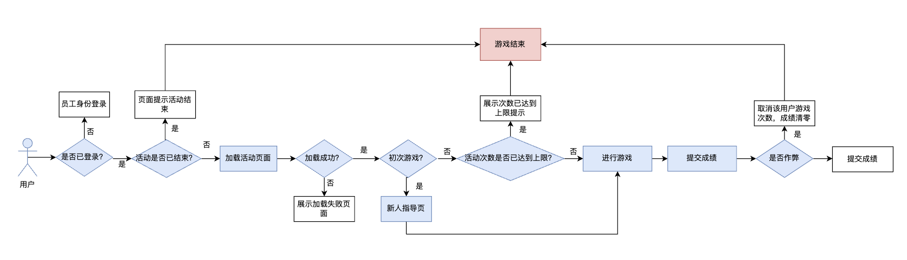
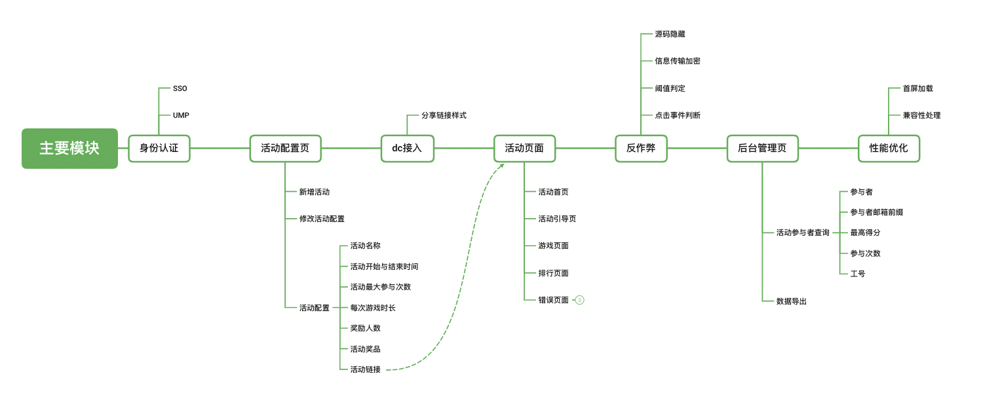
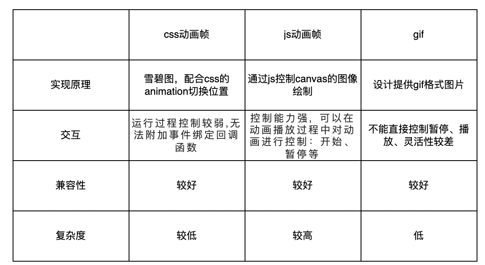
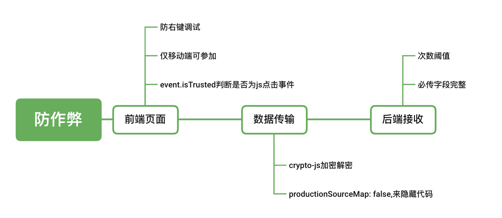

[toc]

# 需求拆分

“小年”将至，部门需要实现摸“吉祥物”脑袋功能，获取半分钟内摸福脑袋的次数，进行排行榜显示，连击时显示不同的动作效果，并且最高得分时需要有额外提示

# 模块设计

## 总体流程设计

+ 用户身份认证
+ 打开页面的时间是否在活动开始结束的范围内
+ 页面是否加载成功
+ 是否初次游戏
+ 游戏次数是否达到上限
+ 是否作弊



## 功能实现



后台进行活动配置信息，得到活动的唯一ID，然后生成活动链接，前台用户打开生成的活动链接，参与活动

### 动画部分实现



对于复杂交互动画，js动画帧是一种较为理想的实现方案，对于简单动画交互，css动画帧但是对于前端开发来说，复杂度较高，而且也不能保证与设计提供的交互完全一致

#### （1）vue-lottie方案

**前提：**设计可以提供lottie文件产出

**Lottie**是一个库，可以解析使用AE制作的动画（需要用bodymovin导出为json格式），支持web、ios、android和react native。

优点：

- 动画由设计使用专业的动画制作工具Adobe After Effects来实现，动画效果基本可以实现完全还原
- 前端可以方便的调用动画，并对动画进行控制，减少前端动画工作量
- json文件大小会比gif文件小很多，性能也会更好

不足：

- lottie-web文件本身仍然比较大，lottie.js大小为513k，轻量版压缩后也有144k，经过gzip后，大小为39k
- lottie动画其实可以理解为svg动画/canvas动画，不能给已存在的html添加动画效果；
- 动画json的导出，如果设计师建了很多的图层，可能仍然有json文件比较大（20kb）的问题

#### （2）animeJS

可用于实现CSS动画的库

### 防作弊方案

由于本次活动涉及奖品的发放，所以要防止有人恶意刷榜，接口与传输数据的安全格外重要，因此设计防作弊方案如下：



+ 判断是否为js模拟点击

  ```
  for(var i=0;i<180;i++){
    $('.touchArea').click()
  }
  ```

  可能有人认为去模拟点击

### 首次加载优化

冗余文件删除、gzip压缩、图片压缩

## 系统架构


## 接口设置

+ 提交、更新活动配置
+ 提交用户得分
+ 获取所有活动配置信息（后台需要）
+ 根据活动id查询特定活动的配置信息（前台需要）
+ 获取排行榜信息
+ 获取用户信息（最高分）

# 项目分工

时间排期： 01.07-01.24

人员分工：3.5人力

# 项目复盘

## 回顾目标：

本次的目标分为

1. 基本需求
   1. 实现用户员工身份认证
   2. 实现游戏互动与分数排行的功能
   3. 实现管理页面数据显示功能
2. 进阶要求：
   1. 获取用户头像
   2. dc接入
   3. 防作弊
   4. 活动可配置

活动效果收益：

参与人数：238

活动天数：3

总数据： 1569

## 评估结果：

+ 亮点：

  + 增加了活动配置页，实现活动的复用，且活动之间数据隔离，活动的开始与结束灵活可控

  + 实现了数据管理页面，可以查看不同活动的数据

  + 实现了敏感数据的获取，可以接收到用户头像、部门、工号等敏感信息

  + 实现了DC接入，分享样式得到优化

  + 实现了接口防作弊

  + 按照设计图实现了活动主体部分的全部功能
+ 不足：

  + 性能可以进一步优化，目前仅仅针对静态资源进行了优化

  + 移动端兼容性在某些机型中适配性不好

  + 对于引入插件的前期调研不足，是“”做一步找一步“的方案，对现有方案对比不足

  + “头像”获取问题导致排行榜模块出现线上问题

  + 防作弊方案覆盖场景不足
+ 失败关键原因

  + 多人合作代码冲突严重，导致代码合并用时较久

  + 调研不足

  + 对外部模块的调用没有做异常处理

  + 对于突发线上bug处理能力不足

  + 接口设计需要进一步优化
+ 线上问题复盘
  + 排行榜无法显示：新入职、外包等特殊人群拿不到头像信息，接口未做异常处理，后端修复后接口返回数据格式改变，导致前端部分相应修改，修改修复上线的时间较长，没有相应的回滚机制
  + 活动结束时间显示为12时制，造成目标人群误解：测试时没有注意到
  + 防作弊误判：防作弊初始标识值设置错误，导致新用户进入，没有任何点击动作时被错误判定为作弊

