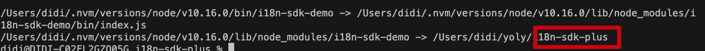
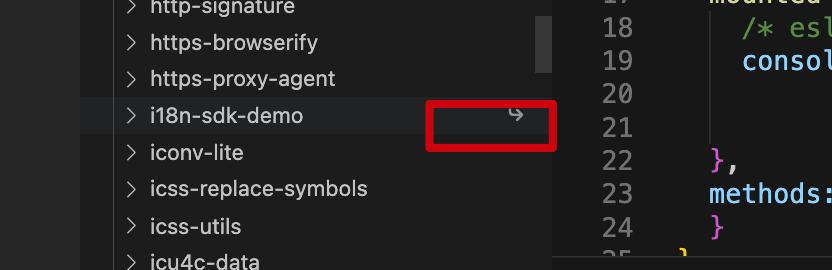

https://blog.csdn.net/weixin_43852267/article/details/123086503

[如何编写一个NPM工具包 ](https://www.cnblogs.com/constantince/p/15429842.html)

rollup官网https://www.rollupjs.com/

# 1.初始化项目

```js
npm init -y
```

测试是否新建成功

```js
// index.js文件
console.log('hello')
```

```js
//package.json文件,bin表示命令和文件名的映射
"bin": {
   "i18n-sdk-demo": "./bin/index.js"
 },		
```

然后执行```npm link ```,出现以下信息

```js
/Users/didi/.nvm/versions/node/v10.16.0/bin/i18n-sdk-demo -> /Users/didi/.nvm/versions/node/v10.16.0/lib/node_modules/i18n-sdk-demo/bin/index.js
/Users/didi/.nvm/versions/node/v10.16.0/lib/node_modules/i18n-sdk-demo -> /Users/didi/yoly/i18n-sdk-plus
```

在终端执行

```js
i18n-sdk-demo
// 此时打印出index.js的内容
```

# 2.安装包

```
// 配置ts相关
npm install @types/node --save-dev
```

```
// tsconfig.json里配置
 "outDir": "./build",  
```

```
每次在终端运行tsc,会把所有ts文件重新编译到build目录下
```

# 3.本地调试

https://www.cnblogs.com/summerstar/p/16560779.html

在要开发的npm包文件里创建软链```npm link ```



然后找一个空项目,安装之后node_modules里可以看到箭头

```
 npm link i18n-sdk-demo 
```



在新项目里引入并使用

```js
const i18n = require('i18n-sdk-demo')
const myi18n = new i18n()
console.log('i18n-----',myi18n.getLocale())
```

# 4.SDK的实际开发

## （1）制定目录结构

制定目录结构

引入ts

## （2）指定入口文件

```
"main": "build/main/index.js",
```

## （3）功能开发

包括几种

1. 需要修改、新增接入的项目里的文件
2. 接入项目需要新增webpack包
3. 接入项目需要新增、修改package命令
4. 接入项目需要有prompt交互

# 5.类型定义文件(*.d.ts)

https://tasaid.com/blog/20171102225101.html?sgs=juejin

https://juejin.cn/post/6987735091925483551

JavaScript 和 TypeScript 的静态类型交叉口 —— 类型定义文件。

[DefinitelyTyped](https://tasaid.com/link?url=https%3A%2F%2Fgithub.com%2FDefinitelyTyped%2FDefinitelyTyped) 就是让你把 "类型定义文件(*.d.ts)"，发布到 `npm` 中，配合编辑器(或插件)，就能够检测到 JS 库中的静态类型。

类型定义文件的以 `.d.ts` 结尾，里面主要用来定义类型。

# 6.接入lint

Eslint按照既定的规则检查代码是否符合规范

+ 安装

```
npm install eslint -D 
```

+ 配置.eslintrc.js

```js
module.exports = {
    "env": {
        "browser": true,
        "es2021": true
    },
    "extends": [
        "eslint:recommended",
        "plugin:vue/vue3-essential",
        "plugin:@typescript-eslint/recommended",
        "plugin:prettier/recommended",
        "prettier"
    ],
    "overrides": [
    ],
    "parser": "@typescript-eslint/parser",
    "parserOptions": {
        "ecmaVersion": "latest",
        "sourceType": "module"
    },
    "plugins": [
        "vue",
        "@typescript-eslint"
    ],
    "rules": {
      "prettier/prettier": "off",
      "@typescript-eslint/no-explicit-any": ["off"]
    }
}

```


.接入husky


# 7.接入prettier-format

eslint在代码格检查方面做的很好，但我们每次跑`npm run lint`时会抛出一些无法解决的错误，为此我们需要引入一个更懂我们的修复代码规范的工具`prettier`。`prettier`能够更加智能的补充你的代码：如加上逗号，去掉大括号，简而言之eslint给你抛出的错误大部分它都能够直接帮你解决。

## 基础用法

+ 安装`prettier`

```
npm install prettier -D #安装包
touch .prettierrc #创建配置文件
```

+ 新建.prettierrc ，写入配置

```json
{
  "printWidth": 120, 
  "tabWidth": 1, 
  "useTabs": false, 
  "semi": true, 
  "singleQuote": true, 
  "jsxSingleQuote": false, 
  "trailingComma": "all", 
  "bracketSpacing": true, 
  "jsxBracketSameLine": false, 
  "arrowParens": "always"
}
```

+ 把启动命令写入配置脚本

```js
"script":{
	"prettier-format": "prettier --config .prettierrc 'src/**/*.ts' --write"
}
```

+ 在控制台执行`npm run prettier-format`,会自动修改规定的格式错误

## 结合eslint使用

`prettier`同时也提供了插件供eslint使用的，将prettier的插件安装到eslint中，eslint会按照prettier的风格检查代码。

+ 安装

  ```
  npm install eslint-plugin-prettier eslint-config-prettier -D
  ```

+ 在`.eslintrc.js`中加入扩展配置

  ```JSON
  extends: [
      ...
      "plugin:prettier/recommended",
      "prettier"
    ],
  rules: {
      "prettier/prettier": 2
  }
  ```

## 自动监听文件变化

+ 安装

  ```
  npm install --save-dev onchange #安装onchange文件监听包
  ```

+ 写配置

  ```
  "script": {
  	...
  	"prettier-watch": "onchange 'src/**/*.ts' -- prettier --write {{changed}}"
  }
  ```

+ 运行`npm run prettier-watch`，开启一个监听文件变化的目录，每当你保存文件，代码自动被格式化。

# 8.接入rollup构建工具

1. webpack & rollup & vite

   因为我们采用typscript编写的模块，这些模块最终需要最终编译成js，为此我们需要引入构建工具rollup来构建我们的工程。rollup帮助我们把指定的ts打包成js文件

+ 安装

  ```
  "rollup-plugin-commonjs": "^10.1.0",
  "rollup-plugin-typescript2": "^0.33.0"
  ```

+ .rollup.config.js(简洁版本)

  ```
  import typescript from 'rollup-plugin-typescript2';
  import commonjs from 'rollup-plugin-commonjs;
  
  export default {
    input: "src/index.ts", //入口文件
    output: [{
       file: 'dist/index.js', //目标路径
       format: 'cjs' //打包目标模式，我们编写的是node模块，请使用commonjs规范
    }
  ],
    plugins: [//打包插件
        commonjs(),
        typescript()
    ]
  }
  ```

+ 添加命令

  ```
  "scripts": {
  	"compile": "rollup --config" //rollup 通过配置文件编译项目
  }
  ```

  
