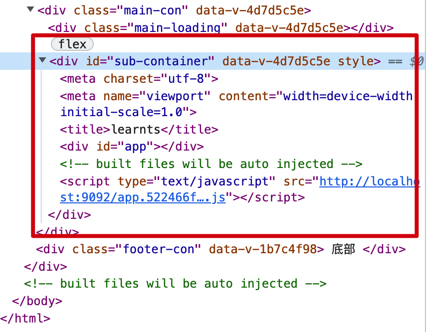
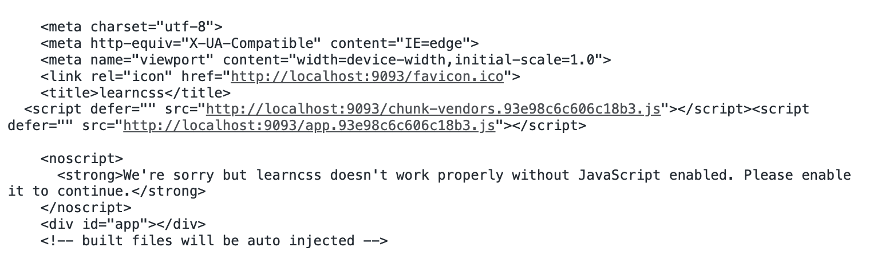

[toc]

# 应用加载解析流程

+ qiankun 会用 原生fetch方法，请求微应用的 entry 获取微应用资源，然后通过 response.text 把获取内容转为字符串。
+ 将 HTML 字符串传入 [processTpl](https://link.juejin.cn/?target=https%3A%2F%2Fgithub.com%2Fkuitos%2Fimport-html-entry%2Fblob%2F76df4b3737d54112f6bf2dfabcd01709079468e4%2Fsrc%2Fprocess-tpl.js%23L58) 函数，进行 HTML 模板解析，通过正则匹配 HTML 中对应的 javaScript（内联、外联）、css（内联、外联）、代码注释、entry、ignore 收集并替换，去除 `html/head/body` 等标签，其他资源保持原样
+ 将收集的 `styles` 外链URL对象通过 fetch 获取 css，并将 css 内容以 `<style>` 的方式替换到原来 link标签的位置
+ 收集 script 外链对象，对于异步执行的 JavaScript 资源会打上 `async` 标识 ，会使用 [requestIdleCallback](https://link.juejin.cn?target=https%3A%2F%2Fgithub.com%2Fkuitos%2Fimport-html-entry%2Fblob%2F76df4b3737d54112f6bf2dfabcd01709079468e4%2Fsrc%2Findex.js%23L104) 方法延迟执行。
+ 接下来会创建一个匿名自执行函数包裹住获取到的 js 字符串，最后通过 eval 去创建一个执行上下文执行 js 代码，通过传入 proxy 改变 window 指向，完成 JavaScript 沙箱隔离。[源码位置](https://link.juejin.cn?target=https%3A%2F%2Fgithub.com%2Fkuitos%2Fimport-html-entry%2Fblob%2F76df4b3737d54112f6bf2dfabcd01709079468e4%2Fsrc%2Findex.js%23L45)。
+ 由于 qiankun 是自执行函数执行微应用的 JavaScript，因此在加载后的微应用中是看不到 JavaScript 资源引用的，只有一个资源被执行替换的标识。
+ 当一切准备就绪的时候，执行微应用的 JavaScript 代码，渲染出微应用

# 微应用接入三步走

## 第一步：修改微应用的入口文件 webpack_public_path

> 在 `src` 目录新增 `public-path.js`
>
> webpack` 默认的 `publicPath` 为 `""` 空字符串，会基于当前路径来加载资源。但是我们在主应用中加载微应用资源的时候会导致资源丢失，所以需要重新设置 `__webpack_public_path__` 的值

```js
// 微应用/src/const/public-path.js
if (window.__POWERED_BY_QIANKUN__) {
    __webpack_public_path__ = window.__INJECTED_PUBLIC_PATH_BY_QIANKUN__;
} 
```

## 第二步：微应用webpack 新增配置

+ **webpack** 配置修改

  ```js
  const { name } = require('./package.json')
  
  module.exports = {
    devServer: {
        port: 8081, // 父应用配置微应用端口，要与微应用端口一致
        disableHostCheck: true, // 关闭主机检查，使微应用可以被 fetch
        headers: {
            'Access-Control-Allow-Origin': '*' //因为qiankun内部请求都是fetch来请求资源，所以子应用必须允许跨域
        }
    },
    configureWebpack: {
        output: {
            library: `${name}-[name]`, // 微应用的包名，这里与主应用中注册的微应用名称一致
            libraryTarget: 'umd', // 这里设置为umd意思是在 AMD 或 CommonJS 的 require 之后可访问。
            jsonpFunction: `webpackJsonp_${name}` // webpack用来异步加载chunk的JSONP 函数。
        }
    }
  }
  ```

## 第三步：微应用添加生命周期

> 微应用需要在自己的入口文件，添加 `bootstrap`、`mount`、`unmount` 三个生命周期钩子，供主应用在适当的时机调用。


# 路由改造

父子路由hash 模式

##  父路由改造工作

新增微应用路由前缀： 新增前缀不是微应用必须的，但是为了从 URL 上与其他应用隔离，也是为了接入旧应用的时候，能让 activeRule 方法能识别并激活应用，故新增路由前缀。

## 子应用改造工作


# 目录配置

+ 新建文件夹micro-test
+ 新建vue3项目base作为基座
+ 新建vue2项目learnjs和learnts，learncss作为子应用
+ 在base里新建micro目录，用来存放所有微前端相关的操作

# 子项目改造

+ 以learncss为例，修改vue.config.js

  ```js
  const path = require('path');
  const { name } = require('./package');
  
  function resolve(dir) {
    return path.join(__dirname, dir);
  }
  
  const port = 9093;
  
  module.exports = {
    outputDir: 'dist',
    assetsDir: 'static',
    filenameHashing: true,
    publicPath: 'http://localhost:9093',
    devServer: {
      static: { 
        directory: path.join(__dirname, 'dist')
      },
      // contentBase: path.join(__dirname, 'dist'),
      hot: true,
      allowedHosts: "all",
      port,
      headers: {
        'Access-Control-Allow-Origin': '*',
      },
    },
    // 自定义webpack配置
    configureWebpack: {
      resolve: {
        alias: {
          '@': resolve('src'),
        },
      },
      output: {
        // 把子应用打包成 umd 库格式
        libraryTarget: 'umd',
        filename: '[name].[hash].js', 
        library: 'learncss',
        chunkLoadingGlobal: `webpackJsonp_${name}`,
      },
    },
  };
  ```

  重点：配置可允许跨域

  输出为umd格式

+ Main.js里修改

  ```js
  //便于卸载时使用
  let instance = null;
  
  //不是微前端环境，直接加载
  if (!window.__MICRO_WEB__) {
    instance = new Vue({
      el: '#app',
      router,
      components: { App },
      template: '<App/>'
    })
  }
  
  //以下是子应用暴露的生命周期函数，便于主应用控制
  export async function bootstrap() {
    console.log('开始加载')
    console.log('vue app bootstraped');
  }
  
  export async function mount() {
    console.log('渲染成功')
    instance = new Vue({
      router,
      store,
      render: h => h(App)
    }).$mount('#app')
  }
  export async function unmount(ctx) {
    instance = null;
    console.log('卸载', instance)
  }
  ```


# 基座开发

作用：中央控制器，公共依赖都放在主应用里，并且控制子应用的加载

## 页面逻辑书写

+ 设置头部导航区，点击之后可以跳转到子应用
+ 设置中部内容区，用于显示子应用
+ 设置底部区域

```vue
//app.vue
<template>
  <HeaderNav/>
  <SubContainer/>
  <FooterText/>
</template>
```

```vue
//header是头部区域，menu点击切换，NAV_LIST是头部导航列表
<template>
  <div>
    <el-menu
      :default-active="activeIndex"
      class="el-menu-demo"
      mode="horizontal"
      @select="handleSelect"
      background-color="#545c64"
      text-color="#fff"
      active-text-color="#ffd04b">
      <el-menu-item
        v-for="(item, index) in NAV_LIST"
        :index = "item.value"
        :key="index"
      >
        {{ item.name }}
      </el-menu-item>
    </el-menu>
  </div>
</template>
// tab栏
 const NAV_LIST = [
        {
          name: 'js资料',
          status: true,
          value: 0,
          url: '/learnjs#/index',
          hash: '',
        },
        {
          name: 'ts资料',
          status: false,
          value: 1,
          url: '/learnts#/index',
        }
    ]
```

```vue
//SubContainer用于显示子应用的内容
<template>
  <div class="main-con">
    <div class="main-loading"
      v-loading="loading">
    </div>
    <div id="sub-container" v-show="!loading">子应用</div>
  </div>
</template>
```

## 子应用注册

注册子应用信息，使得全局可以获取到子应用的详细信息

+ 子应用信息

  ```js
    export const SUB_CHILD_LIST  = [
    {
      name: 'learnjs',              // 子应用名称
      entry: '//localhost:9091/',   // 子应用加载的入口
      container: '#sub-container',  // 子应用加载到哪个基座的容器内
      activeRule: '/learnjs',   //子应用激活逻辑
    },
    {
      name: 'learnts',
      entry: '//localhost:9092/',
      container: '#sub-container',
      activeRule: '/learnts',
    }
  ];
  ```

+ 子应用信息全局都能访问配置(不用window)

  ```js
  let sublist = []
  
  export function setSubList(list){
    sublist = list
  }
  export function getSubList(){
    return sublist
  }
  ```

  然后通过registerSub在main的之后执行，初始化把子应用信息配置好

  ```js
  import {setSubList, getSubList} from './../store/sublist'
  
  export function registerSub(list){
    setSubList(list)
    console.log('getSubList--', getSubList())
  }
  ```

  在main.js里调用

  ```js
  import {registerSub} from './micro/start'
  import {SUB_CHILD_LIST} from './const/subChildList'
  registerSub(SUB_CHILD_LIST)
  ```


## 路由变化监听

+ 点击导航，路由切换为当前规定的url
+ 监听url的变化
+ 根据当前url里的关键信息拼接出子应用的加载路径

### 路由基础配置

```js
//main.js
import router from './router'
app.use(router)
//router.js
import { createRouter, createWebHistory } from 'vue-router';
const routes = [
    {
      path: '/learnjs',
      component: () => import('../components/FooterText.vue')             
    },
    // {
    //   path: '/learnjs',
    //   component: () => import('../APP.vue')    
    // },
    // {
    //   path: '/learnts',
    //   component: () => import('../APP.vue')    
    // }
]

const router = createRouter({
  history: createWebHistory(),
  routes,
});
export default router;
```

### 导航切换时路由改变

```js
import { useRouter, useRoute } from 'vue-router'
setup(){
    const router = useRouter();
    const route = useRoute();
    ...
    function handleSelect (key){
      router.push(NAV_LIST[key].url)
    }
    return{
      handleSelect
    } 
  },
```

### 监听路由的变化

新建自定义事件，监听到自定义事件执行时，可以执行window.history.pushState的同时可以执行自定义的方法

+ 监听

```js
import { turnApp, patchRouter } from './routerHandler';

export const rewriteRouter = () => {
  window.history.pushState = patchRouter(window.history.pushState, 'micro_push');
  window.history.replaceState = patchRouter(window.history.replaceState, 'micro_replace');

  // 添加路由跳转事件监听
  window.addEventListener('micro_push', turnApp);
  window.addEventListener('micro_replace', turnApp);
  window.onpopstate = async function () {
    await turnApp()
  }
}
```

+ patchRouter包装原有的window.history.pushState方法， 执行window.history.pushState的时候，创建自定义事件new Event(), 触发执行，然后正常执行原有的window.history.pushState方法

```js
export const patchRouter = (event, name) => {
  return function () {
    // 创建一个自定义事件
    const e = new Event(name);
    // 让event来代替本函数执行
    event.apply(this, arguments);
    // 通过dispatchEvent来触发自定义事件
    window.dispatchEvent(e);
  };
};
```

+ 这样，触发自定义事件micro_push执行时，可以执行自定义的事件turnApp()

  ```js
  export const turnApp = async () => {
    console.log('路由变化-----')
  }
  ```

+ 基座初始化，加载完子应用后，开始监听路由的变化

  ```js
  rewriteRouter()
  export const start = () =>  {
    // 获取子应用列表
    const appList = getSubList()
    if (!appList.length) {
      throw Error('子应用列表为空，请查看是否正确注册');
    } else {
      const app = currentApp();
      // 初始化的时候url为 http://172.24.221.18:8080/learnjs/#/index
      // 根据url获取到第一个子应用的信息为 {name: 'learnjs', entry: '//localhost:9091/', container: '#sub-container', activeRule: '/learnjs'}
      if (app) {
        const { pathname, hash } = window.location
        const url = pathname + hash
        // url为/learnjs/#/index
        // 强行触发一次路由变化监听
        window.history.pushState(url, app.name, url || app.activeRule)
      }
    }
  }
  
  // 获取当前应用
  export const currentApp = () => {
    const currentRouter = window.location.pathname.match(/(\/\w+)/)[0];
    return filterApp('activeRule', currentRouter);
  };
  
  export const filterApp = (key, rule) => {
    const currentApp = getSubList().filter(app => app[key] === rule);
    return currentApp[0]
  };
  ```

+ 基座的main初始化时候

  ```js
  import {registerSub, start} from './micro/start'
  registerSub(SUB_CHILD_LIST)
  start()   
  ```

+ 优化

  切换路由的时候，可以看到多次触发了turnApp，因为push、replace都要触发，因此可以加一个标识位，标识当前的tab位置，如果在执行turnApp的时候，发现当前的url没变，那么就不再执行(利用window标识状态)

  ```js
  //start补充
  window.__CURRENT_SUB_APP__ = app.activeRule;
  // turnApp调试
  export const turnApp = async () => {
    if(window.__CURRENT_SUB_APP__ === window.location.pathname){
      console.log('只触发一次')
      return
    }
    console.log('路由变化-----')
  }
  ```

## 主应用生命周期

### 注册主应用生命周期

主应用生命周期应该是初始化的时候把需要的操作传递进去

```js
//main.js
registerSub(SUB_CHILD_LIST, {
    beforeLoad: [
      ()=>{
        console.log('开始加载')
      }
    ],
    mounted: [
      ()=>{
        console.log('渲染完成')
      }
    ],
    destoryed: [
      ()=>{
        console.log('卸载完成')
      }
    ],
  }
)
```

然后在registerSub函数内部增加设置生命周期函数的操作

```js
import {setMainLifecycle} from './store/mainLifeCycle'
export function registerSub(list, lifecycle){
  setSubList(list)
  //在这里可以调用主应用的生命周期
   lifecycle.beforeLoad[0]()
   setTimeout(()=>{
      lifecycle.mounted[0]()
    },1000)
  setMainLifecycle(lifecycle)
}
  setMainLifecycle(lifecycle)
}
```

同理，生命周期函数应该是全局都能获取到，所以设置一个变量来存储与操作

```js
let mainLifecycle = {}
export const getMainLifecycle = () => mainLifecycle
export const setMainLifecycle = (data) => {
  mainLifecycle = data
}
```

### 利用生命周期函数改造loading

便于控制加载子应用之前和之后的loading显示

+ 将loading状态抽离出来

  ```js
  import { ref } from 'vue';
  
  export const loadingStatus = ref(false);
  
  // 开启loading
  export const openLoading = () => {
    loadingStatus.value = true;
  };
  
  // 关闭loading
  export const closeLoading = () => {
    loadingStatus.value = false;
  };
  ```

+ 改变页面loading控制

  ```vue
  <template>
    <div class="main-con">
      <div class="main-loading"
        v-loading="loadingStatus">
      </div>
      <div id="sub-container" v-show="!loadingStatus">子应用
        <router-view/>
      </div>
    </div>
  </template>
  <script>
  import {loadingStatus} from './../store/loadingStatus'
  export default {
    name: 'SubContainer',
    props: {
     
    },
    data() {
      return {
        tableData: []
      };
    },
    setup(){ 
      return{
        loadingStatus
      } 
    },
  }
  </script>
  ```

+ main生命周期函数不同阶段就可以调用改变loading的状态

  ```js
  import {openLoading, closeLoading} from './store/loadingStatus'
  
  registerSub(SUB_CHILD_LIST, {
      beforeLoad: [
        ()=>{
          openLoading()
          console.log('开始加载')
        }
      ],
      mounted: [
        ()=>{
          closeLoading()
          console.log('渲染完成')
        }
      ],
      destoryed: [
        ()=>{
          console.log('卸载完成')
        }
      ],
    }
  )
  ```

  

## 触发生命周期

+ 改写路由改变时的自定义函数方法, 并且获取上一个子应用和当前子应用

  ```js
  export const turnApp = async () => {
    if(!isTurnChild()){
      console.log('路由变化-----')
    }
  }
  
  // 查看当前路由是否有变化
  export const isTurnChild = () => {
    //将CURRENT_SUB_APP暂存起来
    window.__ORIGIN_APP__ = window.__CURRENT_SUB_APP__;
    // 如果当前的子应用路由没变，直接返回
    if(window.__CURRENT_SUB_APP__ === window.location.pathname){
      return false
    }
    // 如果当前的路由变了，那么当前的子应用就是当前路由
    window.__CURRENT_SUB_APP__ = window.location.pathname
    console.log('---',  window.__ORIGIN_APP__, window.__CURRENT_SUB_APP__) // /learnjs /learnts
    return true
  };
  ```

+ 触发生命周期函数:检测到子应用变化的时候触发主应用和子应用的生命周期

  ```js
  export const turnApp = async () => {
    if(!isTurnChild()){
      await lifecycle()
    }
  }
  ```

  ```js
  import {findAppByRoute} from '../utils/index';
  import {getMainLifecycle} from '../store/mainLifeCycle'
  
  // 改变了路由，重新装载新的子应用
  export const lifecycle = async () => {
    const prevApp = findAppByRoute(window.__ORIGIN_APP__); // 获取上一个子应用
    const nextApp = findAppByRoute(window.__CURRENT_SUB_APP__); // 获取跳转后的子应用
    if (!nextApp) {
      return
    }
    if (prevApp) {
      // 卸载上一个应用
      await unmount(prevApp);
    }
    //加载下一个应用
    await boostrap(nextApp);
    await mount(nextApp);
  }
  
  // 装载应用
  export const boostrap = async (app) => {
    //运行主应用生命周期
    await runMainLifeCycle('beforeLoad', app)
    //运行子应用的生命周期
    app && app.bootstrap && await app.bootstrap();
  }
  
  // 渲染应用
  export const mount = async (app) => {
    app && app.bootstrap && await app.mount(app);
    await runMainLifeCycle('mounted', app)
  }
  
  // 卸载
  export const unmount = async (app) => {
    app && app.unmount && await app.unmount(app);
    await runMainLifeCycle('destoryed', app)
  }
  
  // 执行主应用生命周期
  export const runMainLifeCycle = async (type, app) => {
    const mainLife = getMainLifecycle();
    // 因为主应用里配置的生命周期是一个数组，所以需要执行数组中的所有内容
    await Promise.all(mainLife[type].map(item => item(app)))
  }
  ```

  

# 子应用渲染

## 加载html

+ 在boostrap里加载子应用

```js
// 装载应用
export const boostrap = async (app) => {
  await runMainLifeCycle('beforeLoad', app)

  // 解析获取html结构
  await htmlLoader(app);
  app && await app.bootstrap();
}
```

+ htmlLoader(app)完成的功能

  + 根据app里的entry（ //localhost:9092/）请求到子应用（learnts）

    ```js
    fetch(entry).then(async res => console.log('res---', await res.text()))
    
    //得到的结果
    <html>
      <head>
        <meta charset="utf-8">
        <meta name="viewport" content="width=device-width,initial-scale=1.0">
        <title>learnts</title>
      </head>
      <body>
        <div id="app"></div>
        <!-- built files will be auto injected -->
      <script type="text/javascript" src="http://localhost:9092/app.522466f280d18abcd2b9.js"></script></body>
    </html>
    ```

  + 通过containerBody.innerHTML将请求的子应用信息塞到基座的容器里, 此时dom已经在容器里，但是页面无法显示内容

    ```js
    let containerBody = document.querySelector(container);
      if (!containerBody) {
        throw Error(` ${name} 的容器不存在，请查看是否正确指定`);
      }
    containerBody.innerHTML = await parseHtml(entry, name);
    ```

    

  + 解析js文件，js文件主要有script和link,把其中的src、href取出来进行单独的请求，类似于请求html

    ```js
    // 解析 js 内容
    export const getResources = (root, app) => {
      const scriptUrls = [];
      const scripts = [];
    
      function deepParse(element) {
        const children = element.children;
        const parent = element.parentNode;
    
        // <script scr=""></script>
        if (element.nodeName.toLowerCase() === 'script') {
          const src = element.getAttribute('src');
          if (!src) {
            // 没有src, 直接在 script 标签中书写的内容
            let script = element.outerHTML;
            scripts.push(script);
          } else {
            if (src.startsWith('http')) {
              scriptUrls.push(src);
            } else {
              // fetch 时 添加 publicPath
              scriptUrls.push(`http:${app.entry}/${src}`);
            }
          }
        }
        //<link href=""></link>
        if (element.nodeName.toLowerCase() === 'link') {
          const href = element.getAttribute('href');
          if (href.endsWith('.js')) {
            if (href.startsWith('http')) {
              scriptUrls.push(href);
            } else {
              // fetch 时 添加 publicPath
              scriptUrls.push(`http:${app.entry}/${href}`);
            }
          }
        }
        for (let i = 0; i < children.length; i++) {
          deepParse(children[i]);
        }
      }
      deepParse(root);
    
      return [scriptUrls, scripts, root.outerHTML];
    }
    ```

    最终拿到的url有

    ```js
    ['http://localhost:9093/chunk-vendors.93e98c6c606c18b3.js', 'http://localhost:9093/app.93e98c6c606c18b3.js']
    ```

    打印

    ```js
    // 解析html
    export const parseHtml = async (url, appName) => {
      const div = document.createElement('div');
      let scriptsArray = [];
      div.innerHTML = await fetchUrl(url);
      const [scriptUrls, scripts, elements] = getResources(div, findAppByName(appName));
      console.log('scriptUrls, scripts, elements', scriptUrls, scripts, elements)
     
      return [elements, scriptsArray];
    }
    ```

    

    + 说明：

      ```
      // 如果子应用设置了publicPath， 那么打包后的文件是http://localhost:9091/xxxx格式，如果没设置，就是xxxx格式，需要使用app的名字和入口链接进行拼接url
      // a.outerHTML 是包含a元素的html片段，a.innerHTML是不包含a元素的
      ```

  + 请求js文件,并且和没有src、href的纯script文件一起返回

    ```js
    const fetchedScript = await Promise.all(scriptUrls.map(url => fetchUrl(url)));
      scriptsArray = scripts.concat(fetchedScript);
    ```

  + 挨个执行script的js文件

    ```js
    scriptsArray.map((item) => {
        performScriptForEval(item)
      });
      
    其中，执行生成的umd文件可以使用new Function或者eval
    export const performScriptForEval = (item) => {
      return eval(item)
    }
    ```

    

## 执行子应用的生命周期函数

目前执行完主应用的生命周期后，子应用一直直接执行非微前端环境!window.__MICRO_WEB__下的代码， 并且此时子应用列表SUB_CHILD_LIST里也无法获取到子应用的生命周期函数， 所以子应用的生命周期是无法执行的```app && app.bootstrap && await app.bootstrap();```，

```js
let instance = null;
console.log(instance);
export async function bootstrap() {
  console.log('vue app bootstraped');
}
if (!window.__MICRO_WEB__) {
  instance = new Vue({
    router,
    store,
    render: h => h(App)
  }).$mount('#app-vue')
}

export async function mount() {
  instance = new Vue({
    router,
    store,
    render: h => h(App)
  }).$mount('#app-vue')
}
export async function unmount(ctx) {
  instance = null;
  const { container } = ctx
  if (container) {
    document.querySelector(container).innerHTML = ''
  }
}
```


执行生命周期：boostrap-》主应用runMainLifeCycle-》获取子应用dom, htmlLoader=>执行子应用生命周期app && app.bootstrap && await app.bootstrap();

可以在 htmlLoader中去拿到子应用生命周期(通过library的特性去拿)

改写

```js
//htmlLoader
scriptsArray.map((item) => {
    sandbox(item, name);
  });
//sandbox
export const sandbox = (script, appName) => {
  performScriptForEval(script)
  console.log('appName', appName)
}

// 执行应用中的 js 内容 eval篇
export const performScriptForEval = (item) => {
  return eval(item)
}

```

+ 设置环境变量，之前都全部执行非微前端环境的判断，window.__MICRO_WEB__进行加载，现在对该变量进行修改，使得只有在执行微前端环境下子应用的mount函数时才去加载页面

  ```js
  export const sandbox = (script, appName) => {
    // 获取当前子应用
    const app = findAppByName(appName);
    // 设置微前端环境
    window.__MICRO_WEB__ = true;
    performScriptForEval(script)
    console.log('appName', appName)
  
    // 获取子应用生命周期
    const lifeCycles = performScriptForEval(script, appName);
  
    // 检查子应用是否包含必须的方法
    const isLack = lackOfLifecycle(lifeCycles)
    if (isLack) {
      return;
    }
    app.bootstrap = lifeCycles.bootstrap;
    app.mount = lifeCycles.mount;
    app.unmount = lifeCycles.unmount;
  }
  
  
  // 检测子应用是否漏掉了生命周期方法
  export const lackOfLifecycle = (lifecycles) => !lifecycles ||
    !lifecycles.bootstrap ||
    !lifecycles.mount ||
    !lifecycles.unmount;
  ```

+ 通过library(可以通过window.XXX访问)拿到子应用的生命周期

  ```js
  // 执行应用中的 js 内容 eval篇
  export const performScriptForEval = (item, appName) => {
    const scriptText = `
      (() => () => {
        try {
          ${item}
          return window['${appName}']
        } catch (err) {
          console.error('runScript error:' + err);
        }
      })()
    `
    return eval(scriptText).call(window,window)
  }
  ```

+ 此时app.bootstrap等有值，可以正常执行

# 环境隔离

为了防止子应用有挂载在window上的变量时，在微前端环境下其他子应用也能获取或者修改该变量的情况发生，需要进行环境隔离

## 快照沙箱

适用于老版本的浏览器，window对象比较大时候性能消耗大，并且是要求同一个时间页面只可以显示一个子应用

子应用进行快照沙箱，离开该子应用时，将该子应用的变量强行初始化

```js
// 快照沙箱
export class SnapShotSandBox {
  constructor() {
    this.proxy = window;
    this.active();
  }
  active() {
    this.snapshot = new Map(); // 创建 window 对象的快照
    for (const key in window) {
      if (window.hasOwnProperty(key)) {
        this.snapshot[key] = window[key];
      }
    }
  }
  inactive() {
    for (const key in window) {
      if (window.hasOwnProperty(key)) {
        // 将上次快照的结果和本次window属性做对比
        if (window[key] !== this.snapshot[key]) {
          // 还原window
          window[key] = this.snapshot[key];
        }
      }
    }
  }
}
```

+ 改变window的指向

  ```js
  // 执行应用中的 js 内容 eval篇
  export const performScriptForEval = (item, appName, global) => {
    const scriptText = `
      (() => () => {
        try {
          ${item}
          return window['${appName}']
        } catch (err) {
          console.error('runScript error:' + err);
        }
      })()
    `
    return  (() => eval(scriptText))().call(global, global)
  }
  ```

+ 快照沙箱的触发

  ```js
  //在bootstrap生命周期里
  export const sandbox = (script, appName) => {
    // 获取当前子应用
    const app = findAppByName(appName);
    // 创建沙箱快照
    const proxy = new SnapShotSandBox()
    if(!app.proxy){
      app.proxy = proxy
    }
    
  // lifecycle里离开子应用的时候卸载
    if (prevApp) {
      // 卸载上一个应用
      await unmount(prevApp);
      prevApp.proxy.inactive() //沙箱快照销毁
    }
  ```

  

## 代理沙箱

支持多实例，可以同时有多个实例

+ 对window对象进行代理拦截new Proxy，每个子应用都是单独拦截的
+ 对于原本window上的function，则需要进行兼容，还从window上查找，而不是对应的proxy上查找使用

```js
export const isFunction = (value) => typeof value === 'function';

// 代理沙箱
export class ProxySandBox {
  constructor() {
    this.proxy = window;
    this.active();
  }
  active() {
    const proxy = window;

    const draftValue = Object.create(Object.getPrototypeOf(proxy))

    this.proxy = new Proxy(proxy, {
      get(target, propKey) {
        // 函数做特殊处理
        if (isFunction(draftValue[propKey])) {
          return draftValue[propKey].bind(proxy)
        }
        if (isFunction(target[propKey])) {
          return target[propKey].bind(proxy)
        }

        return draftValue[propKey] || target[propKey]
      },
      set(target, propKey, value) {
        draftValue[propKey] = value
        return true
      }
    })
  }
  inactive() {
    console.log('关闭沙箱');
  }
}

```

使用

```js
export const sandbox = (script, appName) => {
  // 获取当前子应用
  const app = findAppByName(appName);
  // 创建沙箱环境
  const global = new ProxySandBox();

  // 设置微前端环境
  window.__MICRO_WEB__ = true;
  performScriptForEval(script)
  console.log('appName', appName)

  // 获取子应用生命周期
  const lifeCycles = performScriptForEval(script, appName, global.proxy);
```


## css样式隔离

+ css modules

  ```
  在配置webpack的时候，css的loader里进行配置
  options:{
    module: true
  }
  ```

+ Shadow dom(通过attachShadow实现)： 创建元素，给它样式，但是兼容性可能不高

  ```html
  <div>hello z</div>
      <div id="shadow"></div>
      <script>
          let shadowDom = shadow.attachShadow({ mode: 'open' });  
          let pElem = document.createElement('p');
          let styleElem = document.createElement('style');
  
          styleElem.innerHTML = 'p{color:red}';
          pElem.innerHTML = 'hello shadow';
  
          shadowDom.appendChild(pElem);
          // 外部样式影响不了影子节点内部样式
          document.body.appendChild(styleElem);
          
          console.log(document.getElementById('shadow').firstChild) // 返回null
          console.log(document.getElementById('shadow').shadowRoot.firstChild)
          // 返回影子节点
      </script>
  
  ```

+ Minicss： 可以把css打包成单独的文件，然后直接通过link引用即可

  ```
  MiniCssExtractPlugin
  ```


作者：InfinityTomorrow
链接：https://juejin.cn/post/7069566144750813197
来源：稀土掘金
著作权归作者所有。商业转载请联系作者获得授权，非商业转载请注明出处。