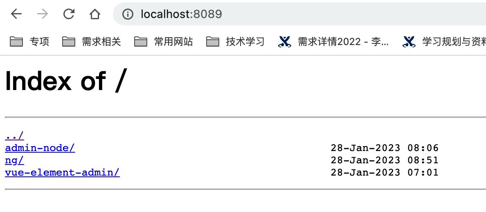

[toc]

# ngnix安装

资料：https://www.jianshu.com/p/c3294887c6b6

+ 安装Homebrew

+ 安装ngnix

  ```
  brew install nginx 
  ```

+ 验证

  ```
  brew services start nginx
  ```

==> 报错

1.

```
fatal: not in a git directory
Error: Command failed with exit 128: git
```

解决：https://blog.csdn.net/Morris_/article/details/125182905

2.

```
No such file or directory @ rb_sysopen
```

解决

```
export HOMEBREW_BOTTLE_DOMAIN=''
```

# ngnix配置

查看ngnix安装位置

```
ps -ef | grep nginx
```

然后使用搜索就可以找到ngnix的安装位置

ngnix启动与结束

```
sudo nginx
sudo nginx -s reload
sudo nginx -s stop
sudo nginx -t  //检查配置文件是否错误
```

打开http://localhost：8080即可

## ngnix.conf配置为静态资源服务器

+ ngnix.conf修改

  ```
  user yoly owner
  大括号最后添加: 引入其他的ngnix配置文件
  include /Users/yoly/bushu/ng/upload.conf
  ```

+ upload.conf配置

  ```json
  //http的配置
  server {
    charset utf-8;
    listen 8089;
    server_name http_host;
    root /Users/yoly/bushu; // 资源文件的位置
    autoindex on; //是否打开索引
    add_header Cache-Control "no-cache, must-revalidate";
    // 对路由做处理
    location / {
      add_header Access-Control-Allow-Origin *;
    }
  }
  ```


效果：



把小说资源放到/Users/yoly/bushu目录下就是简单的静态资源服务器


## https配置补充

```json
//https的配置
server {
  listen 443 default ssl;
  server_name https_host;
  root /Users/mac/upload/;
  autoindex on;
  add_header Cache-Control "no-cache, must-revalidate";
  location / {
    add_header Access-Control-Allow-Origin *;
  }
//https的证书、秘钥（首先需要有域名，然后需要与服务器做备案）
  ssl_certificate /Users/mac/Documents/https/budai.store.pem;
  ssl_certificate_key /Users/mac/Documents/https/budai.store.key;
  ssl_session_timeout 5m;
  ssl_protocols SSLv3 TLSv1;
  ssl_ciphers ALL:ADH:!EXPORT56:RC4+RSA:+HIGH:+MEDIUM:+LOW:+SSLv2:+EXP;
  ssl_prefer_server_ciphers  on;
}
```

# 前端代码打包部署

## 打包

为什么需要打包（使用webpack）

+ 语法转化
+ Import, module.export 模块化语法没打包之前不能在浏览器中打包

执行：

```
"build:prod": "vue-cli-service build",
```

在dist目录下生成打包好的文件，index.html是入口

此时直接打开index.html会无法加载内容， 资源文件比如图片，js文件等都无法加载，找到index.html里加载资源文件的位置

```
<script src=/static/js/app.13f94e5a.js></script>
```

发现修改为static/js/app.13f94e5a.js可以找到app.js的位置正常加载

===》 资源文件加载路径存在问题

### 修改publicPath

Vue.config.js中，修改

```
  publicPath: '.',
  outputDir: 'dist',
  assetsDir: 'static',
```

这样publicPath和static拼接得到static/js/app.13f94e5a.js， 可以正确找到资源位置

## 部署

直接在ngnix静态资源服务器下所读取的资源目录root /Users/yoly/bushu下新建manager目录， 将打包生成的dis t目录下文件直接拷贝进去， 启动ngnix服务，此时可以直接通过ngnix服务器访问到前端的静态页面

