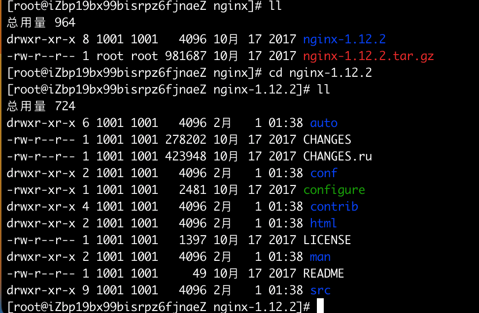
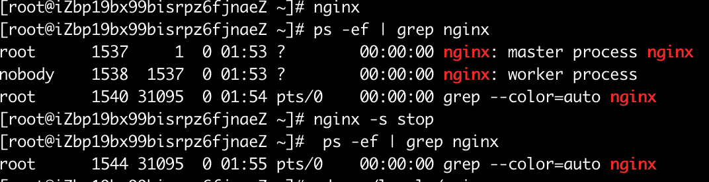
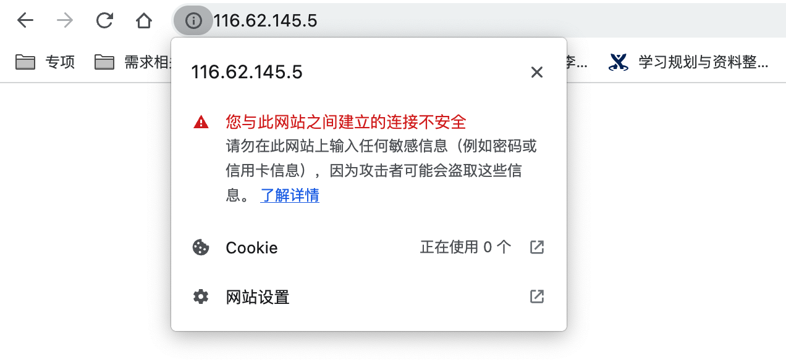
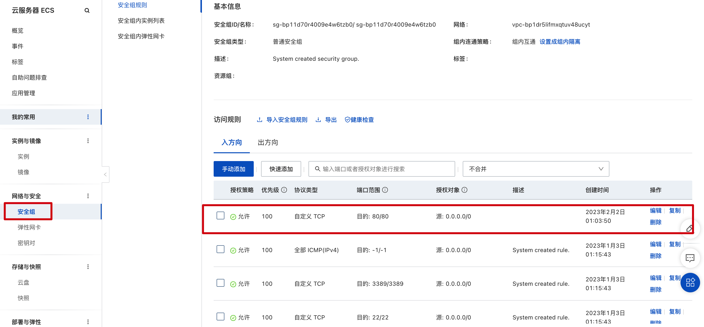
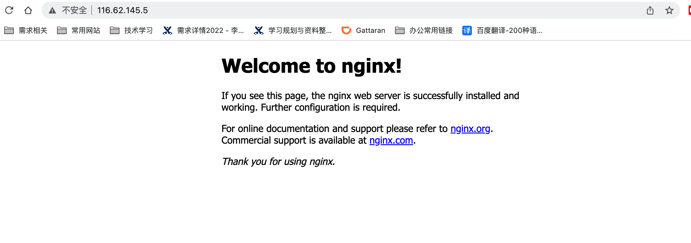
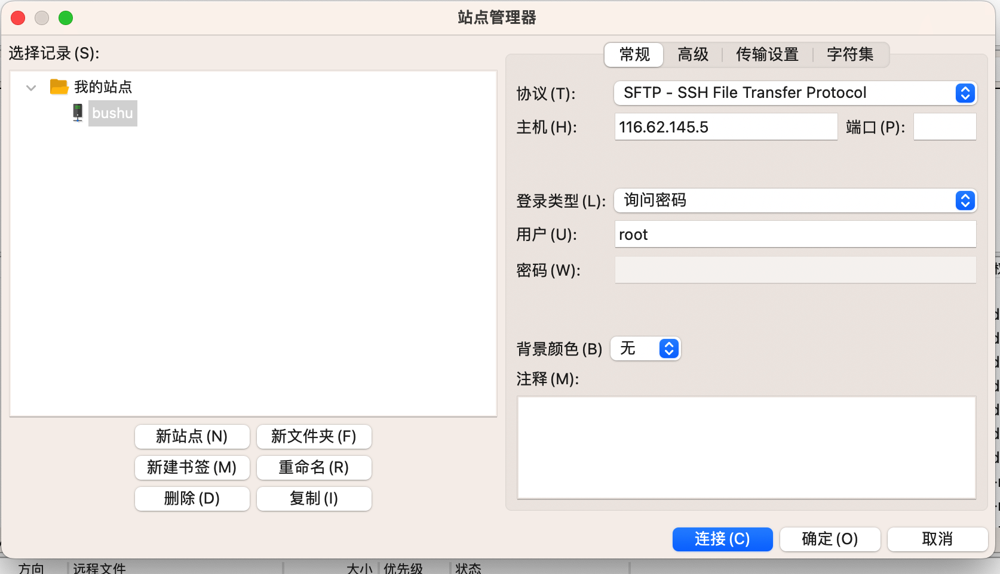
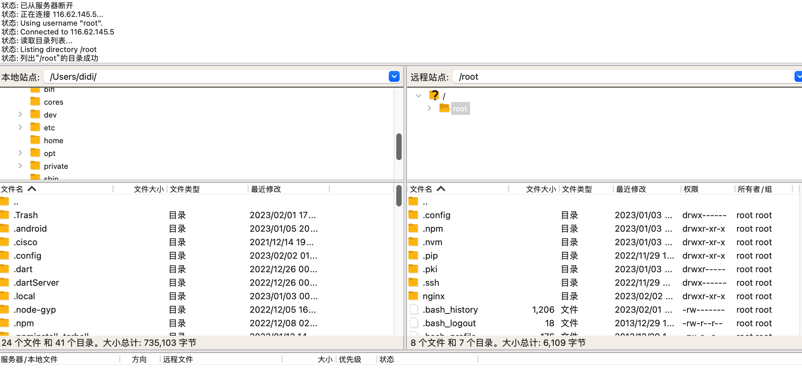
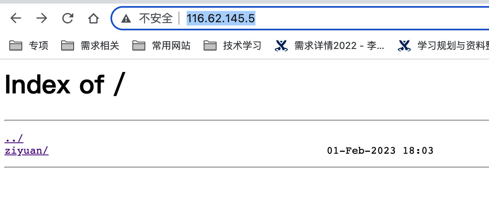

[toc]

# 阿里云

## esc服务器开通

+ 登录阿里云
+ 购买云服务器ECS

## 登录服务器

```
ssh root@xxx(阿里云服务器的ip地址)
```

## Nvm相关

文档： https://github.com/nvm-sh/nvm

+ 安装nvm

```
wget -qO- https://raw.githubusercontent.com/nvm-sh/nvm/v0.39.3/install.sh | bash
```

被安装到了'/root/.nvm'下

```JS
Downloading nvm as script to '/root/.nvm'

=> Appending nvm source string to /root/.bashrc
=> Appending bash_completion source string to /root/.bashrc
=> Close and reopen your terminal to start using nvm or run the following to use it now:

export NVM_DIR="$HOME/.nvm"
[ -s "$NVM_DIR/nvm.sh" ] && \. "$NVM_DIR/nvm.sh"  # This loads nvm
[ -s "$NVM_DIR/bash_completion" ] && \. "$NVM_DIR/bash_completion"  # This loads nvm bash_completion
```

+ 查看是否已经安装

```
ll .nvm/
==============结果：
总用量 148
-rw-r--r-- 1 root root   2299 1月   3 01:43 bash_completion
-rw-r--r-- 1 root root    351 1月   3 01:43 nvm-exec
-rw-r--r-- 1 root root 142060 1月   3 01:42 nvm.sh
```

+ 查看 vim .bashrc，发现里边写了环境变量

  （退出vim时，先按Esc，然后直接输入“ : q”）

```
export NVM_DIR="$HOME/.nvm"
[ -s "$NVM_DIR/nvm.sh" ] && \. "$NVM_DIR/nvm.sh"  # This loads nvm
[ -s "$NVM_DIR/bash_completion" ] && \. "$NVM_DIR/bash_completion"  # This loads nvm bash_completion
```

+ 执行source .bashrc使得环境变量生效( source作用:在当前bash环境下读取并执行FileName中的命令)

+ 使用nvm指令安装node, node -v查看版本

  ```
  nvm install 11.3.0
  ```

  版本过高会报错

  ```
  node: /lib64/libm.so.6: version `GLIBC_2.27' not found (required by node)
  node: /lib64/libc.so.6: version `GLIBC_2.25' not found (required by node)
  node: /lib64/libc.so.6: version `GLIBC_2.28' not found (required by node)
  node: /lib64/libstdc++.so.6: version `CXXABI_1.3.9' not found (required by node)
  node: /lib64/libstdc++.so.6: version `GLIBCXX_3.4.20' not found (required by node)
  node: /lib64/libstdc++.so.6: version `GLIBCXX_3.4.21' not found (required by node)
  ```

+ 安装cnpm,查看版本 cnpm -v

  ```
  npm install -g cnpm --registry=https://registry.npm.taobao.org
  ```

## ngnix安装配置相关

### 安装

yum命令，用于管理centos的软件仓库

+ 安装ngnix之前先安装其他依赖

```
yum -y install pcre*
yum -y install openssl*
```

+ 新建目录，安装ngnix(ngnix是c编写，所以下载ngnix再编译)

```
mkdir ngnix
cd nginx
wget http://nginx.org/download/nginx-1.12.2.tar.gz
```

+ 解压nginx

```
tar -zxvf nginx-1.12.2.tar.gz
```

+ 进入解压好的nginx-1.12.2文件，发现有一个可执行文件configure

```
cd nginx-1.12.2
ll
```



执行configure

```
./configure
```

+ 编译ngnix源码

```
make -j4
```

+ 安装

```
make install
```

+ 读取配置文件

```
/usr/local/nginx/sbin/nginx -t

nginx: the configuration file /usr/local/nginx/conf/nginx.conf syntax is ok
nginx: configuration file /usr/local/nginx/conf/nginx.conf test is successful
```

但是此时nginx无法直接使用

```
nginx
-bash: nginx: 未找到命令
```

===》 制作软链接

```
cd /usr/bin/ (/usr/bin/目录下的所有命令都可以直接访问)
ln -s  /usr/local/nginx/sbin/nginx nginx
```

此时相当于在/usr/bin/下创建了新的命令nginx，实际指向的是

/usr/local/nginx/sbin/nginx

```
ll nginx

lrwxrwxrwx 1 root root 27 2月   1 01:50 nginx -> /usr/local/nginx/sbin/nginx
```

+ 回到root目录

```
cd
pwd
结果/root
此时可以直接调用nginx
nginx
```

查看nginx进程

```
ps -ef | grep nginx
```



此时，启动nginx

```
nginx
```

可以通过ip来访问云上的nginx



===》 安全组必须开放80端口



此时直接通过IP地址可以访问到nginx服务器



### 配置

+ 打开nginx配置文件

```
cd /usr/local/nginx/
cd conf
```

+ 打开主配置文件(ESC 然后:wq退出且保存)

```
vim nginx.config
```

+ 新建并进入nginx目录下

```
cd ngnix/
vim nginx.conf
```

+ 打开nginx的主配置文件并进行修改

```
vim /usr/local/nginx/conf/nginx.conf
```

```
user root
listen: 90 // 修改主nginx监听的端口号
最后添加之前自定义的conf文件
include /root/nginx/*.conf;
```

+ 编辑自定义的nginx

```
cd ngnix/
vim nginx.conf
```

```
server {
  charset utf-8;
  listen 80;
  server_name localhost;
  root /root/nginx/bushu;
  autoindex on; 
  add_header Cache-Control "no-cache, must-revalidate";
  location / {
    add_header Access-Control-Allow-Origin *;
  }
}
```

+ 检查nginx配置

```
nginx -t
```

+ 在root/nginx下新建bushu目录存放静态资源

```
mkdir bushu
```

### 上传静态文件

建议使用ftp工具把资源上传到nginx，比如fileZilla, 可以把本地文件直接上传到ftp服务器，直观的看到服务器上的文件

+ 下载安装fileZailla

+ 新建站点，协议选择SFTP，可以借助ssh实现文件传输

  


确认后进行连接：左侧是本地文件， 右侧是服务器上的文件



+  将本地文件上传到服务器nginx资源位置， 此时重新访问http://116.62.145.5/，可以看到上传的文件

  

### git自动更新

使用ftp文件管理，可以把生成的前端文件打包为dist， 直接通过ftp服务器上传到云服务器，实现访问， 但是如果需要进行功能更新，每次都需要手动上传，非常麻烦，可以使用git实现自动构建部署

+ 在root根目录下安装git

  ```
  cd
  yum install -y git
  ```

+ 创建源码目录, git clone下载

  ```
  mkdir originCode
  git clone XXXXXXX
  ```

  报错

  ```
  fatal: unable to access 'https://github.com/xxx
  ```

+ 更新git版本（https://blog.csdn.net/csdnerM/article/details/122100354）

  ```
  yum remove git // 移除yum源上的git
  // 安装编译环境
  yum install -y curl-devel expat-devel gettext-devel openssl-devel zlib-devel gcc perl-ExtUtils-MakeMaker
  // 下载最新的git版本
  cd originCode
  wget https://github.com/git/git/archive/v2.9.2.tar.gz
  // 解压
  tar -zxvf v2.9.2.tar.gz
  // 进入git目录
  cd git-2.9.2
  // 编译解析,指定解析后的文件位于/usr/local/git目录
  make prefix=/usr/local/git all
  // 安装依赖
  yum install -y tcl build-essential tk gettext
  // 安装
  make prefix=/usr/local/git install
  // 建立软链接
  cd /usr/bin/
  ln -s /usr/local/git/bin/git git
  // 查看git版本
  git version
  2.9.2
  ```

+ 安装更新

  ```
  mkdir originCode
  git clone XXXXXXX
  git init
  git pull
  ```

### 自动化部署shell脚本

+ 在originCode下新建update.sh

```
vim update.sh
```

+ 自动化部署脚本（更新git文件， 安装依赖， 产出dist， dist剪切到nginx服务器下）

```
echo "===start==="
cd /root/originCode/vue-element-admin
echo "====update==="
git pull
echo "===building==="
npm i
npm run build:prod
echo "===public==="
rm -rf ~/bushu/bushuCode
mv dist ~/bushu/bushuCode
echo "finish"
```

+ 执行脚本

```
sh update.sh
```

